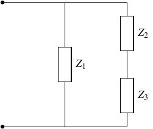
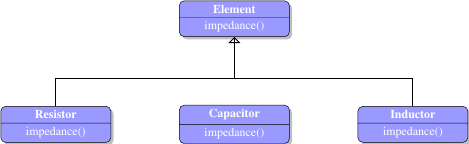
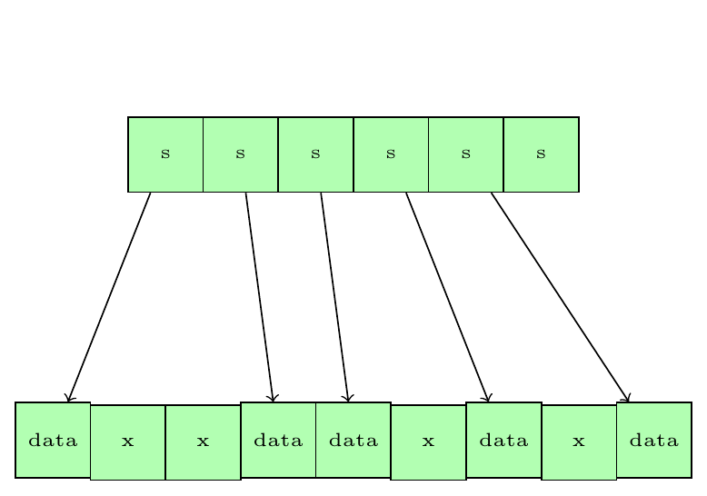

title: Modern C++
class: animation-fade
layout: true

<!-- This slide will serve as the base layout for all your slides -->
.bottom-bar[
  {{title}}
]

---

class: impact

# {{title}}
## Practical uses of C++17 features

---

class: chapter

<!-- begin string_view -->

## `std::string_view`

---

## C-string vs `std::string`
.bottom[
The general recommendation is: use `std::string` and avoid using C raw string.

but...
]

---

## Interfacing with C API

``` cpp
void configureNetworkInterface(const std::string& ifname)
{
    ifreq ifr ;
    strcpy(ifr.ifr name,ifname.cstr());
}
```

--
Who guarantees that ifname fits into the fixed-size ifr name buffer?

---

## Interfacing with C API

``` cpp
void configureNetworkInterface(const std::string& ifname)
{
    ifreq ifr ;
    strncpy(ifr.ifr name,ifname.cstr(), sizeof(ifr.ifr_name));
}
```

--
Less bad but still wrong - buffer is not null-terminated.

---

## Interfacing with C API

``` cpp
void configureNetworkInterface(const std::string& ifname)
{
    ifreq ifr ;
    strncpy(ifr.ifr name,ifname.cstr(), sizeof(ifr.ifr_name) - 1);
    ifr.ifrname[sizeof(ifr.irfname) − 1] = ’ \0 ’ ;
}
```

--
Correct but could be inefficient.

---

## Safe string copy

``` cpp
size_t safeStringCopy(const std::string& src, char* dest, size_t destLen)
{
    if (destLen == 0)
    {
        return 0;
    }
    auto len = std::min(src.length(), destLen - 1);
    std::copy_n(src.begin(), len, dest);
    dest[len] = '\0';
    return len;
}

```

--

``` cpp
void configureNetworkInterface(const std::string& ifname)
{
    ifreq ifr;
    safeStringCopy(ifname, ifr_ifr_name, sizeof(ifr.ifr_name));
}
```
---

.alert[
Never use `strcpy` to copy a string which lengh is not known at compile time into
    a fixed size array.
]
---

## Fixed size buffer copy

```
const int SIZE = 20;

char s[SIZE];
strcpy(s, "Sometimes seems OK");
```

--
```
const int SIZE = 20;

char s[SIZE];
strcpy(s, "Sometimes seems NOT OK");
```

---

## Fixed size buffer copy

```
size_t safeStringCopy(const char* src, char* dest, size_t destLen)
{
    if (destLen == 0)
    {
        return 0;
    }
    auto len = std::min(strlen(src), destLen - 1);
    std::copy_n(src, len, dest);
    dest[len] = '\0';
    return len;
}
```

--
```
const int SIZE = 20;

char s[SIZE];
safeStringCopy("Sometimes seems NOT OK", s, sizeof(s));
```

---

.col-6[
```
size_t safeStringCopy(const std::string& src, char* dest, size_t destLen)
{
    if (destLen == 0)
    {
        return 0;
    }
    auto len = std::min(src.length(), destLen - 1);
    std::copy_n(src.begin(), len, dest);
    dest[len] = '\0';
    return len;
}
```

```
size_t safeStringCopy(const char* src, char* dest, size_t destLen)
{
    if (destLen == 0)
    {
        return 0;
    }
    auto len = std::min(strlen(src), destLen - 1);
    std::copy_n(src, len, dest);
    dest[len] = '\0';
    return len;
}
```
]

.col-6[
```
size_t safeStringCopy(std::string_view src, char* dest, size_t destLen)
{
    if (destLen == 0)
    {
        return 0;
    }
    auto len = std::min(src.length(), destLen - 1);
    std::copy_n(src.begin(), len, dest);
    dest[len] = '\0';
    return len;
}
```
]

---

.note[
Prefer passing **`std::string_view`** to a function over **`const std::string&`**
]
---

## C-string vs `std::string`
.row[
.col-5[

```
class WithString
{
    std::string mName;
};

```
]

.col-5[

```
class WithCString
{
    char mName[20];
};

```
]
]

--
### What is more efficient?

---
.row[
.col-5[
## `std::find` ]
.col-5[
## `std::sort` ]
]
.row[
.col-5[

]

.col-5[

]
]
---

```
class WithCString
{
    char mName[20];
public:
    const char* name() const {return mName;}
};

```

--
Returns raw string forcing user to use raw string functions.

---

```
class WithCString
{
    char mName[20];
public:
    std::string name() const {return std::string{mName, 20};}
};

```

--
Returns `std::string` but requires a new copy of the original string.

---

```
class WithCString
{
    char mName[20];
public:
    std::string_view name() const {return std::string_view{mName, 20};}
};

```

--
Returns `std::string_view`: no copy + nice string-like interface.

--

When a class keeps string data as char array the accessor member function should return
**`std::string_view`** to that array.

---

## Dangling `std::string_view`

```
std::string_view sv;
{
    std::string s = "some string";
    sv = s;
}
std::cout << sv << '\n';
```

--
```
std::string_view sv = std::string{"some string"};
std::cout << sv << '\n';
```
--
```
std::string_view sv;
{
    char s[] = "some string";
    sv = s;
}
std::cout << sv << '\n';
```
--

**`std::string_view`** is a non-owning reference to the underlying string.
If the string is deleted the `string_view` dangles.

---

class: chapter

## `std::optional<T>`

---

# `std::optional<T>`

- container which can be empty or hold a single value of type T

--

- has pointer-like interface
    * `operator *`
    * `operator ->`
--

- no heap allocation

--
- based on the *Monad* concept in functional programming languages
    * Haskell `Maybe` monad

---

# `std::optional<T>`

```
std::optional<int> empty = std::nullopt;
std::optional<int> value = 123;

EXPECT_FALSE(empty.has_value());
EXPECT_THROW(empty.value(), std::bad_optional_access);
EXPECT_EQ(10, empty.value_or(10));
int x = *empty; // undefined behavior


EXPECT_TRUE(value.has_value());
EXPECT_EQ(123, value.value());
EXPECT_EQ(123, value.value_or(10));
EXPECT_EQ(123, *value);

```

---

# `std::optional<T>`

```
int atoi(const char *str);

```

--


```
auto x1 = atoi("123"); // x1 = 123
auto x3 = atoi("123xxx"); // x3 = 123;
auto x2 = atoi("0"); // x2 = 0
auto x4 = atoi("xxx123"); // x4 = 0
auto x5 = atoi(nullptr); // undefined behavior

```

---

```
bool my_atoi(const char* str, int& val)
{
    if (str == nullptr || !std::isdigit(str[0])) { return false; }
    val = atoi(str);
    return val;
}
```

--

```
int x = 0;
if (my_atoi(str, x))
{
    //...
}

```

--
Requires declaring `x` before it can be initialized with the function output.

---

```
int my_atoi(const char* str, bool& ok)
{
    if (str == nullptr || !std::isdigit(str[0]))
    {
        ok = false;
        return 0;
    }
    ok = true;
    return atoi(str);
}
```

--

```
bool ok = false;
int x = my_atoi(str, ok);
if (ok)
{
    //...
}

```

--
Requires declaring `ok` before it can be initialized with the function output.

---

```
std::pair<bool, int> my_atoi(const char* str)
{
    if (str == nullptr || !std::isdigit(str[0]))
    {
        return {false, 0};
    }
    return {true, atoi(str)};
}
```

--
```
auto ret = my_atoi(str);
if (ret.first)
{
    int x = ret.second;
}
```

--
Immediate initialization with function output but a bit clumsy with the pair.


---

```
std::optional<int> my_atoi(const char* str)
{
    if (str == nullptr || !std::isdigit(str[0])) { return std::nullopt; }
    return atoi(str);
}
```

--

```
auto v = my_atoi(str);
if (v)
{
    auto value = *v;
}

```
--

```
auto v = my_atoi(str);
auto value = v.value_or(0);

```


--

```
auto x1 = my_atoi("123"); // x1 = 123
auto x3 = my_atoi("123xxx"); // x3 = 123;
auto x2 = my_atoi("0"); // x2 = 0
auto x4 = my_atoi("xxx123"); // x4 = nullopt
auto x4 = my_atoi(nullptr); // x4 = nullopt

```

---
```
int main(int argc, const char* argv[])
{
    auto x = my_atoi(argv[1]);
    if (!x)
    {
        std::cerr << "Number expected\n";
        return -1;
    }
    std::cout << x.value() << '\n';
}
```

---

.note[
Use `std::optional<T>` as a return type as an alternative to throwing exception when correct value cannot be returned.
]

---
layout: true
class: inverse

## Optional data members

.col-5[
```json
"parameters" : [
{
    "name"   : "temperature",
    "access" : "read-only",
    "type"   : "integer"
},
{
    "name"   : "power",
    "access" : "read-only",
    "type"   : "integer",
    "range"  : {"min": -10, "max": 10}
}
]

```
]

---

.col-5[
```cpp
struct Parameter
{
    std::string name;
    Access access;
    Type type;
};

```
]

---

.col-5[
```cpp
struct Parameter
{
    std::string name;
    Access access;
    Type type;
    std::pair<int, int> range;
    bool hasRange = false;
};

```
]

---

.col-5[
```cpp
struct Parameter
{
    std::string name;
    Access access;
    Type type;
    std::optional<std::pair<int, int>> range;
};

```
]

---
layout: false


layout: true
class: inverse

# `std::optional<T>`
### "Monadic" interface


Many times we pass a result of a function to another function:

```
Shape makeShape(std::vector<Points> points);
Figure makeFigure(Shape shape);
void paint(const Figure& figure);

```
---

```
Shape shape = makeShape({{1,2}, {3,3}, {1,0}});
Figure figure = makeFigure(shape);
paint(figure);

```
---
```
paint(makeFigure(makeShape({{1,2}, {3,3}, {1,0}})));
```

---
layout: false


layout: true
class: inverse


```
std::optional<Shape> makeShape(std::vector<Points> points);
std::optional<Figure> makeFigure(Shape shape);
void paint(const Figure& figure);

```

---

--

```
auto shape = makeShape({{1,2}, {3,3}, {1,0}});
if (shape)
{
    auto figure = makeFigure(*shape);
    if(figure)
    {
        paint(*figure);
    }

}

```

--

"Noisy code" due to error checking.

---


```
auto shape = makeShape({{1,2}, {3,3}, {1,0}});

if (!shape)
{
    return;
}

auto figure = makeFigure(*shape);

if(!figure)
{
    return;
}

paint(*figure);

```

--

Still noisy...

---

```
auto shape = makeShape({{1,2}, {3,3}, {1,0}});
auto figure = bind(shape, makeFigure);
bind(figure, paint);
```

--
What does the function `bind` do ?

---
layout: false


layout: true
class: inverse

```
template <typename T, typename F>
auto bind(const std::optional<T>& opt, F&& f) -> std::result_of_t<F(T)>
{
    if (opt.has_value())
    {
        return f(*opt);
    }
    return std::nullopt;
}
```

---

--

```
auto shape = makeShape({{1,2}, {3,3}, {1,0}});
*auto figure = bind(shape, makeFigure);
```
---


```
auto shape = makeShape({{1,2}, {3,3}, {1,0}});
auto figure = bind(shape, makeFigure);
*bind(figure, paint);
```

--

```bash

 error: void function 'bind' should not return a value [-Wreturn-type]
    return std::nullopt;
    ^      ~~~~~~~~~~~~
 note: in instantiation of function template specialization 'bind<Figure, void (&)(const Figure &)>' requested here
    bind(f, paint);
           ^

```

--

```
void paint(const Figure& figure);
```

`paint` does not return anything but `bind` tries to return `std::nullopt`

---
layout: false

```
template <typename T, typename F>
auto bind(const std::optional<T>& opt, F&& f) -> std::result_of_t<F(T)>
{
    if (opt.has_value())
    {
        return f(*opt);
    }

    using Ret = std::result_of_t<F(T)>;

    if constexpr (std::is_same_v<void, RetF>)
    {
        return;
    }
    else
    {
        return std::nullopt;
    }
}

```

--
```
auto shape = makeShape({{1,2}, {3,3}, {1,0}});
auto figure = bind(shape, makeFigure);
bind(figure, paint);
```

---

class: chapter

## `std::variant<Ts...>`

---

.row[
.col-6[
```
union Union
{
    int i;
    double d;
    char ch[10];
};

Union u;
u.d = 0.5;
```
]

.col-6[
```
using Variant = std::variant<int, double, std::string>;

Variant var = 0.5;
```
]
]

.row[
.col-6[

- POD types only
- not aware of the type it is holding

]

.col-6[
- any types
- aware of the type it is holding
]
]

---

layout: true

```
using Variant = std::variant<int, double, std::string>;

Variant var = "string in variant"s;
```

---

```
*EXPECT_TRUE(std::hold_alternative<std::string>(var));
EXPECT_FALSE(std::hold_alternative<int>(var));
EXPECT_EQ(2, var.index());
EXPECT_EQ("string in variant", std::get<std::string>(var));
EXPECT_THROW(std::get<int>(var), std::bad_variant_access);
EXPECT_EQ("string in variant", *std::get_if<std::string>(var));
EXPECT_EQ(nullptr, std::get_if<int>(var));

```

---

```
EXPECT_TRUE(std::hold_alternative<std::string>(var));
*EXPECT_FALSE(std::hold_alternative<int>(var));
EXPECT_EQ(2, var.index());
EXPECT_EQ("string in variant", std::get<std::string>(var));
EXPECT_THROW(std::get<int>(var), std::bad_variant_access);
EXPECT_EQ("string in variant", *std::get_if<std::string>(var));
EXPECT_EQ(nullptr, std::get_if<int>(var));

```
---

```
EXPECT_TRUE(std::hold_alternative<std::string>(var));
EXPECT_FALSE(std::hold_alternative<int>(var));
*EXPECT_EQ(2, var.index());
EXPECT_EQ("string in variant", std::get<std::string>(var));
EXPECT_THROW(std::get<int>(var), std::bad_variant_access);
EXPECT_EQ("string in variant", *std::get_if<std::string>(var));
EXPECT_EQ(nullptr, std::get_if<int>(var));

```
---

```
EXPECT_TRUE(std::hold_alternative<std::string>(var));
EXPECT_FALSE(std::hold_alternative<int>(var));
EXPECT_EQ(2, var.index());
*EXPECT_EQ("string in variant", std::get<std::string>(var));
EXPECT_THROW(std::get<int>(var), std::bad_variant_access);
EXPECT_EQ("string in variant", *std::get_if<std::string>(var));
EXPECT_EQ(nullptr, std::get_if<int>(var));

```
---

```
EXPECT_TRUE(std::hold_alternative<std::string>(var));
EXPECT_FALSE(std::hold_alternative<int>(var));
EXPECT_EQ(2, var.index());
EXPECT_EQ("string in variant", std::get<std::string>(var));
*EXPECT_THROW(std::get<int>(var), std::bad_variant_access);
EXPECT_EQ("string in variant", *std::get_if<std::string>(var));
EXPECT_EQ(nullptr, std::get_if<int>(var));

```
---

```
EXPECT_TRUE(std::hold_alternative<std::string>(var));
EXPECT_FALSE(std::hold_alternative<int>(var));
EXPECT_EQ(2, var.index());
EXPECT_EQ("string in variant", std::get<std::string>(var));
EXPECT_THROW(std::get<int>(var), std::bad_variant_access);
*EXPECT_EQ("string in variant", *std::get_if<std::string>(var));
EXPECT_EQ(nullptr, std::get_if<int>(var));

```
---

```
EXPECT_TRUE(std::hold_alternative<std::string>(var));
EXPECT_FALSE(std::hold_alternative<int>(var));
EXPECT_EQ(2, var.index());
EXPECT_EQ("string in variant", std::get<std::string>(var));
EXPECT_THROW(std::get<int>(var), std::bad_variant_access);
EXPECT_EQ("string in variant", *std::get_if<std::string>(var));
*EXPECT_EQ(nullptr, std::get_if<int>(var));

```


---
layout: false

.col-6[
- Default type is the first type specified.
]

.col-6[
```
struct Foo
{

};

struct Bar
{

};

std::variant<Foo, Bar> v; // v contains type Foo
```
]

---

.col-6[
- Default type is the first type specified.
- The first type must be *default constructible*
]

.col-6[
```
struct Foo
{
    Foo(int i);
};

struct Bar
{
    Bar(int i);
};

std::variant<Foo, Bar> v; // compiler error
```
]

---

.col-6[
- Default type is the first type specified.
- The first type must be *default constructible*
- `std::monostate` can be used if none of the types have default constructor
]

.col-6[
```
struct Foo
{
    Foo(int i);
};

struct Bar
{
    Bar(int i);
};

std::variant<std::monostate, Foo, Bar> v; // type of v is monostate
```
]

---

## Visitation

```
using Variant = std::variant<int, double, std::string>;

void print(const Variant& v)
{
    if (std::holds_alternative<int>(v))
    {
        std::cout << "integer:" << std::get<int>(v);
    }
    else if (std::holds_alternative<double>(v))
    {
        std::cout << "double:" << std::get<double>(v);
    }
    else if (std::holds_alternative<std::string>(v))
    {
        std::cout << "string:" << std::get<std::string>(v);
    }
}

Variant v = 1234;
print(v);

```

---

## Visitation

```
using Variant = std::variant<int, double, std::string>;

struct print
{
    void operator()(int v) const
    {
        std::cout << "integer:" << v;
    }

    void operator()(double v) const
    {
        std::cout << "double:" << v;
    }

    void operator()(const std::string& v) const
    {
        std::cout << "string:" << v;
    }
};

Variant v = 1234;
std::visit(print{}, v);

```

---


Calculate the impedance of the circuit for any combination of the R, L, C elements.

\\[ Z = {1 \over {1 \over Z_1} + {1 \over {Z_2+Z_3}}} \\]

---

.col-6[

]

.col-6[
```
class Element
{
public:
    Element(double value) : mValue(value) {}

    virtual std::complex<double> impedance(double freq) const = 0;

protected:
    double mValue = 0;
};

class Resistor : public Element
{
public:
    using Element::Element;

    std::complex<double> impedance(double freq) const override
    {
        return {mValue, 0};
    }
};

class Capacitor : public Element
{
public:
    using Element::Element;

    std::complex<double> impedance(double freq) const override
    {
        return {0, -1 / (freq * 2 * pi * mValue)};
    }
};

class Inductor : public Element
{
public:
    using Element::Element;

    std::complex<double> impedance(double freq) const override
    {
        return {0, freq * 2 * pi * mValue};
    };
};
```
]

---

.col-6[


```
std::complex<double>
circuit_impedance(const Element& E1,
                  const Element& E2,
                  const Element& E3,
                  double freq)
{
    auto Z1 = E1.impedance(freq);
    auto Z2 = E2.impedance(freq);
    auto Z3 = E3.impedance(freq);
    auto Z = 1.0 / (1.0 / (Z1 + 1.0 / (Z2 + Z3)));
    return Z;
}
```
]

.col-6[
```
class Element
{
public:
    Element(double value) : mValue(value) {}

    virtual std::complex<double> impedance(double freq) const = 0;

protected:
    double mValue = 0;
};

class Resistor : public Element
{
public:
    using Element::Element;

    std::complex<double> impedance(double freq) const override
    {
        return {mValue, 0};
    }
};

class Capacitor : public Element
{
public:
    using Element::Element;

    std::complex<double> impedance(double freq) const override
    {
        return {0, -1 / (freq * 2 * pi * mValue)};
    }
};

class Inductor : public Element
{
public:
    using Element::Element;

    std::complex<double> impedance(double freq) const override
    {
        return {0, freq * 2 * pi * mValue};
    };
};
```
]

---

.col-6[


```
std::complex<double>
circuit_impedance(const Element& E1, 
                  const Element& E2, 
                  const Element& E3, 
                  double freq)
{
    auto Z1 = nonstd::visit(impedance{freq}, E1);
    auto Z2 = nonstd::visit(impedance{freq}, E2);
    auto Z3 = nonstd::visit(impedance{freq}, E3);
    auto Z  = 1.0 / (1.0 / Z1 + 1.0 / (Z2 + Z3));
    return Z;
}
```
]

.col-6[
```
struct Resistor
{
    double mValue;
};

struct Capacitor
{
    double mValue;
};

struct Inductor
{
    double mValue;
};

using Element = nonstd::variant<Resistor, Capacitor, Inductor>;

```

```
struct impedance
{
    double freq;

    std::complex<double> operator()(const Resistor& e)
    {
        return {e.mValue, 0};
    }

    std::complex<double> operator()(const Capacitor& e)
    {
        return {0, -1 / (freq * 2 * pi * e.mValue)};
    }

    std::complex<double> operator()(const Inductor& e)
    {
        return {0, freq * 2 * pi * e.mValue};
    }
};
```
]

---

# `std::any`

---


- single value container
- keeps type information
- can hold an arbitrary type

--

`std::any` is essentially type-safe replacement of `void*`

---
```
std::any a1 = 123;
*EXPECT_EQ(123, *std::any_cast<int*>(a1));
*EXPECT_EQ(123, std::any_cast<int&>(a1));
EXPECT_EQ(nullptr, std::any_cast<double*>(a1));
EXPECT_THROW(std::any_cast<double&>(a1), std::bad_any_cast);
a1 = std::string{"any string"};
EXPECT_EQ("any_string", std::any_cast<std::string&>(a1));

struct Foo
{
    Foo(int i, double d){/*...*/}
};

// Constructs Foo in-place
a1.emplace<Foo>(10, 0.5);

std::any a2{std::in_place_type_t<Foo>{}, 10, 0.5}; // in place construction
EXPECT_EQ(a1, a2);

auto a3 = std::make_any<Foo>(10, 0.5); // in place construction
EXPECT_EQ(a1, a3);

```
---
```
std::any a1 = 123;
EXPECT_EQ(123, *std::any_cast<int*>(a1));
EXPECT_EQ(123, std::any_cast<int&>(a1));
*EXPECT_EQ(nullptr, std::any_cast<double*>(a1));
*EXPECT_THROW(std::any_cast<double&>(a1), std::bad_any_cast);
a1 = std::string{"any string"};
EXPECT_EQ("any_string", std::any_cast<std::string&>(a1));

struct Foo
{
    Foo(int i, double d){/*...*/}
};

// Constructs Foo in-place
a1.emplace<Foo>(10, 0.5);

std::any a2{std::in_place_type_t<Foo>{}, 10, 0.5}; // in place construction
EXPECT_EQ(a1, a2);

auto a3 = std::make_any<Foo>(10, 0.5); // in place construction
EXPECT_EQ(a1, a3);

```

---
```
std::any a1 = 123;
EXPECT_EQ(123, *std::any_cast<int*>(a1));
EXPECT_EQ(123, std::any_cast<int&>(a1));
EXPECT_EQ(nullptr, std::any_cast<double*>(a1));
EXPECT_THROW(std::any_cast<double&>(a1), std::bad_any_cast);
*a1 = std::string{"any string"};
*EXPECT_EQ("any_string", std::any_cast<std::string&>(a1));

struct Foo
{
    Foo(int i, double d){/*...*/}
};

// Constructs Foo in-place
a1.emplace<Foo>(10, 0.5);

std::any a2{std::in_place_type_t<Foo>{}, 10, 0.5}; // in place construction
EXPECT_EQ(a1, a2);

auto a3 = std::make_any<Foo>(10, 0.5); // in place construction
EXPECT_EQ(a1, a3);

```

---
```
std::any a1 = 123;
EXPECT_EQ(123, *std::any_cast<int*>(a1));
EXPECT_EQ(123, std::any_cast<int&>(a1));
EXPECT_EQ(nullptr, std::any_cast<double*>(a1));
EXPECT_THROW(std::any_cast<double&>(a1), std::bad_any_cast);
a1 = std::string{"any string"};
EXPECT_EQ("any_string", std::any_cast<std::string&>(a1));

struct Foo
{
    Foo(int i, double d);
};

// Constructs Foo in-place
*a1.emplace<Foo>(10, 0.5);

std::any a2{std::in_place_type_t<Foo>{}, 10, 0.5}; // in place construction
EXPECT_EQ(a1, a2);

auto a3 = std::make_any<Foo>(10, 0.5); // in place construction
EXPECT_EQ(a1, a3);

```

---
```
std::any a1 = 123;
EXPECT_EQ(123, *std::any_cast<int*>(a1));
EXPECT_EQ(123, std::any_cast<int&>(a1));
EXPECT_EQ(nullptr, std::any_cast<double*>(a1));
EXPECT_THROW(std::any_cast<double&>(a1), std::bad_any_cast);
a1 = std::string{"any string"};
EXPECT_EQ("any_string", std::any_cast<std::string&>(a1));

struct Foo
{
    Foo(int i, double d);
};

// Constructs Foo in-place
a1.emplace<Foo>(10, 0.5);

*std::any a2{std::in_place_type_t<Foo>{}, 10, 0.5}; // in place construction
*EXPECT_EQ(a1, a2);

auto a3 = std::make_any<Foo>(10, 0.5); // in place construction
EXPECT_EQ(a1, a3);

```
---
```
std::any a1 = 123;
EXPECT_EQ(123, *std::any_cast<int*>(a1));
EXPECT_EQ(123, std::any_cast<int&>(a1));
EXPECT_EQ(nullptr, std::any_cast<double*>(a1));
EXPECT_THROW(std::any_cast<double&>(a1), std::bad_any_cast);
a1 = std::string{"any string"};
EXPECT_EQ("any_string", std::any_cast<std::string&>(a1));

struct Foo
{
    Foo(int i, double d);
};

// Constructs Foo in-place
a1.emplace<Foo>(10, 0.5);

std::any a2{std::in_place_type_t<Foo>{}, 10, 0.5}; // in place construction
EXPECT_EQ(a1, a2);

*auto a3 = std::make_any<Foo>(10, 0.5); // in place construction
*EXPECT_EQ(a1, a3);

```
---

## Example: Database record

.col-6[
```
struct DatabaseRecord
{
    std::string name;
    std::chrono::time_point lastModified;
    /* some generic schema */

    void* userData = nulltpr;
};
```
```
std::vector<DatabaseRecord> database;

DatabaseRecord record;
record.name "rec1"

record.userData = new Foo{};

```

```
auto it = std::find(database.begin(), database.end(), "rec1");
Foo* foo = static_cast<Foo*>(it->userData);
foo.doFoo();

```

```
auto it = std::find(database.begin(), database.end(), "rec1");
Bar* bar = static_cast<Bar*>(it->userData);
bar.doBar(); // undefined behavior

```
]

--

.col-6[
```
struct DatabaseRecord
{
    std::string name;
    std::chrono::time_point lastModified;
    /* some generic schema */

    std::any userData;
};
```
```
std::vector<DatabaseRecord> database;

DatabaseRecord record;
record.name "rec1"

record.userData = Foo{};

```

```
auto it = std::find(database.begin(), database.end(), "rec1");
Foo* foo = std::any_cast<Foo*>(it->userData);
if (foo)
    foo.doFoo();
else
    // error

```

```
auto it = std::find(database.begin(), database.end(), "rec1");
Bar* bar = it->userData;
Bar* bar = std::any_cast<Bar*>(it->userData);
if (bar)
    bar.doBar();
else
    // error

```
]

---
layout: true

.col-6[
```
class any
{
public:
    any() {/*...*/}

    any(const any& other) {/*...*/}
    
    any(any&& other) {/*...*/}

    template <typename T>
    any(T&& value) {/*...*/}

    ~any() {/*...*/}

    void reset() {/*...*/}

    const std::type_info& type() const {/*...*/}

    // Rest of methods and operators...

private:
    void* mStorage = nullptr;
    /* Some type information */
    
```
]

---

--
.col-6[
```
template <typename T>
struct TypeHandler
{
    template <typename... Args>
    T& create(any& dest, Args&&... args)
    {
*        auto p        = std::make_unique<T>(std::forward<Args>()...);
*        auto ret      = p.release();
*        dest.mStorage = ret;
*        return *ret;
    }

    void destroy(any& _this)
    {/*...*/ }

    void copy(any const& _this, any& _dest)
    {/*...*/ }

    void move(any& _this, any& _dest)
    {/*...*/ }

    void* get(any& _this, const std::type_info& _info)
    {/*...*/ }

    const std::type_info& typeInfo()
    {/*...*/ }
};
```
]

---

.col-6[
```
template <typename T>
struct TypeHandler
{
    template <typename... Args>
    T& create(any& dest, Args&&... args)
    {/*...*/ }

    void destroy(any& _this)
    {
*        delete static_cast<T*>(_this.mStorage);
    }

    void copy(any const& souce, any&_dest)
    {/*...*/ }

    void move(any& source, any& dest)
    {/*...*/ }

    void* get(any& _this, const std::type_info& info)
    {/*...*/ }

    const std::type_info& typeInfo()
    {/*...*/ }
};
```
]

---

.col-6[
```
template <typename T>
struct TypeHandler
{
    template <typename... Args>
    T& create(any& dest, Args&&... args)
    {/*...*/ }

    void destroy(any& _this)
    {/*...*/ }

    void copy(any const& source, any& dest)
    {
*        create(dest, *static_cast<T const*>(source.mStorage));
    }

    void move(any& source, any& dest)

    void* get(any& _this, const std::type_info& info)
    {/*...*/ }

    const std::type_info& typeInfo()
    {/*...*/ }
};
```
]

---

.col-6[
```
template <typename T>
struct TypeHandler
{
    template <typename... Args>
    T& create(any& dest, Args&&... args)
    {/*...*/ }

    void destroy(any& _this)
    {/*...*/ }

    void copy(any const& source, any& dest)
    {/*...*/ }

    void move(any& source, any& dest)
    {
*        dest.mStorage = source.mStorage;
*        source.mStorage = nullptr;
    }

    void* get(any& _this, const std::type_info& info)
    {/*...*/ }

    const std::type_info& typeInfo()
    {/*...*/ }
};
```
]

---

.col-6[
```
template <typename T>
struct TypeHandler
{
    template <typename... Args>
    T& create(any& dest, Args&&... args)
    {/*...*/ }

    void destroy(any& _this)
    {/*...*/ }

    void copy(any const& source, any& dest)
    {/*...*/ }

    void move(any& source, any& dest)
    {/*...*/ }

    void* get(any& _this, const std::type_info& info)
    {
*        if (typeid(T) == info)
*            return _this.mStorage);
*        return nullptr;
    }

    const std::type_info& typeInfo()
    {/*...*/ }
};
```
]

---

.col-6[
```
template <typename T>
struct TypeHandler
{
    template <typename... Args>
    T& create(any& dest, Args&&... args)
    {/*...*/ }

    void destroy(any& _this)
    {/*...*/ }

    void copy(any const& source, any& dest)
    {/*...*/ }

    void move(any& source, any& dest)
    {/*...*/ }

    void* get(any& _this, const std::type_info& info)
    {/*...*/ }

    const std::type_info& typeInfo()
    {
*        return typeid(T);
    }
};
```
]


---
layout: false

.col-6[
```
class any
{
public:
    any() = default;

    any(const any& other) 
    { 
        mHandler.copy(other, *this); 
    }
    
    any(any&& other)
    { 
        mHandler.move(other, *this); 
    }

    template <typename T>
    any(T&& value)
    {
*        TypeHandler<T> handler;
*        handler.create(*this, value);
    }

    ~any() 
    {
        reset();
    }

    void reset() 
    {
        mHandler.destroy(*this);
    }

    const std::type_info& type() const
    {
        return mHandler.typeInfo();
    }

    // Rest of methods and operators...

private:
    void* mStorage = nullptr;
*    std::unique_ptr<IHandler> mHandler;
    
```
]

.col-6[
```

struct ITypeHandler
{
    virtual ~ITypeHandler() = default;

    virtual void destroy(any& _this) = 0;

    virtual void copy(any const& source, any& dest) = 0;

    virtual void move(any& source, any& dest) = 0;

    virtual void* get(any& _this, const std::type_info& info) = 0;

    virtual const std::type_info& typeInfo() = 0;
};

template <typename T>
*struct TypeHandler : ITypeHandler
{
    template <typename... Args>
    T& create(any& dest, Args&&... args)
    {
        auto p        = std::make_unique<T>(std::forward<Args>()...);
        auto ret      = p.release();
        dest.mStorage = ret;
*       dest.mHandler= std::make_unique<TypeHandler<T>>(*this);
        return *ret;
    }

    void destroy(any& _this) override
    {/*...*/ }

    void copy(any const& source, any& dest) override
    {/*...*/ }

    void move(any& source, any& dest) override
    {/*...*/ }

    void* get(any& _this, const std::type_info& info) override
    {/*...*/ }

    const std::type_info& typeInfo() override
    {/*...*/ }
};
```
]

---

.col-6[
```
class any
{
public:
    any() = default;

    any(const any& other) 
    { 
*        mHandler.copy(other, *this); 
    }
    
    any(any&& other)
    { 
*        mHandler.move(other, *this); 
    }

    template <typename T>
    any(T&& value)
    {
        TypeHandler<T> handler;
        handler.create(*this, value);
    }

    ~any() 
    {
        reset();
    }

    void reset() 
    {
        mHandler.destroy(*this);
    }

    const std::type_info& type() const
    {
        return mHandler.typeInfo();
    }

    // Rest of methods and operators...

private:
    void* mStorage = nullptr;
*    std::unique_ptr<IHandler> mHandler;
    
```
]

.col-6[
```

struct ITypeHandler
{
    virtual ~ITypeHandler() = default;

    virtual void destroy(any& _this) = 0;

    virtual void copy(any const& source, any& dest) = 0;

    virtual void move(any& source, any& dest) = 0;

    virtual void* get(any& _this, const std::type_info& info) = 0;

    virtual const std::type_info& typeInfo() = 0;
};

template <typename T>
*struct TypeHandler : ITypeHandler
{
    template <typename... Args>
    T& create(any& dest, Args&&... args)
    {/*...*/ }

    void destroy(any& _this) override
    {/*...*/ }

    void copy(any const& source, any& dest) override
    {
*        create(dest, *static_cast<T const*>(source.mStorage));
    }

    void move(any& source, any& dest) override
    {
         dest.mStorage = source.mStorage;
         source.mStorage = nullptr;
*        dest.mHandler = std::move(source.mHandler);
    }

    void* get(any& _this, const std::type_info& info) override
    {/*...*/ }

    const std::type_info& typeInfo() override
    {/*...*/ }
};
```
]

---


# Class template parameter deduction

<!-- end class template parameter deduction -->

---

```
std::pair p{1,2}; //compiler error in C++14
```
--

```
std::pair<int, int> p{1,2}; // OK
```
--

```
// helper to avoid specifing template params
auto p = std::make_pair(1,2);
```
--

```
// OK in C++17: first parameter is deduced to int, second to float
std::pair p{1, 2.0f};
```
---

```
template <typename T>
void f(const T& t);

f(10);
```
--

```
template <typename T>
class Foo
{
public:
    Foo(const T& t);
};

Foo foo(10);
```

---

.col-5[
```
std::vector<string> vs = {"foo"s, "bar"s};
```
]

.col-5[
```
std::vector vs = {"foo"s, "bar"s};
```
]

--

.col-5[
```
std::array<std::string, 2> vs = {"foo"s, "bar"s};
```
]

.col-5[
```
std::array vs = {"foo"s, "bar"s};
```
]

--

.col-5[
```
std::tuple<double, std::string> vs = {0.4, "bar"s};
```
]

.col-5[
```
std::tuple vs = {0.4, "bar"s};
```
]

--

.row[
.col-5[
```
std::unique_ptr<int> p{new int};
```
]

.col-5[
```
std::unique_ptr p{new int}; // compiler error
```
]
]

.row[
`unique_ptr` template argument cannot be deduced because does not know whether to deduce it to be
**`unique_ptr<int>`** or **`unique_ptr<int[]>`**
]
---

#C-array vs std::array

```
char x[100];
std::cout << sizeof(x) << '\n';
```
--
Size of x is **100** bytes.

--

```
void f(char x[100])
{
    std::cout << sizeof(x) << '\n';
}
```
--
Size of x is the size of a pointer (**4** or **8** bytes depending on the architecture).

--

```
std::array<char, 100> x;
std::cout << sizeof(x) << '\n';
```

--
Size of x is **100** bytes.

--
```
void f(const std::array<char, 100>& x)
{
    std::cout << sizeof(x) << '\n';
}
```

--
Size of x is **100** bytes.


<!-- begin fold_expression -->

---

#Algorithm predicates

---

layout: true
class: inverse


```
template <typename Predicate>
std::vector<int> subset(const std::vector<int>& in, Predicate&& pred)
{
    std::vector<int> out;
    std::copy_if(in.begin(), in.end(), std::back_inserter(out), pred);
    return out;
}
```

---
--

```
std::vector<int> v = {1, 2, 3, 4, 5, 6, 7, 8, 9, 18, 20, 24, 21, 55, 11};

auto greaterThan5  = [](int x) { return x > 5; };
auto v2 = subset(v, greaterThan5);

```

---

```
std::vector<int> v = {1, 2, 3, 4, 5, 6, 7, 8, 9, 18, 20, 24, 21, 55, 11};

auto greaterThan5  = [](int x) { return x > 5; };
auto v2 = subset(v, greaterThan5);

auto greaterThan5AndLesstThan20  = [](int x) { return x > 5 && x < 20; };
auto v3 = subset(v, greaterThan5AndLessThan20);

```

---

```
std::vector<int> v = {1, 2, 3, 4, 5, 6, 7, 8, 9, 18, 20, 24, 21, 55, 11};

auto greaterThan5  = [](int x) { return x > 5; };
auto v2 = subset(v, greaterThan5);

auto greaterThan5AndLesstThan20  = [](int x) { return x > 5 && x < 20; };
auto v3 = subset(v, greaterThan5AndLessThan20);

auto greaterThan5AndLesstThan20AndEven  = [](int x) { return x > 5 && x < 20 && (x % 2) == 0; };
auto v4 = subset(v, greaterThan5AndLessThan20AndEven);

```

---

```
std::vector<int> v = {1, 2, 3, 4, 5, 6, 7, 8, 9, 18, 20, 24, 21, 55, 11};

auto greaterThan5  = [](int x) { return x > 5; };
auto lesstThan20  = [](int x) { return x < 20; };
auto even  = [](int x) { x % 2 == 0; };

auto v2 = subset(v, greaterThan5);
auto v3 = subset(v, [&](int x){return greaterThan5(x) && lessThan20(x);});
auto v4 = subset(v, [&](int x){return greaterThan5(x) && lessThan20(x) && even(x);});

```

---

```
std::vector<int> v = {1, 2, 3, 4, 5, 6, 7, 8, 9, 18, 20, 24, 21, 55, 11};

auto greaterThan5  = [](int x) { return x > 5; };
auto lesstThan20  = [](int x) { return x < 20; };
auto even  = [](int x) { x % 2 == 0; };

auto v2 = subset(v, greaterThan5);
auto v3 = subset(v, [&](int x){return greaterThan5(x) && lessThan20(x);});
auto v4 = subset(v, [&](int x){return greaterThan5(x) && lessThan20(x) && even(x);});
auto v5 = subset(v, [&](int x){return lessThan20(x) || even(x);});

```
---

```
std::vector<int> v = {1, 2, 3, 4, 5, 6, 7, 8, 9, 18, 20, 24, 21, 55, 11};

auto greaterThan5  = [](int x) { return x > 5; };
auto lesstThan20  = [](int x) { return x < 20; };
auto even  = [](int x) { x % 2 == 0; };

auto v4 = subset(v, [&](int x){return greaterThan5(x) && lessThan20(x) && even(x);});

```

---

```
std::vector<int> v = {1, 2, 3, 4, 5, 6, 7, 8, 9, 18, 20, 24, 21, 55, 11};

auto greaterThan5  = [](int x) { return x > 5; };
auto lesstThan20  = [](int x) { return x < 20; };
auto even  = [](int x) { x % 2 == 0; };

auto v4 = subset(v, And<int>(greaterThan5, lessThan20, even);

```
--
This is more readable and explanatory than lamba syntax.

---
layout: false


.row[
.col-6[
```
struct and_
{
    template <typename T, typename Predicate, typename... Predicates>
    static bool apply(T&& t, Predicate&& pred, Predicates&&... preds)
    {
        return pred(std::forward<T>(t)) && apply(std::forward<T>(t),
                                     std::forward<Predicates>(preds)...);
    }

    template <typename T>
    static bool apply(T&& t)
    {
        return true;
    }
};
```
]]

--

```
bool test = and_::apply(8, greaterThan5, lessThan20, even)
EXPECT_TRUE(test);

test = and_::apply(9, greaterThan5, lessThan20, even)
EXPECT_FALSE(test);

```

---

.row[
.col-6[
```
struct and_
{
    template <typename T, typename Predicate, typename... Predicates>
    static bool apply(T&& t, Predicate&& pred, Predicates&&... preds)
    {
        return pred(std::forward<T>(t)) && apply(std::forward<T>(t),
                                     std::forward<Predicates>(preds)...);
    }

    template <typename T>
    static bool apply(T&& t)
    {
        return true;
    }
};
```
]
.col-6[
```
struct and_
{
    template <typename T>
    static bool apply(T&& t, decltype(greaterThan5) pred1,
                             decltype(lessThan20) pred2,
                             decltype(even) pred3)
    {
        return pred1(std::forward<T>(t)) && apply(pred2, pred3);
    }

    template <typename T>
    static bool apply(T&& t, decltype(lessThan20) pred2,
                             decltype(even) pred3)
    {
        return pred2(std::forward<T>(t)) && apply(pred3);
    }

    template <typename T>
    static bool apply(T&& t, decltype(even) pred3)
    {
        return pred3(std::forward<T>(t));
    }

    template <typename T>
    static bool apply(T&& t)
    {
        return true;
    }
};
```
]
]

---

.row[
.col-6[
```
struct and_
{
    template <typename T, typename Predicate, typename... Predicates>
    static bool apply(T&& t, Predicate&& pred, Predicates&&... preds)
    {
        return pred(std::forward<T>(t) && apply(std::forward<T>(t),
                                     std::forward<Predicates>(preds)...);
    }

    template <typename T>
    static bool apply(T&& t)
    {
        return true;
    }
};
```
]
.col-6[
```
struct and_
{
    template <typename T>
    static bool apply(T&& t, decltype(greaterThan5) pred1,
                             decltype(lessThan20) pred2,
                             decltype(even) pred3)
    {
        return pred1(std::forward<T>(t)) &&
               pred2(std::forward<T>(t)) &&
               apply(pred3);
    }

    template <typename T>
    static bool apply(T&& t, decltype(even) pred3)
    {
        return pred3(std::forward<T>(t));
    }

    template <typename T>
    static bool apply(T&& t)
    {
        return true;
    }
};
```
]
]

---

.row[
.col-6[
```
struct and_
{
    template <typename T, typename Predicate, typename... Predicates>
    static bool apply(T&& t, Predicate&& pred, Predicates&&... preds)
    {
        return pred(std::forward<T>(t) && apply(std::forward<T>(t),
                                     std::forward<Predicates>(preds)...);
    }

    template <typename T>
    static bool apply(T&& t)
    {
        return true;
    }
};
```
]
.col-6[
```
struct and_
{
    template <typename T>
    static bool apply(T&& t, decltype(greaterThan5) pred1,
                             decltype(lessThan20) pred2,
                             decltype(even) pred3)
    {
        return pred1(std::forward<T>(t)) &&
               pred2(std::forward<T>(t)) &&
               pred3(std::forward<T>(t)));
    }

    template <typename T>
    static bool apply(T&& t)
    {
        return true;
    }
};
```
]
]

---

```
struct and_
{
    template <typename T, typename Predicate, typename... Predicates>
    static bool apply(T&& t, Predicate&& pred, Predicates&&... preds)
    {
        return pred(std::forward<T>(t) && apply(std::forward<T>(t),
                                     std::forward<Predicates>(preds)...);
    }

    template <typename T>
    static bool apply(T&& t)
    {
        return true;
    }
};
```

```
template <class T>
struct And
{
    std::function<bool(const T&)> f;

    template <class... Ts>
    And(Ts... ts)
    {
        f = [&ts...](const T& t) { return and_::apply(t, std::forward<Ts>(ts)...); };
    }

    bool operator()(const T& v) const
    {
        return f(v);
    }
};
```

```
bool test = And{greaterThan5, lessThan20, even}(8);
EXPECT_TRUE(test);

```

---
layout: true
class: inverse

---

```
struct and_
{
    template <typename T, typename Predicate, typename... Predicates>
    static bool apply(T&& t, Predicate&& pred, Predicates&&... preds)
    {
        return pred(std::forward<T>(t) && apply(std::forward<T>(t),
                                     std::forward<Predicates>(preds)...);
    }

    template <typename T>
    static bool apply(T&& t)
    {
        return true;
    }
};
```

Standard C++11 way of "unpacking" variadic pack - use function overloading.

---

```
struct and_
{
    template <typename T, typename... Predicates>
    static bool apply(T&& t, Predicates&&... preds)
    {
        bool b  = true;
        int _[] = {0, b = b && preds(std::forward<T>(t))...};
        return b;
    }
};
```

Nice but a cryptic trick to avoid defining 2 overloads.

---

```
struct and_
{
    template <typename T, typename... Predicates>
    static bool apply(T&& t, Predicates&&... preds)
    {
        return (... && preds(std::forward<T>(t)));
    }
};

```

C++17 *fold expression*.

---
layout: false


.col-6[
```
struct and_
{
    template <typename T, typename... Predicates>
    static bool apply(T&& t, Predicates&&... preds)
    {
        return (... && preds(std::forward<T>(t)));
    }
};

```
```
template <class T>
struct And
{
    std::function<bool(const T&)> f;

    template <class... Ts>
    And(Ts... ts)
    {
        f = [&ts...](const T& t) {
*            return and_::apply(t, std::forward<Ts>(ts)...); };
    }

    bool operator()(const T& v) const
    {
        return f(v);
    }
};
```
]

--

.col-6[
```
struct or_
{
    template <typename T, typename... Predicates>
    static bool apply(T&& t, Predicates&&... preds)
    {
        return (... || preds(std::forward<T>(t)));
    }
};

```
```
template <class T>
struct Or
{
    std::function<bool(const T&)> f;

    template <class... Ts>
    And(Ts... ts)
    {
        f = [&ts...](const T& t) {
*            return or_::apply(t, std::forward<Ts>(ts)...); };
    }

    bool operator()(const T& v) const
    {
        return f(v);
    }
};
```
]

---

.row[
.col-6[
```
struct and_
{
    template <typename T, typename... Predicates>
    static bool apply(T&& t, Predicates&&... preds)
    {
        return (... && preds(std::forward<T>(t)));
    }
};
```
]

.col-6[
```
struct or_
{
    template <typename T, typename... Predicates>
    static bool apply(T&& t, Predicates&&... preds)
    {
        return (... || preds(std::forward<T>(t)));
    }
};
```
]
]

```
template <class T, class F>
struct Operation
{
    std::function<bool(const T&)> f;

    template <class... Ts>
    Operation(Ts&&... ts)
    {
        f = [&ts...](const T& t) {
*            return F::apply(t, std::forward<Ts>(ts)...); };
    }

    bool
    operator()(const T& v) const
    {
        return f(v);
    }
};
```

--

```
template <typename T>
using And = Operation<T, v2::and_>;

template <typename T>
using Or = Operation<T, v2::or_>;

```

---
```
auto v2 = subset(v, And<int>(greaterThan5, Or<int>(even, lessThan20)));
```

---


<!-- end fold_expression -->

---

#`constexpr if` as SFINAE replacement

---

##Substitution Failure Is Not An Error (SFINAE)

--

```
struct Foo
{
    using type = int;
};

template <typename T>
void f(T t, typename T::type* p = nullptr) {}

int main()
{
    f(Foo{});
*   f(20);
}
```

--

```bash
source>: In function 'int main()':

<source>:14:9: error: no matching function for call to 'f(int)'

     f(20);

         ^

<source>:7:6: note: candidate: 'template<class T> void f(T, typename T::type*)'

 void f(T t, typename T::type* p = nullptr) {}

      ^

<source>:7:6: note:   template argument deduction/substitution failed:

<source>: In substitution of 'template<class T> void f(T, typename T::type*) [with T = int]':

<source>:14:9:   required from here

<source>:7:6: error: 'int' is not a class, struct, or union type

Compiler returned: 1
```

---

##Substitution Failure Is Not An Error (SFINAE)


```
struct Foo
{
    using type = int;
};

template <typename T>
void f(T t, typename T::type* p = nullptr) {}

void f(...) {}

int main()
{
    f(Foo{});
*   f(20);
}
```
Compiles fine thanks to SFINAE.

---
layout: true
class: invert

## `std::enable_if`

```
template<bool B, class T = void>
struct enable_if {};


template<class T>
struct enable_if<true, T> { using type = T; }
```

---

```
template <typename T>
void f(T t, typename T::type* p = nullptr) {}
```

---
```
template <typename T>
void f(T t, typename std::enable_if<true, T>::type* p = nullptr) 
{
    // do something
}

template <typename T>
void f(T t, typename std::enable_if<false, T>::type* p = nullptr) 
{
    // do something else
}
```

---

```
template <typename T>
void f(T t, typename std::enable_if<std::is_floating_point<T>::value>::type* p = nullptr) 
{
    // optimized implementation for floating point types
}

template <typename T>
void f(T t, typename std::enable_if<!std::is_floating_point<T>::value>::type* p = nullptr) 
{
    // default implementation for all other types
}
```

---
layout: false

<!-- begin constexpr -->

.row[
```
template<class InputIt, class OutputIt>
void copy_n(InputIt first, size_t n, OutputIt dest_first)
{
    for (size_t i = 0; i < n; i++)
        *dest_first = *first;
}
```
]

--
.row[
.col-6[
```
struct String
{ 
    std::string s; 
};
```
`std::vector<String>`

]
.col-6[
```
struct SmallString
{ 
    char s[10];
};
```
`std::vector<SmallString>`


]
]

---

layout: true
class: inverse

Copying a container holding contiguous memory region can be optimized by a single `memcpy` when:

---

--

* container of type `T` stores data in a contiguous memory block 
    - e.g. `std::vector` or `std::array`
--
* type `T` stored in the container is *trivially copyable* 
    - e.g. a struct containing built-in types only


---

* container of type `T` stores data in a contiguous memory block 
    - e.g. `std::vector` or `std::array`

```
template <class Iter>
using iterator_category = typename std::iterator_traits<Iter>::iterator_category;

template <class Iter>
struct is_random_access_iterator : std::is_same<iterator_category<Iter>, 
                                                std::random_access_iterator_tag> {};
```

* type `T` stored in the container is *trivially copyable* 
    - e.g. a struct containing built-in types only

```
template <class Iter>
struct is_trivially_copyable : std::is_trivially_copyable<typename std::iterator_traits<Iter>::value_type> {};
```


---
layout:false

```
template <class Iter>
using iterator_category = typename std::iterator_traits<Iter>::iterator_category;

template <class Iter>
struct is_random_access_iterator : std::is_same<iterator_category<Iter>, 
                                                std::random_access_iterator_tag> {};
template <class Iter>
struct is_trivially_copyable : std::is_trivially_copyable<typename std::iterator_traits<Iter>::value_type> {};

template <class Iter>
struct is_memcpy_copyable
{
    static constexpr bool value = is_random_access_iterator<Iter>::value &&
                                  is_trivially_copyable<Iter>::value;
};
```
---
layout: true
class: inverse

```
template <class InputIt, class OutputIt>
void copy_default(InputIt first, size_t n, OutputIt dest_first)
{
    for (size_t i = 0; i < n; i++)
        *dest_first = *first;
}
```

```
template <class InputIt, class OutputIt>
void copy_memcpy(InputIt first, size_t n, OutputIt dest_first)
{
     memcpy(&*dest_first, &*first, n * sizeof(typename InputIt::value_type));
}
```
---

```
template <class InputIt, class OutputIt>
void copy_n(InputIt first, size_t n, OutputIt dest_first)
{
    /*...*/
}
```

---
```
template <class InputIt, class OutputIt>
void copy_n(InputIt first, size_t n, OutputIt dest_first,
*       std::enable_if_t<is_memcpy_copyable<InputIt>::value && is_memcpy_copyable<OutputIt>::value>* = nullptr)
{
    copy_memcpy(first, n, dest_first);
}

template <class InputIt, class OutputIt>
void copy_n(InputIt first, size_t n, OutputIt dest_first,
*       std::enable_if_t<!(is_memcpy_copyable<InputIt>::value &&  is_memcpy_copyable<OutputIt>::value)>* = nullptr)
{
    copy_default(first, n, dest_first);
}
```
---
layout: false


`std::enable_if` is a very power tool but:
- it is not easy or intuitive to use
- the code is very noisy and not easly digestable
- many conditions on types leads to explosion of number of function overloads

---

```
template <class InputIt, class OutputIt>
void copy_n(InputIt first, size_t n, OutputIt dest_first)
{
    if constexpr (is_memcpy_copyable<InputIt>::value &&  is_memcpy_copyable<OutputIt>::value)
    {
        copy_memcpy(first, n, dest_first);
    }
    else
    {
        copy_default(first, n, dest_first);
    }
}
```
---
layout: false

```
template <class InputIt, class OutputIt>
void copy_n(InputIt first, size_t n, OutputIt dest_first)
{
    if constexpr (is_memcpy_copyable<InputIt>::value &&  is_memcpy_copyable<OutputIt>::value)
    {
        copy_memcpy(first, n, dest_first);
    }
    else
    {
        copy_default(first, n, dest_first);
    }
}
```

```
std::vector<SmallString> v1 = {SmallString{"small"}};
std::vector<SmallString> v2;
v2.resize(1);
copy_n(v1.begin(), 1, v2.begin());
```
--
`copy_memcpy` is called
--

```
std::vector<String> v1 = {String{"bigger string "}};
std::vector<String> v2;
v2.resize(1);
::copy_n(v1.begin(), 1, v2.begin()); // default copy will be used

```
--
`copy_default` is called

---

```
template <class InputIt, class OutputIt>
void copy_n(InputIt first, size_t n, OutputIt dest_first)
{
    if constexpr (is_memcpy_copyable<InputIt>::value &&  is_memcpy_copyable<OutputIt>::value)
    {
        copy_memcpy(first, n, dest_first);
    }
    else
    {
        copy_default(first, n, dest_first);
    }
}
```

```
std::vector<SmallString> v1 = {SmallString{"small"}};
std::vector<SmallString> v2;
copy_n(v1.begin(), 1, std::back_inserter(v2));
```
---

## Small buffer optimization

We need to write a Buffer class with compile-time size which:
- is iterable
- uses dynamic memory allocation only if the size is greater than 1024B

---

.col-6[
```
template <size_t N>
struct DynamicBuffer : private std::vector<std::byte>
{
    using Base = std::vector<std::byte>;

    DynamicBuffer() : Base{N} {}

    using Base::begin;
    using Base::end;
    using Base::size;
};
```
]
.col-6[
```
template <size_t N>
struct StaticBuffer : private std::array<std::byte, N>
{
    using Base = std::array<std::byte>;


    using Base::begin;
    using Base::end;
    using Base::size;
};
```
]

--

What we need is a single class that covers both cases.

--
```
template <size_t N>
struct Buffer : private /* array or vector */
{
    using Base = std::array<std::byte>;

    /*...*/

    using Base::begin;
    using Base::end;
    using Base::size;
};
```
---

```
template <size_t N>
constexpr auto make_base()
{
    if constexpr (N > 1024)
    {
        return std::vector<std::byte>(N);
    }
    else
    {
        return std::array<std::byte, N>();
    }
}
```

```
template <size_t N>
struct Buffer : private decltype(make_base<N>())
{
    using Base = decltype(make_base<N>());

    Buffer() : base(make_base<N>()) {}

    using Base::begin;
    using Base::end;
    using Base::size;
};
```

--

```
Buffer<256> smallBuff; // stack
Buffer<2048> bigBuff;  // heap
```

---

Static type analyses for data serialization

---

```
void print(int v)
{
    std::cout << v;
}
```
--
```
void print(double v)
{
    std::cout << v;
}
```
--
```
void print(const std::string& v)
{
    std::cout << v;
}
```
---
```
template <typename T>
void print(const T& v)
{
    std::cout << v;
}
```
---
```
template <typename T>
void print(const T& v, std::string_view n = {})
{
    if (!n.empty())
    {
        std::cout << '\"' << n << '\"' << ':';
    }
    std::cout << v;
}
```
--

```
template <typename T>
void println(const T& v, std::string_view n = {})
{
    print(v, n);
    std::cout << '\n';
}
```

--
This will work for any T for which `operator<<` exists.

--
.row[
.col-6[
    ```
    println(123, "x");
    println(0.4, "x");
    println("Print me", "x");
    println(true, "x");
    ```
]
.col-6[
    ```bash
    "x":123
    "x":0.4
    "x":Print me
    "x":1
    ```
]
]

--

```
std::vector<int> v = {1,2,3};
println(v, "numbers");
```
--

```bash
error: invalid operands to binary expression ('std::__1::ostream' (aka 'basic_ostream<char>') and 'const std::__1::vector<int,
  std::__1::allocator<int> >')
std::cout << v << '\n';
~~~~~~~~~ ^  ~
```

---

```
template <typename T>
void print_default(const T& v)
{
    std::cout << v << '\n';
}
```

```
template <typename T>
void print_container(const T& v)
{
    std::cout << '[';
    for (const auto& x : v)
    {
        print(x, {});
        std::cout << ",";
    }
    std::cout << '\b' << ']';
}
```

```
template <typename T>
void print(const T& v, std::string_view n = {})
{
    if (!n.empty())
    {
        std::cout << n << '=';
    }

*   if constexpr (/*...*/)
    {
        print_container(v);
    }
    else
    {
        print_default(v);
    }
}
```

---
## What are the properties (traits) of a container?

--
* `begin()` and `end()` member functions

--
* `iterator` member type

---

### Detect member function existance at compile-time (C++14)
---

```
template <typename T>
struct has_member_function_begin
{
    template <typename U>
    static auto apply(void* p) -> decltype(std::declval<U>().begin(), std::true_type{});

    template <typename>
    static auto apply(...) -> std::false_type;

    static constexpr bool value = decltype(apply<T>(nullptr))::value;
};
```
--

.row[
.col-7[

```
std::cout << "has begin: " << has_member_function_begin<int>::value;
std::cout << "has begin: " << has_member_function_begin<std::vector<int>>::value;
std::cout << "has begin: " << has_member_function_begin<std::map<int, int>>::value;
```
]
.col-5[

```
has begin: 0
has begin: 1
has begin: 1
```
]
]

---

##`std::void_t`

```
template <typename...>
using void_t = void;
```

--

```
using T = std::void_t<int>; // T is void
using U = std::void_t<int, std::string, double>; // U is also void
```

---

```
template <typename T, typename=void>
struct has_member_function_begin : std::false_type{};

template <typename T>
struct has_member_function_begin<T, std::void_t<decltype(std::declval<T>().begin())>> : std::true_type{};

```
--

```
template <typename T, typename=void>
struct is_container : std::false_type{};

template <typename T>
struct is_container<T, std::void_t<decltype(std::declval<T>().begin(),
                                   decltype(std::declval<T>().end())),
                                   typename T::iterator>> : std::true_type{};

```

--

.row[
.col-7[

```
std::cout << "is_container: " << is_container<int>::value;
std::cout << "is_container: " << is_container<std::vector<int>>::value;
std::cout << "is_container: " << is_container<std::map<int, int>>::value;
```
]
.col-5[

```
is_container: 0
is_container: 1
is_container: 1
```
]
]

---

.row[
.col-6[
```
template <typename T>
void print_default(const T& v)
{
    std::cout << v << '\n';
}

template <typename T>
void print_container(const T& v)
{
    std::cout << '[';
    for (const auto& x : v)
    {
        print(x, {});
        std::cout << ",";
    }
    std::cout << '\b' << ']' << '\n';
}
```
]

.col-6[
```
template <typename T>
void print(const T& v, std::string_view n = {})
{
    if (!n.empty())
    {
        std::cout << n << '=';
    }

*   if constexpr (is_container<T>::value)
    {
        print_container(v);
    }
    else
    {
        print_default(v);
    }
}
```
]
]

--

.row[
.col-6[

```
println(123, "x");
println(0.4, "x");
println("Print me", "x");

std::vector<int> v = {1,2,3};
*println(v, "numbers");
```
]
.col-6[
```bash
"x":123
"x":0.4
"x":Print me


*"numbers"=[1,2,3]
```

]
]

---

.row[
.col-6[
```
template <typename T>
void print_default(const T& v) {/*...*/}

template <typename T>
void print_container(const T& v)a {/*...*/}

template <typename T>
*void print_pointer(const T& v)
{
    if (v == nullptr)
        std::cout << "null";
    else
        print(*v, {});
}
```
]

.col-6[
```
template <typename T>
void print(const T& v, std::string_view n = {})
{
    /*...*/

    if constexpr (is_container<T>::value)
    {
        print_container(v);
    }
*   else if constexpr (std::is_pointer<T>::value)
    {
        print_pointer(v);
    }
    else
    {
        print_default(v);
    }
}
```
]
]

--

.row[
.col-6[

```
println(123, "x");
println(0.4, "x");
println("Print me", "x");

std::vector<int> v = {1,2,3};
println(v, "numbers");

int* x = new int(5);
int* y = nullptr;
*println(x, "x");
*println(y, "y");
```
]
.col-6[
```bash
"x":123
"x":0.4
"x":Print me


"numbers"=[1,2,3]


*"x"=5
*"y"=null
```

]
]

--
.row[
.col-6[
```
auto u = std::make_unique<int>(765);
```
]
]


---

## Pointer-like type detection

* check for `operator*` and `operator->` existance

--

```
template <typename T, typename=void>
struct has_pointer_operator : std::false_type{};

template <typename T>
struct has_pointer_operator <T, std::void_t<decltype(std::declval<T>().operator->())>> : std::true_type{};

template <typename T, typename=void>
struct has_pointer_deref_operator : std::false_type{};

template <typename T>
struct has_pointer_deref_operator <T, std::void_t<decltype(std::declval<T>().operator*())>> : std::true_type{};
```
--

```
template <typename T>
struct is_pointer
{
    static constexpr bool value = std::is_pointer<T>::value || 
                                  (has_pointer_operator<T>::value &&  
                                  has_pointer_deref_operator<T>::value);
};
```
---

layout: true
class: inverse

.row[
.col-6[
```
template <typename T>
void print_default(const T& v) {/*...*/}

template <typename T>
void print_container(const T& v)a {/*...*/}

template <typename T>
*void print_pointer(const T& v)
{
    if (v == nullptr)
        std::cout << "null";
    else
        print(*v, {});
}
```
]

.col-6[
```
template <typename T>
void print(const T& v, std::string_view n = {})
{
    /*...*/

    if constexpr (is_container<T>::value)
    {
        print_container(v);
    }
*   else if constexpr (::is_pointer<T>::value)
    {
        print_pointer(v);
    }
    else
    {
        print_default(v);
    }
}
```
]
]
---

.row[
.col-6[

```
println(123, "x");
println(0.4, "x");
println("Print me", "x");

std::vector<int> v = {1,2,3};
println(v, "numbers");

int* x = new int(5);
int* y = nullptr;
*println(x, "x");
*println(y, "y");

auto u = std::make_unique<int>(765);
*println(u, "u");
```
]
.col-6[
```bash
"x":123
"x":0.4
"x":Print me


"numbers":[1,2,3]


*"x"=5
*"y"=null


*"u"=765
```

]
]

---

.row[
.col-6[

```
println(123, "x");
println(0.4, "x");
println("Print me", "x");

std::vector<int> v = {1,2,3};
println(v, "numbers");

int* x = new int(5);
int* y = nullptr;
*println(x, "x");
*println(y, "y");

auto u = std::make_unique<int>(765);
*println(u, "u");
auto s = std::make_shared<int>(54);
*println(s, "s");
```
]
.col-6[
```bash
"x":123
"x":0.4
"x":Print me


"numbers":[1,2,3]


*"x":5
*"y":null


*"u":765

*"s":54
```

]
]

---
layout: false

## `std::optional`

--
```
template <typename T>
void print_pointer(const T& v)
{
*   if (v == nullptr)
        std::cout << "null";
    else
        print(*v, {});
}
```

--

Won't compile because `std::optional` is not comparable with nullptr

---

## `std::optional`

```
template <typename T, typename=void>
struct Null
{
    static constexpr std::nullptr_t value = nullptr;
};

template <typename T>
struct Null<T, std::void_t<decltype(std::declval<T>() = std::nullopt)>>
{
    static constexpr std::nullopt_t value = std::nullopt;
};

```

```
template <typename T>
void print_pointer(const T& v)
{
*   if (v == Null<T>::value)
        std::cout << "null";
    else
        print(*v, {});
}
```

--

Now `print_pointer` works for:
* raw pointer
* smart pointers
* `std::optional`
* any pointer-like user type whose empty value is either `nullptr` or `std::nullopt`

---

.row[
.col-6[

```
println(123, "x");
println(0.4, "x");
println("Print me", "x");

std::vector<int> v = {1,2,3};
println(v, "numbers");

int* x = new int(5);
int* y = nullptr;
*println(x, "x");
*println(y, "y");

auto u = std::make_unique<int>(765);
*println(u, "u");
auto s = std::make_shared<int>(54);
*println(s, "s");

std::optional<int> o1 = 111;
std::optional<int> o2;
*println(o1, "o1");
*println(o2, "o2");
```
]
.col-6[
```bash
"x":123
"x":0.4
"x":Print me


"numbers":[1,2,3]


*"x":5
*"y":null


*"u":765

*"s":54


*"o1":111
*"o2":null
```

]
]

---

.row[
.col-6[

```
std::vector<std::optional<int>> vo = {4,5,6, std::nullopt, 8};
println(vo, "vector_of_optionals");

```
]
.col-6[
```bash

vector_of_optionals=[4,5,6,null,8]
```

]
]

---

.row[
.col-7[

```
std::vector<std::optional<int>> vo = {4,5,6, std::nullopt, 8};
println(vo, "vector_of_optionals");

std::optional<std::vector<std::optional<int>>> ovo = {{4,5,6, std::nullopt, 8}};
println(ovo, "optional_vector_of_optionals");

```
]
.col-5[
```bash

vector_of_optionals=[4,5,6,null,8]


optional_vector_of_optionals=[4,5,6,null,8]
```

]
]

--
.row[
.col-6[
```
template <typename T>
void print_default(const T& v) {/*...*/}

template <typename T>
void print_container(const T& v)
{
    std::cout << '[';
    for (const auto& x : v)
    {
        print(x, {});
        std::cout << ",";
    }
    std::cout << '\b' << ']';
}

template <typename T>
void print_pointer(const T& v)
{
    if (v == nullptr)
        std::cout << "null";
    else
        print(*v, {});
}
```
]

.col-6[
```
template <typename T>
void print(const T& v, std::string_view n = {})
{
    /*...*/

    if constexpr (is_container<T>::value)
    {
        print_container(v);
    }
   else if constexpr (::is_pointer<T>::value)
    {
        print_pointer(v);
    }
    else
    {
        print_default(v);
    }
}
```
]
]

---

So, thus far we can print:
* primitive types
* string
* containers
* pointers
* optional
* any composition of the above

--

Let's make it a serialization library...

---
.col-6[
```
template <typename T>
void print_default(const T& v)
{
    std::cout << v;
}
```
]

--

.col-6[
```
template <typename T>
void print_default(std::ostream& os, const T& v)
{
    os << v;
}
```
]

---

.col-6[
```
template <typename T>
void print_default(const T& v);

template <typename T>
void print_container(const T& v);

template <typename T>
void print_pointer(const T& v);

template <typename T>
void print(const T& v, std::string_view n);

template <typename T>
void println(const T& v, std::string_view n);
```
]

--

.col-6[
```
template <typename T>
void print_default(std::ostream& os, const T& v);

template <typename T>
void print_container(std::ostream& os, const T& v);

template <typename T>
void print_pointer(std::ostream& os, const T& v);

template <typename T>
void print(std::ostream& os, const T& v, std::string_view n);

template <typename T>
void println(std::ostream& os, const T& v, std::string_view n);
```
]

---

.row[
.col-6[
```
class Writer
{
    std::ostream& mOs;
public:
    Writer(std::ostream& os) : mOs(os) {}

    template <typename T>
    friend Writer& operator<<(Writer& writer, Nvp<T> nvp)
    {
        print(writer.mOs, nvp.second, nvp.first);
        return writer;
    }

    template <typename T>
    friend Writer& operator<<(Writer& writer, const T& v)
    {
        print(writer.mOs, v);
        return writer;
    }
};
```
]
.col-6[
```
template <typename T>
using Nvp = std::pair<std::string_view, const T&>;

template <typename T>
Nvp<T> makeNvp(std::string_view n, const T& v)
{
    return std::make_pair(n, std::cref(v));
}
```

```
template <typename T>
void print(std::ostream& os, const T& v, std::string_view n)
{ /*...*/}
```
]
]

---

.row[
.col-7[
```
Writer writer(std::cout);

writer << makeNvp("x", 123) << '\n';
writer << makeNvp("x", 0.4) << '\n';
writer << makeNvp("x", "Print me") << '\n';

std::vector<int> v = {1,2,3};
writer << makeNvp("numbers", v) << '\n';

int x = 5;
writer << makeNvp("x", &x) << '\n';
int* y = nullptr;
writer << makeNvp("y", &y) << '\n';

auto uptr = std::make_unique<int>(543);
writer << makeNvp("uptr", uptr) << '\n';

auto sptr = std::make_shared<int>(543);
writer << makeNvp("sptr", sptr) << '\n';

auto opt = std::make_optional<int>(65);
writer << makeNvp("opt", opt) << '\n';

std::vector<std::optional<int>> vo = {4,5,6, std::nullopt, 8};
writer << makeNvp("vector_of_optionals", vo) << '\n';

std::optional<std::vector<std::optional<int>>> ovo = {{4,5,6, std::nullopt, 8}};
writer << makeNvp("optioal_vector_of_optionals", ovo) << '\n';

```
]

.col-5[
```bash


"x":123
"x":0.4
"x":Print me


"numbers":[1,2,3]


"x":5

"y":null


"uptr":543


"sptr":543


"opt":65


"vector_of_optionals":[4,5,6,null,8]


"optioal_vector_of_optionals":[4,5,6,null,8]
```
]
]

---
.row[
.col-7[
```
Writer writer(std::cout);

writer << makeNvp("x", "Print me") << '\n';
```
]
.col-5[
```bash


"x":Print me
```
]]

```
template <typename T>
void print_default(std::ostream& os, const T& v)
{
    os << v;
}
```

---
.row[
.col-7[
```
Writer writer(std::cout);

writer << makeNvp("x", "Print me") << '\n';
```
]
.col-5[
```bash


"x":"Print me"
```
]]

```
template <typename T>
void print_default(std::ostream& os, const T& v)
{
    if constexpr (std::is_convertible_v<T, std::string_view>)
    {
        os << '\"' << v << '\"';
    }
    else
    {
        os << v;
    }
}
```

---
.row[
.col-7[
```
Writer writer(std::cout);

writer << makeNvp("b", "true") << '\n';
```
]
.col-5[
```bash


"b":1
```
]]

```
template <typename T>
void print_default(std::ostream& os, const T& v)
{
    if constexpr (std::is_convertible_v<T, std::string_view>)
    {
        os << '\"' << v << '\"';
    }
    else
    {
        os << v;
    }
}
```

---
.row[
.col-7[
```
Writer writer(std::cout);

writer << makeNvp("b", "true") << '\n';
```
]
.col-5[
```bash


"b":true
```
]]

```
template <typename T>
void print_default(std::ostream& os, const T& v)
{
    if constexpr (std::is_convertible_v<T, std::string_view>)
    {
        os << '\"' << v << '\"';
    }
    else
    {
        os << v;
    }
}

void print_default(std::ostream& os, bool v)
{
    os << std::boolalpha << v << std::noboolalpha;
}
```


---

## User types

.row[
.col-6[
```
struct Foo
{
    std::string s;
    int i;
};
```
]
]

---

## User types

.row[
.col-6[
```
struct Foo
{
    std::string s;
    int i;

    template <class Writer>
    void serialize(Writer& writer) const
    {
        writer << makeNvp("i", i) << ',' << makeNvp("s", s);
    }
};
```
]
]

---

## User types

.row[
.col-6[
```
struct Foo
{
    std::string s;
    int i;

    template <class Writer>
    void serialize(Writer& writer) const
    {
        writer << makeNvp("i", i) << ',' << makeNvp("s", s);
    }
};
```
]

.col-6[
```
class Writer
{
    /*...*/

    template <typename T>
    friend Writer& operator<<(Writer& writer, Nvp<T> nvp)
    {
*       if constexpr (has_member_function_serialize<T, Writer&>::value)
        {

            if (!nvp.first.empty())
            {
                std::cout << nvp.first << '=';
            }
            nvp.second.serialize(writer);
        }
        else
        {
            print(writer.mOs, nvp.second, nvp.first);
        }
        return writer;
    }
};
```

```
template <typename T, class Writer, typename = void>
struct has_member_function_serialize : std::false_type {};

template <typename T, class Writer>
struct has_member_function_serialize<T, Writer,
    std::void_t<decltype(std::declval<T>().serialize(std::declval<Writer>()))>>
    : std::true_type {};
```
]
]

---

.row[
.col-6[
```
struct Foo
{
    int i;
    std::string s;

    template <class Writer>
    void serialize(Writer& writer) const
    {
        writer << makeNvp("i", i) << ',' << makeNvp("s", s);
    }
};

struct Bar
{
    std::vector<Foo> foos;

    template <class Writer>
    void serialize(Writer& writer) const
    {
        writer << makeNvp("foos", foos);
    }
};

struct Baz
{
    std::string name;
    bool valid;
    std::optional<Bar> bar;

    template <class Writer>
    void serialize(Writer& writer) const
    {
        writer << makeNvp("name", name) << ',' 
               << makeNvp("valid", valid) << ',' 
               << makeNvp("bar", bar);
    }
};

```
]
.col-6[
```
Writer writer(std::cout);

Bar bar{{Foo{10, "foo10"}, Foo{20, "foo20"}}};
Baz baz{"Some cool BAZ", true, bar};
writer << makeNvp("baz", baz) << '\n';

```

]
]

--

```bash
"baz":{"name":"Some cool BAZ","valid":true,"bar":{"foos":[{"i":10,"s":"foo10"},{"i":20,"s":"foo20"}]}}
```
---


<!-- end constexpr -->


<!-- begin serialization -->

#JSON serialization library

---
layout: true
class: inverse

#JSON name-value pair

"name" : T

---

Where T can be:
- string
- number
- boolean
- object
- array
- null


---

```
template <typename T>
using Nvp = std::pair<const std::string&, const T&>;
```
---

```
template <typename T>
using Nvp = std::pair<const std::string&, const T&>;

template <typename T>
Nvp<T> makeNvp(const std::string& n, const T& v)
{
    return std::make_pair(std::cref(n), std::cref(v));
}
```


---
layout: false


```
class Archive
{
    std::ostream& mOs;

public:
    Archive(std::ostream& os) : mOs(os){}

    template <class T>
    friend Archive& operator<<(Archive& arch, Nvp<T> nvp);

private:
    /* ...  */
};

template <class T>
Archive& operator<<(Archive& arch, Nvp<T> nvp)
{
    /*...*/
}
```
--
.col-5[
```
Archive archive{std::cout};
archive << makeNvp("x", 123);
```
]

--

.col-5[
```bash
"x" : 123,
```
]

---

.row[
.col-6[
```
class Archive
{
    std::ostream& mOs;

public:
    Archive(std::ostream& os) : mOs(os){}

    template <class T>
    friend Archive& operator<<(Archive& arch, Nvp<T> nvp);

private:
    template <typename T>
    void serialize(Nvp<T> nvp)
    {
*        details::serialize_impl(mOs, nvp.first, nvp.second);
    }
};

template <class T>
Archive& operator<<(Archive& arch, Nvp<T> nvp)
{
    arch.serialize(nvp);
    return arch;

}
```
]

.col-6[
```
struct serialize_scalar
{
    template <typename T>
    static void apply(std::ostream& os, const std::string& n, const T& v)
    {
        os << "\"" << n << "\"" << ":"  << v << ",";
    }
}

template <typename T>
void serialize_impl(std::ostream& os, const std::string& n, const T& v)
{
    return serialize_scalar::apply(os, n, v)
}

```
]]

.row[
.col-5[
```
Archive archive{std::cout};
archive << makeNvp("x", 123);
```
]

.col-5[
```bash
"x" : 123,
```
]]

--


---

.row[
.col-6[
```
struct serialize_scalar
{
    template <typename T>
    static void apply(std::ostream& os, const std::string& n, const T& v)
    {
        os << "\"" << n << "\"" << ":"  << v << ",";
    }
}
```
]
]

.row[
.col-5[
```
archive << makeNvp("x", 123);
```
]

.col-5[
```bash
"x" : 123,
```
]]

--
.row[
.col-5[
```
archive << makeNvp("name", "Luke Skywalker");
```
]


.col-5[
```bash
"name" : Luke Skywalker,
```
]]

---
.row[
.col-6[
```
struct serialize_scalar
{
    template <typename T>
    static void apply(std::ostream& os, const std::string& n, const T& v)
    {
        os << "\"" << n << "\"" << ":"  << v << ",";
    }

    static void apply(std::ostream& os, const std::string& n,
                                        const std::string& v)
    {
        os << "\"" << n << "\"" << ":"  << "\"" << v << "\"" << ",";
    }
}
```
]
]

.row[
.col-5[
```
archive << makeNvp("x", 123);
```
]

.col-5[
```bash
"x" : 123,
```
]]

.row[
.col-5[
```
archive << makeNvp("name", "Luke Skywalker");
```
]


.col-5[
```bash
"name" : "Luke Skywalker",
```
]]

--
.row[
.col-5[
```
archive << makeNvp("bool", true);
```
]


.col-5[
```bash
"bool" : 1,
```
]]

---
.row[
.col-6[
```
struct serialize_scalar
{
    template <typename T>
    static void apply(std::ostream& os, const std::string& n, const T& v)
    {
        os << "\"" << n << "\"" << ":"  << v << ",";
    }

    static void apply(std::ostream& os, const std::string& n,
                                        const std::string& v)
    {
        os << "\"" << n << "\"" << ":"  << "\"" << v << "\"" << ",";
    }

    static void apply(std::ostream& os, const std::string& n,
                                        bool v)
    {
        os << "\"" << n << "\"" << ":"
           << std::boolalpha  << v << std::noboolalpha << ",";
    }
}
```
]
]

.row[
.col-5[
```
archive << makeNvp("x", 123);
```
]

.col-5[
```bash
"x" : 123,
```
]]

.row[
.col-5[
```
archive << makeNvp("name", "Luke Skywalker");
```
]


.col-5[
```bash
"name" : "Luke Skywalker",
```
]]

.row[
.col-5[
```
archive << makeNvp("bool", true);
```
]


.col-5[
```bash
"bool" : true,
```
]]

---
.row[
.col-6[
```
struct serialize_scalar
{
    template <typename T>
    static void apply(std::ostream& os, const std::string& n, const T& v)
    {
        os << "\"" << n << "\"" << ":"  << v << ",";
    }

    static void apply(std::ostream& os, const std::string& n,
                                        const std::string& v)
    {
        os << "\"" << n << "\"" << ":"  << "\"" << v << "\"" << ",";
    }

    static void apply(std::ostream& os, const std::string& n,
                                        bool v)
    {
        os << "\"" << n << "\"" << ":"
           << std::boolalpha  << v << std::noboolalpha << ",";
    }
}
```
]
]

---
.row[
.col-6[
```
struct serialize_scalar
{
    template <typename T>
    static void apply(std::ostream& os, JsonName n, const T& v)
    {
        os << n << v << ",";
    }

    static void apply(std::ostream& os, JsonName n, const std::string& v)
    {
        os << n << "\"" << v << "\"" << ",";
    }

    static void apply(std::ostream& os, JsonName n, bool v)
    {
        os << n << std::boolalpha  << v << std::noboolalpha << ",";
    }
}
```
]

.col-6[
```
struct JsonName
{
    JsonName() = default;
    JsonName(const std::string& s) : n(&s){}
    JsonName(std::nullptr_t) {}

    const std::string* n = nullptr;
};

std::ostream& operator<<(std::ostream& os, const JsonName& n)
{
    if (n.n != nullptr)
        os << '\"' << *n.n << '\"' << ':';
    return os;
}
```
]
]

--
.row[
.col-5[
```
archive << makeNvp("x", 123);
```
]

.col-5[
```bash
"x" : 123,
```
]]

.row[
.col-5[
```
archive << makeNvp("name", "Luke Skywalker");
```
]


.col-5[
```bash
"name" : "Luke Skywalker",
```
]]

.row[
.col-5[
```
archive << makeNvp("bool", true);
```
]


.col-5[
```bash
"bool" : true,
```
]]

---

.row[
.col-6[
```
class Archive
{
    std::ostream& mOs;

public:
    Archive(std::ostream& os) : mOs(os){}

    template <class T>
    friend Archive& operator<<(Archive& arch, Nvp<T> nvp);

private:
    template <typename T>
    void serialize(Nvp<T> nvp)
    {
*        details::serialize_impl(mOs, nvp.first, nvp.second);
    }
};

template <class T>
Archive& operator<<(Archive& arch, Nvp<T> nvp)
{
    arch.serialize(nvp);
    return arch;

}
```
]

.col-6[
```
struct serialize_scalar
{
    template <typename T>
    static void apply(std::ostream& os, JsonName n, const T& v)
    {
        os << n << v << ",";
    }

    static void apply(std::ostream& os, JsonName n, const std::string& v)
    {
        os << n << "\"" << v << "\"" << ",";
    }

    static void apply(std::ostream& os, JsonName n, bool v)
    {
        os << n << std::boolalpha  << v << std::noboolalpha << ",";
    }
};
`

template <typename T>
void serialize_impl(std::ostream& os, const std::string& n, const T& v)
{
    return serialize_scalar::apply(os, n, v)
}

```
]]

---
.row[
.col-6[
```
std::vector<int> vec = {1,2,3,4};
archive << makeNvp("vec", vec);
```
]
.col-6[
```bash
"vec" : [1,2,3,4]
```
]
]

---
.row[
.col-6[
```
class Archive
{
    std::ostream& mOs;

public:
    Archive(std::ostream& os) : mOs(os){}

    template <class T>
    friend Archive& operator<<(Archive& arch, Nvp<T> nvp);

private:
    template <typename T>
    void serialize(Nvp<T> nvp)
    {
*        details::serialize_impl(mOs, nvp.first, nvp.second);
    }
};

template <class T>
Archive& operator<<(Archive& arch, Nvp<T> nvp)
{
    arch.serialize(nvp);
    return arch;

}
```
]

.col-6[
```
struct serialize_scalar
{
    /*...*/
};

struct serialize_container
{
    /*...*/
};

template <typename T>
void serialize_impl(std::ostream& os, const std::string& n, const T& v)
{
    /* ?? */
}

```
]]

<!-- end serialization -->


---

# The basics

## Getting started

Use [Markdown](https://github.com/adam-p/markdown-here/wiki/Markdown-Cheatsheet) to write your slides. Don't be afraid, it's really easy!

--

## Making points

Look how you can make *some* points:
--

- Create slides with your **favorite text editor**
--

- Focus on your **content**, not the tool
--

- You can finally be **productive**!

---

# There's more

## Syntax highlighting

You can also add `code` to your slides:
```
template <class T>  class A
{
private:
    std::vector<int> x;
    void f(int x)
    {
        if (x > 0) x.push_back(x);
    }
};

A a;
a.f(1);
```
```xml
<span class="footnote">
  <span class="red bold">*</span> Important footnote
</span>
```

## CSS classes

You can use .alt[shortcut] syntax to apply .big[some style!]

...or just <span class="alt">HTML</span> if you prefer.

---

# And more...

## 12-column grid layout

Use to the included **grid layout** classes to split content easily:
.col-6[
  ### Left column

  - I'm on the left
  - It's neat!
]
.col-6[
  ### Right column

  - I'm on the right
  - I love it!
]

## Learn the tricks

See the [wiki](https://github.com/gnab/remark/wiki) to learn more of what you can do with .alt[Remark.js]
