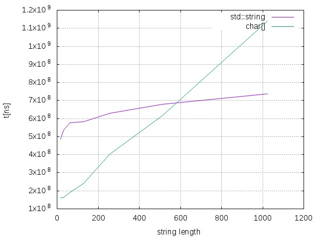
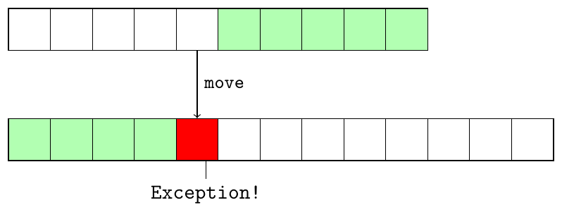
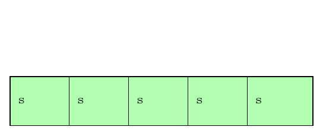

title: Modern C++
class: animation-fade
layout: true

---

class: impact

# {{title}}
## Practical uses of C++17 features

---

class: chapter

## `const char*`
## `std::string`
## `std::string_view`

---

## C-string vs `std::string`

.center[
The general recommendation is: use `std::string` and avoid using C raw string.

but...
]

--

.center[
... sometimes you just can't
]

---

## Interfacing with C API

.row[
.col-6[
``` cpp
void configureNetworkInterface(const std::string& ifname)
{
    ifreq ifr ;
    strcpy(ifr.ifr_name,ifname.cstr());
}
```
]
.col-6[
```
struct ifreq {
    char ifr_name[IFNAMSIZ]; /* Interface name */
    /*...*/
};
```
]
]

--
.emph[
Who guarantees that ifname fits into the fixed-size `ifr_name` buffer?
]
---

## Interfacing with C API

``` cpp
void configureNetworkInterface(const std::string& ifname)
{
    ifreq ifr ;
    strncpy(ifr.ifr_name,ifname.cstr(), sizeof(ifr.ifr_name));
}
```

--

.emph[
Less bad but still wrong - buffer is not null-terminated.
]

---

## Interfacing with C API

``` cpp
void configureNetworkInterface(const std::string& ifname)
{
    ifreq ifr ;
    strncpy(ifr.ifr name,ifname.cstr(), sizeof(ifr.ifr_name) - 1);
    ifr.ifrname[sizeof(ifr.irfname) − 1] = ’ \0 ’ ;
}
```

--
.emph[
Correct but could be inefficient.
]
---

## Safe string copy

.row[
.col-6[
``` cpp
size_t safeStringCopy(const std::string& src, char* dest, size_t destLen)
{
    if (destLen == 0)
    {
        return 0;
    }
    auto len = std::min(src.length(), destLen - 1);
    std::copy_n(src.begin(), len, dest);
    dest[len] = '\0';
    return len;
}

```
]

.col-6[
- destination buffer is passed to the function and coping never reaches beyond it
- the null terminator is added at the end
]
]

--

.col-6[
``` cpp
void configureNetworkInterface(const std::string& ifname)
{
    ifreq ifr;
    safeStringCopy(ifname, ifr_ifr_name, sizeof(ifr.ifr_name));
}
```
]

---
class: middle

.center[
.alert[
Never use `strcpy` to copy a string which lengh is not known at compile time into
    a fixed size array.
]
]
---

## Fixed size buffer copy

.row[
.col-6[
```
const int SIZE = 20;

char s[SIZE];
strcpy(s, "Sometimes seems OK");
```
]
]

--

.row[
.col-6[
```
*const int SIZE = 20;

char s[SIZE];
strcpy(s, "Sometimes seems NOT OK");
```
]
]

---

## Fixed size buffer copy

```
size_t safeStringCopy(const std::string& src, char* dest, size_t destLen)
{
    if (destLen == 0)
    {
        return 0;
    }
    auto len = std::min(src.length(), destLen - 1);
    std::copy_n(src.begin(), len, dest);
    dest[len] = '\0';
    return len;
}
```
```
const int SIZE = 20;

char s[SIZE];
safeStringCopy(std::string{"Sometimes seems NOT OK"}, s, sizeof(s));
```
--

.emph[
Unnecessary string allocation.
]

---

## Fixed size buffer copy

```
size_t safeStringCopy(const char* src, char* dest, size_t destLen)
{
    if (destLen == 0)
    {
        return 0;
    }
    auto len = std::min(strlen(src), destLen - 1);
    std::copy_n(src, len, dest);
    dest[len] = '\0';
    return len;
}
```
Second overload taking `const char*`

--
```
const int SIZE = 20;

char s[SIZE];
safeStringCopy("Sometimes seems NOT OK", s, sizeof(s));
```

---

.col-6[
```
size_t safeStringCopy(const std::string& src, char* dest, size_t destLen)
{
    if (destLen == 0)
    {
        return 0;
    }
    auto len = std::min(src.length(), destLen - 1);
    std::copy_n(src.begin(), len, dest);
    dest[len] = '\0';
    return len;
}
```
]

--

.col-6[
```
size_t safeStringCopy(const char* src, char* dest, size_t destLen)
{
    if (destLen == 0)
    {
        return 0;
    }
    auto len = std::min(strlen(src), destLen - 1);
    std::copy_n(src, len, dest);
    dest[len] = '\0';
    return len;
}
```

]

---

.row[
.col-6[
```
size_t safeStringCopy(const std::string& src, char* dest, size_t destLen)
{
    if (destLen == 0)
    {
        return 0;
    }
*   auto len = std::min(src.length(), destLen - 1);
    std::copy_n(src.begin(), len, dest);
    dest[len] = '\0';
    return len;
}
```
]


.col-6[
```
size_t safeStringCopy(const char* src, char* dest, size_t destLen)
{
    if (destLen == 0)
    {
        return 0;
    }
*   auto len = std::min(strlen(src), destLen - 1);
    std::copy_n(src, len, dest);
    dest[len] = '\0';
    return len;
}
```
]
]

Implement the first function in terms of the second ?

.row[
.col-6[
```
size_t safeStringCopy(const std::string& src, char* dest, size_t destLen)
{
    return safeStringCopy(src.c_str(), dest, destLen);
}
```
]


.col-6[
```
size_t safeStringCopy(const char* src, char* dest, size_t destLen)
{
    if (destLen == 0)
    {
        return 0;
    }
    auto len = std::min(strlen(src), destLen - 1);
    std::copy_n(src, len, dest);
    dest[len] = '\0';
    return len;
}
```
]
]

--

Efficiency issue: calculate length of `std::string`

---

## `std::string_view`

.row[
.col-6[
```
constexpr basic_string_view() noexcept;
constexpr basic_string_view(const basic_string_view& other) noexcept;
constexpr basic_string_view(const CharT* s, size_type count);
constexpr basic_string_view(const CharT* s);
```
]

.col-6[
.small[
- 'reference' to const character sequences
- provides `std::string`-like interface without owning the underlying memory
]
]
]

--

```
std::string s = "Simple string";
std::string_view sv = s;
std::string_view sub_sv = sv.substr(0, 5); // sub_sv == "Simple"
```
--

```
const char* s = "Raw string";
std::string_view sv = s;
sv.remove_prefix(4);  // sv == "string";

```


---

```
size_t safeStringCopy(std::string_view src, char* dest, size_t destLen)
{
    if (destLen == 0)
    {
        return 0;
    }
    auto len = std::min(src.length(), destLen - 1);
    std::copy_n(src.begin(), len, dest);
    dest[len] = '\0';
    return len;
}
```

.center[ Single function which serves both `std::string` and raw string ]

---

class: middle

.note[
Prefer passing **`std::string_view`** to a function over **`const std::string&`**
]
---

## C-string vs `std::string`
.row[
.col-5[

```
class WithString
{
    std::string mName;
};


std::vector<WithString> withString;

```
]

.col-5[

```
class WithCString
{
    char mName[20];
};


std::vector<WithCString> withCString;

```
]
]

--
.row[
.center[
What is more efficient?
]
]

---
.row[
.center[
.col-6[
### `std::find` ]]
.center[
.col-6[
### `std::sort` ]]
]

.row[
.col-6[

]

.col-6[

]
]
---

```
class WithCString
{
    char mName[20];
public:
    const char* name() const {return mName;}
};

```

--
.emph[
Returns raw string forcing user to use raw string functions.
]

---

```
class WithCString
{
    char mName[20];
public:
    std::string name() const {return std::string{mName, 20};}
};

```

--
.emph[
Returns `std::string` but requires a new copy of the original string.
]

---

```
class WithCString
{
    char mName[20];
public:
    std::string_view name() const {return std::string_view{mName, 20};}
};

```

--
.center[
Returns `std::string_view`: no copy + nice string-like interface.
]

---
class: middle, center

.note[
When a class keeps string data as char array the accessor member function should return
**`std::string_view`** to that array.
]

---

## Dangling `std::string_view`

```
std::string_view sv;
{
    std::string s = "some string";
    sv = s;
}
std::cout << sv << '\n';
```

--
```
std::string_view sv = std::string{"some string"};
std::cout << sv << '\n';
```
--
```
std::string_view sv;
{
    char s[] = "some string";
    sv = s;
}
std::cout << sv << '\n';
```
--

.alert[
**`std::string_view`** is a non-owning reference to the underlying string.
If the string is deleted the `string_view` dangles.
]

---

## `std::span<T>` (C++20)

- an iterable view of the contiguous sequence of objects
- does not own the underlying memory

--

```
std::vector<int> v = {1,2,3,4,5};
std::span<int> s(v);

std::span<int> sub_s = s.subspan(0,2); // {1,2,3}

```

---

class: chapter

`decltype`

.greyout[

`<type_traits>`

`std::integral_constant`

`std::forward`
]

---
## `decltype`

.row[
.col-6[

```
int i = 10;
using T = decltype(i);
```
]
.col-6[
- `T` is `int`
]
]

--

.row[
.col-6[

```
int i = 10;
using T = decltype(i+20);
```

]
.col-6[
- `T` is `int`
]
]

--

.row[
.col-6[

```
int i = 10;
using T = decltype(i==10);
```

]
.col-6[
- `T` is `bool`
]
]

--

.row[
.col-6[

```
std::map<int, string> m;
using T = decltype(m);
```

]
.col-6[
- `T` is `std::map<int, string>`
]
]

--

.row[
.col-6[

```
std::map<int, string> m;
using T = decltype(m)::key_type;
```

]
.col-6[
- `T` is `int`
]
]

--

---
## `decltype`

.row[
.col-6[

```
struct Foo
{
    std::string toString() const;
};

using T = decltype(Foo().toString());
```

]
.col-6[
- `T` is `std::string`
]
]

--

.row[
.col-6[

```
struct Foo
{
    Foo(int i);
    std::string toString() const;
};

using T = decltype(Foo().toString());
```

]
.col-6[
- compiler error
]
]


---
## `decltype`

.row[
.col-6[

```
struct Foo
{
    std::string toString() const;
};

using T = decltype(Foo().toString());
```

]
.col-6[
- `T` is `std::string`
]
]


.row[
.col-6[

```
struct Foo
{   
    Foo(int i);
    std::string toString() const;
};

using T = decltype(Foo(10).toString());
```

]
.col-6[
- `T` is `std::string`
]
]

--

.row[
.col-6[

```
struct Foo
{
    Foo(int i);
    std::string toString() const;
};

using T = decltype(std::declval<Foo>().toString());
```

]
.col-6[
- `T` is `std::string`
]
]

---

class: chapter

.greyout[
`decltype`
]

`<type_traits>`

.greyout[

`std::integral_constant`

`std::forward`
]

---

## `<type_traits>`

- C++11 header file defining set of meta-functions to examine type properties
- type traits are being used in generic implementations of algorithms taylored for
  types with specific properties
- types are very often used with `std::enable_if` and `if constexpr`

Some examples:


```
bool v1 = std::is_same_v<std::string, std::string>; // v1 == true
bool v2 = std::is_same_v<std::string, int>; // v2 == false

bool v1 = std::is_pointer_v<int>; // v1 == false
bool v2 = std::is_pointer_v<int*>; // v2 == true

bool v1 = std::is_trivially_copyable_v<std::string>; // v1 == false
bool v2 = std::is_trivially_copyable_v<double>; // v2 == true

bool v1 = std::is_convertible<const char*, std::string>; // v1 == true
bool v2 = std::is_convertible<int, std::string>; // v2 == false

```

--

.center[...and many more]

https://en.cppreference.com/w/cpp/header/type_traits

---

class: chapter

.greyout[
`decltype`

`<type_traits>`

]

`std::integral_constant`

.greyout[
`std::forward`
]

---
## `std::integral_constant`

```
template <typename T, T v>
integral_constant
{
    static constexpr T value = v;
};
```
--

```
using const_5 = std::integral_constant<int, 5>;
using const_6 = std::integral_constant<int, 6>;

std::cout << const_5::value << '\n'; // prints 5
std::cout << const_6::value << '\n'; // prints 6

```

--

```
using true_type  = integral_constant<bool, true>;
using false_type = integral_constant<bool, false>;
```
--

```
template <typename T>
struct is_pointer : false_type {};

template <typename T>
struct is_pointer<T*> : true_type {};

```

--
```
bool v1 = std::is_pointer<int>::value; // v1 == false
bool v2 = std::is_pointer<int*>::value; // v2 == true

```

--
```
template <typename T>
constexpr bool is_pointer_v = std::is_pointer<T>::value;
```
--

```
bool v1 = std::is_pointer_v<int>;  // v1 == false
bool v2 = std::is_pointer_v<int*>; // v2 == true
```

---

class: chapter

.greyout[
`decltype`

`<type_traits>`


`std::integral_constant`
]

`std::forward`

---
layout: true

.row[
.col-6[
```
class Foo
{
public:
    Foo() = default;

    Foo(const Foo& other) { std::cout << "Copy Foo\n"; }

    Foo(Foo&& other) { std::cout << "Move Foo\n"; }
};

class Bar
{
    Foo foo;
public:
    Bar(const Foo& f) : foo(f) {}
    Bar(Foo&& f) : foo(std::move(f)) {}
};

```
]]

---

--

.row[
.col-6[
```
unique_ptr<Bar> bar1{new Bar{Foo{}}}; // r-value reference

Foo foo;
unique_ptr<Bar> bar2{new Bar{foo}}; // l-value reference
```
]]

--

.row[
.col-6[
```bash
Move Foo

Copy Foo
```
]]


---
layout: false

layout: true

.row[
.col-6[
```
class Foo
{
public:
    Foo() = default;

    Foo(const Foo& other) { std::cout << "Copy Foo\n"; }

    Foo(Foo&& other) { std::cout << "Move Foo\n"; }
};

class Bar
{
    Foo foo;
public:
    Bar(const Foo& f) : foo(f) {}
    Bar(Foo&& f) : foo(std::move(f)) {}
};

```
]

.col-6[
```
template<typename T, typename... Args>
unique_ptr<T> make_unique(Args&&... args)
{
    return std::unique_ptr<T>(new T{args...});
}
```
]
]

---

--

.row[
.col-6[
```
unique_ptr<Bar> bar1{new Bar{Foo{}}}; // r-value reference

Foo foo;
unique_ptr<Bar> bar2{new Bar{foo}}; // l-value reference
```
]]


.row[
.col-6[
```bash
Move Foo

Copy Foo
```
]]

---

.row[
.col-6[
```
unique_ptr<Bar> bar1{new Bar{Foo{}}}; // r-value reference

Foo foo;
unique_ptr<Bar> bar2{new Bar{foo}}; // l-value reference
```
]
.col-6[
```
auto bar1 = make_unique<Bar>(Foo{}); // r-value reference

Foo foo;
auto bar2 = make_unique<Bar>(foo); // l-value reference

```
]
]


.row[
.col-6[
```bash
Move Foo

Copy Foo
```
]]

---

.row[
.col-6[
```
unique_ptr<Bar> bar1{new Bar{Foo{}}}; // r-value reference

Foo foo;
unique_ptr<Bar> bar2{new Bar{foo}}; // l-value reference
```
]
.col-6[
```
auto bar1 = make_unique<Bar>(Foo{}); // r-value reference

Foo foo;
auto bar2 = make_unique<Bar>(foo); // l-value reference

```
]
]


.row[
.col-6[
```bash
Move Foo

Copy Foo
```
]
.col-6[
```bash
*Copy Foo

Copy Foo
```
]
]

--

.center[.emph[ Where does the extra copy come from? ]]

---
layout: false

## Forwarding reference

There are special template type deduction rules for a function taking a *forwarding reference*:
```
template <typename T>
void func(T&& value);
```
--

- When called with *l-value* of type `Foo` T is deduced to `Foo&`

.row[
.col-6[
```
Foo foo;
func(foo); // T == Foo&
```
]

.col-6[
```
void func(Foo& && value); 
// As per reference collapsing rules this becomes:
void func(Foo& value);

```
]
]

--

- When called with *r-value* of type `Foo` T is deduced to `Foo`

.row[
.col-6[
```
func(Foo{}); // T == Foo
```
]

.col-6[
```
void func(Foo&& value); 

```
]
]

---

## Forwarding reference

.row[
.col-6[
```
void doFoo(const Foo&);
void doFoo(Foo&&);

template <typename T>
void func(T&& value)
{
    doFoo(value);
}
```
]


.col-6[
```
Foo foo;
func(foo);   // doFoo(const Foo&) is called

func(Foo{}); // doFoo(const Foo&) is called
```
]
]

--

.row[
.col-6[
```
void doFoo(const Foo&);
void doFoo(Foo&&);

template <typename T>
void func(T&& value)
{
    doFoo(std::forward<T>(value));
}
```
]


.col-6[
```
Foo foo;
func(foo);   // doFoo(const Foo&) is called

func(Foo{}); // doFoo(Foo&&) is called
```
]
]

--

.center[Perfect forwarding]

---

layout: true

.row[
.col-6[
```
class Foo
{
public:
    Foo() = default;

    Foo(const Foo& other) { std::cout << "Copy Foo\n"; }

    Foo(Foo&& other) { std::cout << "Move Foo\n"; }
};

class Bar
{
    Foo foo;
public:
    Bar(const Foo& f) : foo(f) {}
    Bar(Foo&& f) : foo(std::move(f)) {}
};

```
]

.col-6[
```
template<typename T, typename... Args>
unique_ptr<T> make_unique(Args&&... args)
{
    return std::unique_ptr<T>(new T{args...});
}
```
]
]

---

.row[
.col-6[
```
unique_ptr<Bar> bar1{new Bar{Foo{}}}; // r-value reference

Foo foo;
unique_ptr<Bar> bar2{new Bar{foo}}; // l-value reference
```
]
.col-6[
```
auto bar1 = make_unique<Bar>(Foo{}); // r-value reference

Foo foo;
auto bar2 = make_unique<Bar>(foo); // l-value reference

```
]
]


.row[
.col-6[
```bash
Move Foo

Copy Foo
```
]
.col-6[
```bash
*Copy Foo

Copy Foo
```
]
]

---
layout: false


layout: true

.row[
.col-6[
```
class Foo
{
public:
    Foo() = default;

    Foo(const Foo& other) { std::cout << "Copy Foo\n"; }

    Foo(Foo&& other) { std::cout << "Move Foo\n"; }
};

class Bar
{
    Foo foo;
public:
    Bar(const Foo& f) : foo(f) {}
    Bar(Foo&& f) : foo(std::move(f)) {}
};

```
]

.col-6[
```
template<typename T, typename... Args>
unique_ptr<T> make_unique(Args&&... args)
{
*   return std::unique_ptr<T>(new T{std::forward<Args>(args)...});
}
```
]
]

---

.row[
.col-6[
```
unique_ptr<Bar> bar1{new Bar{Foo{}}}; // r-value reference

Foo foo;
unique_ptr<Bar> bar2{new Bar{foo}}; // l-value reference
```
]
.col-6[
```
auto bar1 = make_unique<Bar>(Foo{}); // r-value reference

Foo foo;
auto bar2 = make_unique<Bar>(foo); // l-value reference

```
]
]


.row[
.col-6[
```bash
Move Foo

Copy Foo
```
]
.col-6[
```bash
*Move Foo

Copy Foo
```
]
]

---
layout: false

class: chapter

## `std::optional<T>`

---

# `std::optional<T>`

- container which can be empty or hold a single value of type T

--

- has pointer-like interface
    * `operator *`
    * `operator ->`
--

- no heap allocation

--
- based on the *Monad* concept in functional programming languages
    * Haskell `Maybe` monad

---
layout: true

# `std::optional<T>`

---

.col-6[
```
*std::optional<int> empty = std::nullopt;
EXPECT_FALSE(empty.has_value());
EXPECT_THROW(empty.value(), std::bad_optional_access);
EXPECT_EQ(10, empty.value_or(10));
int x = *empty; // undefined behavior


*std::optional<int> value = 123;
EXPECT_TRUE(value.has_value());
EXPECT_EQ(123, value.value());
EXPECT_EQ(123, value.value_or(10));
EXPECT_EQ(123, *value);
```
]

.col-6[
]

---

.col-6[
```
std::optional<int> empty = std::nullopt;
*EXPECT_FALSE(empty.has_value());
EXPECT_THROW(empty.value(), std::bad_optional_access);
EXPECT_EQ(10, empty.value_or(10));
int x = *empty; // undefined behavior


std::optional<int> value = 123;
*EXPECT_TRUE(value.has_value());
EXPECT_EQ(123, value.value());
EXPECT_EQ(123, value.value_or(10));
EXPECT_EQ(123, *value);

```
]

.col-6[
]

---

.col-6[
```
std::optional<int> empty = std::nullopt;
EXPECT_FALSE(empty.has_value());
*EXPECT_THROW(empty.value(), std::bad_optional_access);
EXPECT_EQ(10, empty.value_or(10));
int x = *empty; // undefined behavior


std::optional<int> value = 123;
EXPECT_TRUE(value.has_value());
*EXPECT_EQ(123, value.value());
EXPECT_EQ(123, value.value_or(10));
EXPECT_EQ(123, *value);

```
]

.col-6[
]

---

.col-6[
```
std::optional<int> empty = std::nullopt;
EXPECT_FALSE(empty.has_value());
EXPECT_THROW(empty.value(), std::bad_optional_access);
*EXPECT_EQ(10, empty.value_or(10));
int x = *empty; // undefined behavior


std::optional<int> value = 123;
EXPECT_TRUE(value.has_value());
EXPECT_EQ(123, value.value());
*EXPECT_EQ(123, value.value_or(10));
EXPECT_EQ(123, *value);

```
]

.col-6[
]

---

.col-6[
```
std::optional<int> empty = std::nullopt;
EXPECT_FALSE(empty.has_value());
EXPECT_THROW(empty.value(), std::bad_optional_access);
EXPECT_EQ(10, empty.value_or(10));
*int x = *empty; // undefined behavior


std::optional<int> value = 123;
EXPECT_TRUE(value.has_value());
EXPECT_EQ(123, value.value());
EXPECT_EQ(123, value.value_or(10));
*EXPECT_EQ(123, *value);

```
]

.col-6[
]

---
layout: false

layout: true

# `std::optional<T>`
### in-place construction

.row[
.col-6[
```
struct Foo
{
    Foo(std::string s, int i);
};

```
]
]

---

.row[
.col-6[
```
std::optional<Foo> opt{std::in_place, "Foo", 10};
```
]
]

---

.row[
.col-6[
```
std::optional<Foo> opt{std::in_place, "Foo", 10};
*auto opt2 = std::make_optional<Foo>("Foo, 10");
EXPECT_EQ(*opt1, *opt2);
```

]
]

---

.row[
.col-6[
```
std::optional<Foo> opt{std::in_place, "Foo", 10};
*auto opt2 = std::make_optional<Foo>("Foo, 10");
EXPECT_EQ(*opt1, *opt2);
```
]

.col-6[
```
template <typename T, typename... Args>
std::optional<T> make_optional(Args&&... args)
{
    return std::optional<T>(std::in_place, std::forward<Args>(args)...);
}
```
]
]

---
layout: false


layout: true

# Infamous `atoi`

.row[
.col-6[
```
int atoi(const char *str);

```
]
]

--

---

.row[
.col-6[
```
auto x1 = atoi("123"); // x1 = 123
auto x3 = atoi("123xxx"); // x3 = 123;
auto x2 = atoi("0"); // x2 = 0
auto x4 = atoi("xxx123"); // x4 = 0
auto x5 = atoi(nullptr); // undefined behavior
```
]
]

---

.row[
.col-6[
```
auto x1 = atoi("123"); // x1 = 123
auto x3 = atoi("123xxx"); // x3 = 123;
*auto x2 = atoi("0"); // x2 = 0
*auto x4 = atoi("xxx123"); // x4 = 0
auto x5 = atoi(nullptr); // undefined behavior
```
]
]


.center[.emph[0 return value is ambigous.]]

---
layout: false


class: middle, center

What's the best way of returning parsing status along with the converted number?

---
layout: false

layout: true

### status as return value, result as output argument

.row[
.col-6[

```
bool my_atoi(const char* str, int& val)
{
    if (str == nullptr || !std::isdigit(str[0]) || !str[0] != '-') 
    { 
        return false; 
    }
    val = atoi(str);
    return val;
}
```
]
]

---

.row[
.col-6[
```
int x = 0;
if (my_atoi(str, x))
{
    //...
}

```
]
]

--

.center[.emph[ Declaring `x` before it can be assigned in the function. ]]

---

.row[
.col-6[
```
*int x;
if (my_atoi(str, x))
{
    //...
}

*int y = x;

```
]
]

--

.center[.emph[ Common mistake: using unitialized value ]]

---

.row[
.col-6[
```
if (int x = 0; my_atoi(str, x))
{
    //...
}

```
]
]

.center[C++17 feature: initializer in `if statement` may be handy]


---
layout: false

layout: true

### result as return value, status as output argument

.row[
.col-6[
```
int my_atoi(const char* str, bool& ok)
{
    if (str == nullptr || !std::isdigit(str[0]) || !str[0] != '-')
    {
        ok = false;
        return 0;
    }
    ok = true;
    return atoi(str);
}
```
]
]

--

---

.row[
.col-6[
```
bool ok = false;
int x = my_atoi(str, ok);
if (ok)
{
    //...
}
```
]
]

--

.center[.emph[
Declaring `ok` before it can be initialized with the function output.
]]

---

.row[
.col-6[
```
bool ok = false;
if (int x = my_atoi(ok); ok)
{
    //...
}
```
]
]


.center[Use of `if statement` initializer]

---
layout: false

layout: true

### result & status as return value (`std::pair`)

.row[
.col-6[
```
std::pair<bool, int> my_atoi(const char* str)
{
    if (str == nullptr || !std::isdigit(str[0]) || !str[0] != '-')
    {
        return {false, 0};
    }
    return {true, atoi(str)};
}
```
]
]

--

---

.row[
.col-6[
```
auto ret = my_atoi(str);
if (ret.first)
{
    int x = ret.second;
}
```
]
]

--
.center[.emph[Need to remember what is first and what is second.]]

---

.row[
.col-6[
```
if (auto ret = my_atoi(str); ret.first)
{
    int x = ret.second;
}
```
]
]

.center[Use of `if statement` initializer]


---

.row[
.col-6[
```
auto [valid, value] = my_atoi(str);
if (valid)
{
    int x = value;
}
```
]
]

.center[C++17 structured binding]

---
layout: false


layout: true

## Structured binding

.row[
.col-6[
```
struct Foo
{
    int i;
    std::string s;
    double d;
};

Foo makeFoo(int i, std::string s, double d)
{
    return Foo{i, std::move(s), d};
}
```
]]

---

.row[
.col-6[
```
Foo foo = makeFoo(10, "foo", 0.5);
auto i = foo.i;
auto s = foo.s;
auto d = foo.d;

```
]

.col-6[
- "traditional" way of "unpacking" a struct
]

]

---

.row[
.col-6[
```
auto [i,s,d] = makeFoo(10, "foo", 0.5);
```
]

.col-6[
- structured binding directly assigning members of `Foo` to variables `i, s, d`
]
]

---

.row[
.col-6[
```
Foo foo = makeFoo(10, "foo", 0.5);
auto& [i,s,d] = foo;

```
]
.col-6[
- structured binding assigning references to members of `Foo`
]
]

---

.row[
.col-6[
```
auto& [i,s,d] = makeFoo(10, "foo", 0.5);

```
]
.col-6[
- compiler error: cannot assign temporary variable to non-cost l-value reference
]
]

---
.row[
.col-6[
```
const auto& [i,s,d] = makeFoo(10, "foo", 0.5);

```
]
.col-6[
- Okay: const reference extend the lifetime of the temporary
]
]

---
layout: false

layout: true


### result & status as return value (`std::pair`)

.row[
.col-6[
```
std::pair<bool, int> my_atoi(const char* str)
{
    if (str == nullptr || !std::isdigit(str[0]) || !str[0] != '-')
    {
        return {false, 0};
    }
    return {true, atoi(str)};
}
```
]
]

---

.row[
.col-6[
```
auto [valid, value] = my_atoi(str);
if (valid)
{
    int x = value;
}
```
]
]

.center[C++17 structured binding]

---

.row[
.col-6[
```
if (auto [valid, value] = my_atoi(str); valid)
{
    int x = value;
}
```
]
]

.center[C++17 structured binding with `if statement` initializer]

---
layout: false


### result & status as return value (`std::optional`)

.row[
.col-6[
```
std::optional<int> my_atoi(const char* str)
{
    if (str == nullptr || !std::isdigit(str[0]) || !str[0] != '-') 
    { 
        return std::nullopt; 
    }
    return atoi(str);
}
```
]]

--

.row[
.col-6[
```
if (auto v = my_atoi(str); v)
{
    auto value = *v;
}

```
]]

--

.row[
.col-6[
```
auto x1 = my_atoi("123"); // *x1 = 123
auto x3 = my_atoi("123xxx"); // *x3 = 123;
*auto x2 = my_atoi("0"); // *x2 = 0
*auto x4 = my_atoi("xxx123"); // x4 = nullopt
auto x5 = my_atoi(nullptr); // x5 = nullopt

```
]]

---

.row[
.col-6[
```
int main(int argc, const char* argv[])
{
    auto x = my_atoi(argv[1]);
    if (!x)
    {
        std::cerr << "Number expected\n";
        return -1;
    }
    std::cout << x.value() << '\n';
}
```
]
]

.center[`std::optional` comes handy when parsing command line or files]

---
class: middle

`bool my_atoi(const char* s, int& i)`;

`int my_atoi(const char* s, bool& valid)`;

`std::pair<bool, int> my_atoi(const char* s)`;

`std::optional<int> my_atoi(const char* s)`;

---

class: middle, center

.note[
Use `std::optional<T>` as a return type as an alternative to throwing exception when correct value cannot be returned.
]

---
layout: true
class: inverse

## Optional data members

.col-5[
```json
"parameters" : [
{
    "name"   : "temperature",
    "access" : "read-only",
    "type"   : "integer"
},
{
    "name"   : "power",
    "access" : "read-only",
    "type"   : "integer",
*   "range"  : {"min": -10, "max": 10}
}
]

```
]

---

.col-5[
```cpp
struct Parameter
{
    std::string name;
    Access access;
    Type type;
    // range ?
};

```
]

---

.col-5[
```cpp
struct Parameter
{
    std::string name;
    Access access;
    Type type;
    std::pair<int, int> range;
    bool hasRange = false;
};

```
]

---

.col-5[
```cpp
struct Parameter
{
    std::string name;
    Access access;
    Type type;
    std::optional<std::pair<int, int>> range;
};

```
]

---

.col-7[
```cpp
struct Parameter
{
    std::string name;
    Access access;
    Type type;
    std::optional<std::pair<int, int>> range;
};

```

```
void print(const Parameter& p)
{
    std::cout << "name=" << p.name << '\n'; 
    std::cout << "access=" << p.access << '\n'; 
    std::cout << "type=" << p.type << '\n'; 
    if (auto range = p.range; range)
        std::cout << "range=" << range->first << ","  << range.second << '\n';
}
```
]

---
layout: false


layout: true
class: inverse

# `std::optional<T>`
### "Monadic" interface


Many times we pass a result of a function to another function:

```
Shape makeShape(std::vector<Points> points);

Figure makeFigure(Shape shape);

Painting paint(const Figure& figure);

void display(const Painting& painting);

```
---

```
Shape shape = makeShape({{1,2}, {3,3}, {1,0}});
Figure figure = makeFigure(shape);
Painting painting = paint(figure);
display(painting);

```
---
```
display(paint(makeFigure(makeShape({{1,2}, {3,3}, {1,0}}))));
```

---
layout: false


layout: true
class: inverse


```
std::optional<Shape> makeShape(std::vector<Points> points);

std::optional<Figure> makeFigure(Shape shape);

std::optional<Painting> paint(const Figure& figure);

void display(const Painting& painting);

```

---

--

```
*auto shape = makeShape({{1,2}, {3,3}, {1,0}});
if (shape)
{
*   auto figure = makeFigure(*shape);
    if(figure)
    {
*       auto painting = paint(*figure);
        if (painting)
        {
*           display(painting);
        }
    }

}

```

--

.center[.emph["Noisy code" due to error checking.]]

---


```
*auto shape = makeShape({{1,2}, {3,3}, {1,0}});

if (!shape)
{
    return;
}

*auto figure = makeFigure(*shape);

if(!figure)
{
    return;
}

*auto painting = paint(*figure);
if (!painting)
{
    return;
}

*display(*painting);

```

.center[.emph["Noisy code" due to error checking.]]

---

```
auto shape    = makeShape({{1,2}, {3,3}, {1,0}});
auto figure   = bind(shape, makeFigure);
auto painting = bind(figure, paint);

if (painting)
{
    display(*painting);
}
```

--
.center[What does the function `bind` do ?]

---
layout: false


layout: true
class: inverse

```
template <typename T, typename F>
auto bind(const std::optional<T>& opt, F&& f) -> std::invoke_result_t<F, T>
{
    if (opt.has_value())
    {
        return f(*opt);
    }
    return std::nullopt;
}
```

---

--

```
auto shape = makeShape({{1,2}, {3,3}, {1,0}});
*auto figure = bind(shape, makeFigure);
auto painting = bind(figure, paint);
```
---


```
auto shape = makeShape({{1,2}, {3,3}, {1,0}});
auto figure = bind(shape, makeFigure);
*auto painting = bind(figure, paint);
```

---
layout: false


class: chapter

## `std::variant<Ts...>`

---

## `std::variant<Ts...>`

- container which can be empty or hold a single value of one of the types `Ts`

--

- is type safe: aware of type it is holding

--

- can store any type

--

- no heap allocation

---

.row[
.col-6[
```
union Union
{
    int i;
    double d;
    char ch[10];
};

Union u;
u.d = 0.5;
```
]

.col-6[
```
using Variant = std::variant<int, double, std::string>;

Variant var = 0.5;
```
]
]

.row[
.col-6[

- POD types only
- not aware of the type it is holding

]

.col-6[
- any types
- aware of the type it is holding
]
]

--
.row[
.col-6[.center[.text-red[Type **un**safe]]]
.col-6[.center[.text-green[Type safe]]]
]

---

layout: true

```
using Variant = std::variant<int, double, std::string>;

Variant var = "string in variant"s;
```

---

```
*EXPECT_TRUE(std::hold_alternative<std::string>(var));
EXPECT_FALSE(std::hold_alternative<int>(var));
EXPECT_EQ(2, var.index());
EXPECT_EQ("string in variant", std::get<std::string>(var));
EXPECT_THROW(std::get<int>(var), std::bad_variant_access);
EXPECT_EQ("string in variant", *std::get_if<std::string>(var));
EXPECT_EQ(nullptr, std::get_if<int>(var));

```

---

```
EXPECT_TRUE(std::hold_alternative<std::string>(var));
*EXPECT_FALSE(std::hold_alternative<int>(var));
EXPECT_EQ(2, var.index());
EXPECT_EQ("string in variant", std::get<std::string>(var));
EXPECT_THROW(std::get<int>(var), std::bad_variant_access);
EXPECT_EQ("string in variant", *std::get_if<std::string>(var));
EXPECT_EQ(nullptr, std::get_if<int>(var));

```
---

```
EXPECT_TRUE(std::hold_alternative<std::string>(var));
EXPECT_FALSE(std::hold_alternative<int>(var));
*EXPECT_EQ(2, var.index());
EXPECT_EQ("string in variant", std::get<std::string>(var));
EXPECT_THROW(std::get<int>(var), std::bad_variant_access);
EXPECT_EQ("string in variant", *std::get_if<std::string>(var));
EXPECT_EQ(nullptr, std::get_if<int>(var));

```
---

```
EXPECT_TRUE(std::hold_alternative<std::string>(var));
EXPECT_FALSE(std::hold_alternative<int>(var));
EXPECT_EQ(2, var.index());
*EXPECT_EQ("string in variant", std::get<std::string>(var));
EXPECT_THROW(std::get<int>(var), std::bad_variant_access);
EXPECT_EQ("string in variant", *std::get_if<std::string>(var));
EXPECT_EQ(nullptr, std::get_if<int>(var));

```
---

```
EXPECT_TRUE(std::hold_alternative<std::string>(var));
EXPECT_FALSE(std::hold_alternative<int>(var));
EXPECT_EQ(2, var.index());
EXPECT_EQ("string in variant", std::get<std::string>(var));
*EXPECT_THROW(std::get<int>(var), std::bad_variant_access);
EXPECT_EQ("string in variant", *std::get_if<std::string>(var));
EXPECT_EQ(nullptr, std::get_if<int>(var));

```
---

```
EXPECT_TRUE(std::hold_alternative<std::string>(var));
EXPECT_FALSE(std::hold_alternative<int>(var));
EXPECT_EQ(2, var.index());
EXPECT_EQ("string in variant", std::get<std::string>(var));
EXPECT_THROW(std::get<int>(var), std::bad_variant_access);
*EXPECT_EQ("string in variant", *std::get_if<std::string>(var));
EXPECT_EQ(nullptr, std::get_if<int>(var));

```
---

```
EXPECT_TRUE(std::hold_alternative<std::string>(var));
EXPECT_FALSE(std::hold_alternative<int>(var));
EXPECT_EQ(2, var.index());
EXPECT_EQ("string in variant", std::get<std::string>(var));
EXPECT_THROW(std::get<int>(var), std::bad_variant_access);
EXPECT_EQ("string in variant", *std::get_if<std::string>(var));
*EXPECT_EQ(nullptr, std::get_if<int>(var));

```


---
layout: false

.col-6[
.small[
- Default type is the first type specified.
]]

.col-6[
```
struct Foo
{

};

struct Bar
{

};

std::variant<Foo, Bar> v; // v contains type Foo
```
]

---

.col-6[
.small[
.greyout[
- Default type is the first type specified.]
- The first type must be *default constructible*
]]

.col-6[
```
struct Foo
{
    Foo(int i);
};

struct Bar
{
    Bar(int i);
};

std::variant<Foo, Bar> v; // compiler error
```
]

---

.col-6[
.small[
.greyout[
- Default type is the first type specified.

- The first type must be *default constructible*]
- `std::monostate` can be used if none of the types have default constructor
]
]

.col-6[
```
struct Foo
{
    Foo(int i);
};

struct Bar
{
    Bar(int i);
};

std::variant<std::monostate, Foo, Bar> v; // type of v is monostate
```
]

---

## Visitation

```
using Variant = std::variant<int, double, std::string>;

void print(const Variant& v)
{
    if (std::holds_alternative<int>(v))
    {
        std::cout << "integer:" << std::get<int>(v);
    }
    else if (std::holds_alternative<double>(v))
    {
        std::cout << "double:" << std::get<double>(v);
    }
    else if (std::holds_alternative<std::string>(v))
    {
        std::cout << "string:" << std::get<std::string>(v);
    }
}

Variant v = 1234;
print(v);

```

---

## Visitation

```
using Variant = std::variant<int, double, std::string>;

struct print
{
    void operator()(int v) const
    {
        std::cout << "integer:" << v;
    }

    void operator()(double v) const
    {
        std::cout << "double:" << v;
    }

    void operator()(const std::string& v) const
    {
        std::cout << "string:" << v;
    }
};

Variant v = 1234;
std::visit(print{}, v);

```

---

class: center


Calculate the impedance of the circuit for any combination of the R, L, C elements.

\\[ Z = {1 \over {1 \over Z_1} + {1 \over {Z_2+Z_3}}} \\]

---

.col-6[

]

.col-6[
```
class Element
{
public:
    Element(double value) : mValue(value) {}

    virtual std::complex<double> impedance(double freq) const = 0;

protected:
    double mValue = 0;
};

class Resistor : public Element
{
public:
    using Element::Element;

    std::complex<double> impedance(double freq) const override
    {
        return {mValue, 0};
    }
};

class Capacitor : public Element
{
public:
    using Element::Element;

    std::complex<double> impedance(double freq) const override
    {
        return {0, -1 / (freq * 2 * pi * mValue)};
    }
};

class Inductor : public Element
{
public:
    using Element::Element;

    std::complex<double> impedance(double freq) const override
    {
        return {0, freq * 2 * pi * mValue};
    };
};
```
]

---

.col-6[

```
std::complex<double>
circuit_impedance(const Element& E1,
                  const Element& E2,
                  const Element& E3,
                  double freq)
{
    auto Z1 = E1.impedance(freq);
    auto Z2 = E2.impedance(freq);
    auto Z3 = E3.impedance(freq);
    auto Z = 1.0 / (1.0 / (Z1 + 1.0 / (Z2 + Z3)));
    return Z;
}
```
]

.col-6[
```
class Element
{
public:
    Element(double value) : mValue(value) {}

    virtual std::complex<double> impedance(double freq) const = 0;

protected:
    double mValue = 0;
};

class Resistor : public Element
{
public:
    using Element::Element;

    std::complex<double> impedance(double freq) const override
    {
        return {mValue, 0};
    }
};

class Capacitor : public Element
{
public:
    using Element::Element;

    std::complex<double> impedance(double freq) const override
    {
        return {0, -1 / (freq * 2 * pi * mValue)};
    }
};

class Inductor : public Element
{
public:
    using Element::Element;

    std::complex<double> impedance(double freq) const override
    {
        return {0, freq * 2 * pi * mValue};
    };
};
```
]

---

.col-6[

```
std::complex<double>
circuit_impedance(const Element& E1, 
                  const Element& E2, 
                  const Element& E3, 
                  double freq)
{
    auto Z1 = std::visit(impedance{freq}, E1);
    auto Z2 = std::visit(impedance{freq}, E2);
    auto Z3 = std::visit(impedance{freq}, E3);
    auto Z  = 1.0 / (1.0 / Z1 + 1.0 / (Z2 + Z3));
    return Z;
}
```
]

.col-6[
```
struct Resistor
{
    double mValue;
};

struct Capacitor
{
    double mValue;
};

struct Inductor
{
    double mValue;
};

using Element = std::variant<Resistor, Capacitor, Inductor>;

```

```
struct impedance
{
    double freq;

    std::complex<double> operator()(const Resistor& e)
    {
        return {e.mValue, 0};
    }

    std::complex<double> operator()(const Capacitor& e)
    {
        return {0, -1 / (freq * 2 * pi * e.mValue)};
    }

    std::complex<double> operator()(const Inductor& e)
    {
        return {0, freq * 2 * pi * e.mValue};
    }
};
```
]

---
class: chapter

## `std::any`

---

# `std::any`


- single value container
- type safe: keeps type information
- can hold an arbitrary type
- implementations should use Small Buffer Optimization technique to avoid heap allocation for small types

--

.center[.note[Essentially, `std::any` is a type-safe replacement of `void*`]]

---
```
std::any a1 = 123;
*EXPECT_EQ(123, *std::any_cast<int*>(a1));
*EXPECT_EQ(123, std::any_cast<int&>(a1));
EXPECT_EQ(nullptr, std::any_cast<double*>(a1));
EXPECT_THROW(std::any_cast<double&>(a1), std::bad_any_cast);
a1 = std::string{"any string"};
EXPECT_EQ("any_string", std::any_cast<std::string&>(a1));

struct Foo
{
    Foo(int i, double d){/*...*/}
};

// Constructs Foo in-place
a1.emplace<Foo>(10, 0.5);

std::any a2{std::in_place_type_t<Foo>{}, 10, 0.5}; // in place construction
EXPECT_EQ(a1, a2);

auto a3 = std::make_any<Foo>(10, 0.5); // in place construction
EXPECT_EQ(a1, a3);

```
---
```
std::any a1 = 123;
EXPECT_EQ(123, *std::any_cast<int*>(a1));
EXPECT_EQ(123, std::any_cast<int&>(a1));
*EXPECT_EQ(nullptr, std::any_cast<double*>(a1));
*EXPECT_THROW(std::any_cast<double&>(a1), std::bad_any_cast);
a1 = std::string{"any string"};
EXPECT_EQ("any_string", std::any_cast<std::string&>(a1));

struct Foo
{
    Foo(int i, double d){/*...*/}
};

// Constructs Foo in-place
a1.emplace<Foo>(10, 0.5);

std::any a2{std::in_place_type_t<Foo>{}, 10, 0.5}; // in place construction
EXPECT_EQ(a1, a2);

auto a3 = std::make_any<Foo>(10, 0.5); // in place construction
EXPECT_EQ(a1, a3);

```

---
```
std::any a1 = 123;
EXPECT_EQ(123, *std::any_cast<int*>(a1));
EXPECT_EQ(123, std::any_cast<int&>(a1));
EXPECT_EQ(nullptr, std::any_cast<double*>(a1));
EXPECT_THROW(std::any_cast<double&>(a1), std::bad_any_cast);
*a1 = std::string{"any string"};
*EXPECT_EQ("any_string", std::any_cast<std::string&>(a1));

struct Foo
{
    Foo(int i, double d){/*...*/}
};

// Constructs Foo in-place
a1.emplace<Foo>(10, 0.5);

std::any a2{std::in_place_type_t<Foo>{}, 10, 0.5}; // in place construction
EXPECT_EQ(a1, a2);

auto a3 = std::make_any<Foo>(10, 0.5); // in place construction
EXPECT_EQ(a1, a3);

```

---
```
std::any a1 = 123;
EXPECT_EQ(123, *std::any_cast<int*>(a1));
EXPECT_EQ(123, std::any_cast<int&>(a1));
EXPECT_EQ(nullptr, std::any_cast<double*>(a1));
EXPECT_THROW(std::any_cast<double&>(a1), std::bad_any_cast);
a1 = std::string{"any string"};
EXPECT_EQ("any_string", std::any_cast<std::string&>(a1));

struct Foo
{
    Foo(int i, double d);
};

// Constructs Foo in-place
*a1.emplace<Foo>(10, 0.5);

std::any a2{std::in_place_type_t<Foo>{}, 10, 0.5}; // in place construction
EXPECT_EQ(a1, a2);

auto a3 = std::make_any<Foo>(10, 0.5); // in place construction
EXPECT_EQ(a1, a3);

```

---
```
std::any a1 = 123;
EXPECT_EQ(123, *std::any_cast<int*>(a1));
EXPECT_EQ(123, std::any_cast<int&>(a1));
EXPECT_EQ(nullptr, std::any_cast<double*>(a1));
EXPECT_THROW(std::any_cast<double&>(a1), std::bad_any_cast);
a1 = std::string{"any string"};
EXPECT_EQ("any_string", std::any_cast<std::string&>(a1));

struct Foo
{
    Foo(int i, double d);
};

// Constructs Foo in-place
a1.emplace<Foo>(10, 0.5);

*std::any a2{std::in_place_type_t<Foo>{}, 10, 0.5}; // in place construction
*EXPECT_EQ(a1, a2);

auto a3 = std::make_any<Foo>(10, 0.5); // in place construction
EXPECT_EQ(a1, a3);

```
---
```
std::any a1 = 123;
EXPECT_EQ(123, *std::any_cast<int*>(a1));
EXPECT_EQ(123, std::any_cast<int&>(a1));
EXPECT_EQ(nullptr, std::any_cast<double*>(a1));
EXPECT_THROW(std::any_cast<double&>(a1), std::bad_any_cast);
a1 = std::string{"any string"};
EXPECT_EQ("any_string", std::any_cast<std::string&>(a1));

struct Foo
{
    Foo(int i, double d);
};

// Constructs Foo in-place
a1.emplace<Foo>(10, 0.5);

std::any a2{std::in_place_type_t<Foo>{}, 10, 0.5}; // in place construction
EXPECT_EQ(a1, a2);

*auto a3 = std::make_any<Foo>(10, 0.5); // in place construction
*EXPECT_EQ(a1, a3);

```
---

## Example: Database record

.col-6[


```
struct DatabaseRecord
{
    std::string name;
    std::chrono::time_point lastModified;
    /* some generic schema */

    void* userData = nulltpr;
};
```
```
std::vector<DatabaseRecord> database;

DatabaseRecord record;
record.name "rec1"

record.userData = new Foo{};

```

```
auto it = std::find(database.begin(), database.end(), "rec1");
Foo* foo = static_cast<Foo*>(it->userData);
foo.doFoo();

```

```
auto it = std::find(database.begin(), database.end(), "rec1");
Bar* bar = static_cast<Bar*>(it->userData);
*bar.doBar(); // undefined behavior

```

.center[.text-red[Type **un**safe]]
]

--

.col-6[

```
struct DatabaseRecord
{
    std::string name;
    std::chrono::time_point lastModified;
    /* some generic schema */

    std::any userData;
};
```
```
std::vector<DatabaseRecord> database;

DatabaseRecord record;
record.name "rec1"

record.userData = Foo{};

```

```
auto it = std::find(database.begin(), database.end(), "rec1");
Foo* foo = std::any_cast<Foo*>(it->userData);
if (foo)
    foo.doFoo();
else
    // error

```

```
auto it = std::find(database.begin(), database.end(), "rec1");
Bar* bar = std::any_cast<Bar*>(it->userData);
if (bar)
    bar.doBar();
else
    // error

```

.center[.text-green[Type safe]]
]

---

## `std::any`
### Small Buffer Optimization

- All known Standard Library implementations employ Small Buffer Optimization technique
- For 'small objects' objects stored in side `std::any` there's no heap allocation
- What 'small object' is depends on the implementation e.g.:
    * GCC: 8 bytes or less
    * Clang: 24 bytes or less


---

## Small Buffer Optimization

.col-6[
```
struct Large
{
    Large() { std::cout << "Constructing Large\n"; }
   
    void* operator new(size_t s)
    {
        std::cout << "Allocating Large\n";
        return ::operator new(s);
    }

*   char b[100];
};

int main()
{
    std::any a{Large{}};
}
```

```bash
Constructing Large
Allocating Large

```
]

--

.col-6[
```
struct Small
{
    Small() { std::cout << "Constructing Small\n"; }
    
    void* operator new(size_t s)
    {
        std::cout << "Allocating Small\n";
        return ::operator new(s);
    }

*   char b[1];
};

int main()
{
    std::any a{Small{}};
}
```

```bash
Constructing Small

```
]

---
class: middle, center


How it works?

---

.col-6[
```
class any
{
public:
    any() {/*...*/}

    any(const any& other) {/*...*/}
    
    any(any&& other) noexcept {/*...*/}

    template <typename T>
    any(T&& value) 
    {
*        TypeHandler<T>::create(*this, std::forward<T>(value));
    }

    ~any() {/*...*/}

    void reset() {/*...*/}

    const std::type_info& type() const {/*...*/}

    // Rest of methods and operators...

private:
*    void* mStorage = nullptr;
    
    /* Type information */
    using HandleFuncPtr =  void* (*)(Action, any const *, 
                                     any *, const std::type_info *,
                                     const void*fallback_info);
*    HandlerFuncPtr mHandler = nullptr;

    
```
]

.col-6[
```
template <typename T>
struct TypeHandler
{
    static void* handle(Action act, any const * _this, any * other,
                           type_info const * info, const void* fallback_info)
     {
        switch (act)
        {
        case Action::Destroy:
            destroy(const_cast<any &>(*_this)); return nullptr;
        case Action::Copy:
            copy(*_this, *other); return nullptr;
        case Action::Move:
            move(const_cast<any &>(*_this), *other); return nullptr;
        case Action::Get:
            return get(const_cast<any &>(*_this), info, fallback_info);
        case Action::TypeInfo:
            return type_info();
        }
      
    }

    template <typename... Args>
    static T& create(any& dest, Args&&... args)
    {
*        auto p        = std::make_unique<T>(std::forward<Args>()...);
*        auto ret      = p.release();
*        dest.mStorage = ret;
*        dest.mHandler = &TypeHandler::handle;
*        return *ret;
    }

    static void destroy(any& _this) {/*...*/ }
    static void copy(any const& _this, any& _dest) {/*...*/ }
    static void move(any& _this, any& _dest) {/*...*/ }
    static void* get(any& _this, const std::type_info& _info) {/*...*/ }
    static void* typeInfo() {/*...*/ }
};
```
]

---

.col-6[
```
class any
{
public:
    any() {/*...*/}

    any(const any& other) {/*...*/}
    
    any(any&& other) noexcept {/*...*/}

    template <typename T>
    any(T&& value) 
    {
        TypeHandler<T>::create(*this, std::forward<T>(value));
    }

*   ~any() {reset();}

    void reset() 
    {
*       mHandler(Action::Destroy, this);
    }

    const std::type_info& type() const {/*...*/}

    // Rest of methods and operators...

private:
*    void* mStorage = nullptr;
    
    /* Type information */
    using HandleFuncPtr =  void* (*)(Action, any const *, 
                                     any *, const std::type_info *,
                                     const void*fallback_info);
*    HandlerFuncPtr mHandler = nullptr;

    
```
]

.col-6[
```
template <typename T>
struct TypeHandler
{
    static void* handle(Action act, any const * _this, any * other,
                           type_info const * info, const void* fallback_info)
     {
        switch (act)
        {
*       case Action::Destroy:
*           destroy(const_cast<any &>(*_this)); return nullptr;
        case Action::Copy:
            copy(*_this, *other); return nullptr;
        case Action::Move:
            move(const_cast<any &>(*_this), *other); return nullptr;
        case Action::Get:
            return get(const_cast<any &>(*_this), info, fallback_info);
        case Action::TypeInfo:
            return type_info();
        }
      
    }

    template <typename... Args>
    static T& create(any& dest, Args&&... args) {/*...*/ }

    static void destroy(any& _this)
    {
*        delete static_cast<T*>(_this.mStorage);
*        _this.mHandler = nullptr;
    }

    static void copy(any const& _this, any& _dest) {/*...*/ }
    static void move(any& _this, any& _dest) {/*...*/ }
    static void* get(any& _this, const std::type_info& _info) {/*...*/ }
    static void* typeInfo() {/*...*/ }
};
```
]

---

.col-6[
```
class any
{
public:
    any() {/*...*/}

    any(const any& other)
    {
*        mHandler(Action::copy, this, &other);
    }
    
    any(any&& other) noexcept {/*...*/}

    template <typename T>
    any(T&& value) 
    {
        TypeHandler<T>::create(*this, std::forward<T>(value));
    }

    ~any() {reset();}

    void reset() 
    {
        mHandler(Action::Destroy, this);
    }

    const std::type_info& type() const {/*...*/}

    // Rest of methods and operators...

private:
*    void* mStorage = nullptr;
    
    /* Type information */
    using HandleFuncPtr =  void* (*)(Action, any const *, 
                                     any *, const std::type_info *,
                                     const void*fallback_info);
*    HandlerFuncPtr mHandler = nullptr;

    
```
]

.col-6[
```
template <typename T>
struct TypeHandler
{
    static void* handle(Action act, any const * _this, any * other,
                           type_info const * info, const void* fallback_info)
     {
        switch (act)
        {
        case Action::Destroy:
           destroy(const_cast<any &>(*_this)); return nullptr;
*       case Action::Copy:
*          copy(*_this, *other); return nullptr;
        case Action::Move:
            move(const_cast<any &>(*_this), *other); return nullptr;
        case Action::Get:
            return get(const_cast<any &>(*_this), info, fallback_info);
        case Action::TypeInfo:
            return type_info();
        }
      
    }

    template <typename... Args>
    static T& create(any& dest, Args&&... args) {/*...*/ }
    static void destroy(any& _this) {/*...*/ }

    static void copy(any const& _this, any& _dest)
    {
*       create(dest, static_cast<const T&>(*_this.mStorage);
    }
    
    static void move(any& _this, any& _dest) {/*...*/ }
    static void* get(any& _this, const std::type_info& _info) {/*...*/ }
    static void* typeInfo() {/*...*/ }
};
```
]

---

.col-6[
```
class any
{
public:
    any() {/*...*/}

    any(const any& other)
    {
        mHandler(Action::Copy, this, &other);
    }
    
    any(any&& other) noexcept
    {
*        mHandler(Action::Move, this, &other);
    }

    template <typename T>
    any(T&& value) 
    {
        TypeHandler<T>::create(*this, std::forward<T>(value));
    }

    ~any() {reset();}

    void reset() 
    {
        mHandler(Action::Destroy, this);
    }

    const std::type_info& type() const {/*...*/}

    // Rest of methods and operators...

private:
*    void* mStorage = nullptr;
    
    /* Type information */
    using HandleFuncPtr =  void* (*)(Action, any const *, 
                                     any *, const std::type_info *,
                                     const void*fallback_info);
*    HandlerFuncPtr mHandler = nullptr;

    
```
]

.col-6[
```
template <typename T>
struct TypeHandler
{
    static void* handle(Action act, any const * _this, any * other,
                           type_info const * info, const void* fallback_info)
     {
        switch (act)
        {
        case Action::Destroy:
           destroy(const_cast<any &>(*_this)); return nullptr;
        case Action::Copy:
           copy(*_this, *other); return nullptr;
*       case Action::Move:
*           move(const_cast<any &>(*_this), *other); return nullptr;
        case Action::Get:
            return get(const_cast<any &>(*_this), info, fallback_info);
        case Action::TypeInfo:
            return type_info();
        }
      
    }

    template <typename... Args>
    static T& create(any& dest, Args&&... args) {/*...*/ }
    static void destroy(any& _this) {/*...*/ }
    static void copy(any const& _this, any& _dest){/*...*/ }

    static void move(any& _this, any& _dest)
    {
*      dest.mStorage = _this.mStorage
*      dest.mHandler = &TypeHandler::handle;
*      _this.mHandler = nullptr;
    }
    
    static void* get(any& _this, const std::type_info& _info) {/*...*/ }
    static void* typeInfo() {/*...*/ }
};
```
]

---

.col-6[
```
class any
{
public:
    /*...*/

private:
*    union Storage
*    {
*        void* ptr = nullptr;
*        std::array<std::byte, sizeof(void*)> buffer;
*    }
*    Storage mStorage;
    
    /* Type information */
    using HandleFuncPtr =  void* (*)(Action, any const *, 
                                     any *, const std::type_info *,
                                     const void*fallback_info);
    HandlerFuncPtr mHandler = nullptr;

    
```
]

--

.col-6[
```
template <typename T>
struct LargeTypeHandler
{
    static void* handle(Action act, any const * _this, any * other,
                           type_info const * info, const void* fallback_info)
    { /*...*/ }

    template <typename... Args>
    static T& create(any& dest, Args&&... args)
    {
        auto p        = std::make_unique<T>(std::forward<Args>()...);
        auto ret      = p.release();
*        dest.mStorage.ptr = ret;
        dest.mHandler = &TypeHandler::handle;
        return *ret;

    }
    static void destroy(any& _this) {/*...*/ }
    static void copy(any const& _this, any& _dest){/*...*/ }

    static void move(any& _this, any& _dest)
    {
*      dest.mStorage.ptr = _this.mStorage.ptr
       dest.mHandler = &TypeHandler::handle;
      _this.mHandler = nullptr;
    }
    
    static void* get(any& _this, const std::type_info& _info) {/*...*/ }
    static void* typeInfo() {/*...*/ }
};
```
]

---

.col-6[
```
template <typename T>
struct LargeTypeHandler
{
    static void* handle(Action act, any const * _this, any * other,
                           type_info const * info, const void* fallback_info)
    { /*...*/ }

    template <typename... Args>
    static T& create(any& dest, Args&&... args)
    {
*        auto p        = std::make_unique<T>(std::forward<Args>()...);
*        auto ret      = p.release();
*        dest.mStorage.ptr = ret;
*        dest.mHandler = &LargeTypeHandler::handle;
*        return *ret;

    }
    static void destroy(any& _this) {/*...*/ }
    static void copy(any const& _this, any& _dest){/*...*/ }
    static void move(any& _this, any& _dest){/*...*/ }
    static void* get(any& _this, const std::type_info& _info) {/*...*/ }
    static void* typeInfo() {/*...*/ }
};
```

.center[Dynamic allocation]
]

.col-6[
```
template <typename T>
struct SmallTypeHandler
{
    static void* handle(Action act, any const * _this, any * other,
                           type_info const * info, const void* fallback_info)
    { /*...*/ }

    template <typename... Args>
    static T& create(any& dest, Args&&... args)
    {
*        T* ret = ::new (static_cast<void*>(&dest.mStorage.buffer)) 
*                            T{std::forward<_Args>(args)...};
*        dest.mHandler = &_SmallTypeHandler::handle;
*        return *ret;
    }
    static void destroy(any& _this) {/*...*/ }
    static void copy(any const& _this, any& _dest){/*...*/ }
    static void move(any& _this, any& _dest){/*...*/ }
    static void* get(any& _this, const std::type_info& _info) {/*...*/ }
    static void* typeInfo() {/*...*/ }
};
```
]

.center[Constructing object in the existing buffer using placement `new`]

---

.col-6[
```
template <typename T>
struct LargeTypeHandler
{
    static void* handle(Action act, any const * _this, any * other,
                           type_info const * info, const void* fallback_info)
    { /*...*/ }

    template <typename... Args>
    static T& create(any& dest, Args&&... args) {/*...*/ }
    static void destroy(any& _this)
    {
*        delete static_cast<T*>(_this.mStorage.ptr);
*        _this.mHandler = nullptr;
    }
    static void copy(any const& _this, any& _dest){/*...*/ }
    static void move(any& _this, any& _dest){/*...*/ }
    static void* get(any& _this, const std::type_info& _info) {/*...*/ }
    static void* typeInfo() {/*...*/ }
};
```

.center[Releasing allocated heap memory]

]

.col-6[
```
template <typename T>
struct SmallTypeHandler
{
    static void* handle(Action act, any const * _this, any * other,
                           type_info const * info, const void* fallback_info)
    { /*...*/ }

    template <typename... Args>
    static T& create(any& dest, Args&&... args) {/*...*/ }
    static void destroy(any& _this)
    {
*        T& value = *static_cast<T*>(
*            static_cast<void*>(&_this.mStorage.buffer));
*        value.~_Tp();
*        _this.mHandler = nullptr;

    }
    static void copy(any const& _this, any& _dest){/*...*/ }
    static void move(any& _this, any& _dest){/*...*/ }
    static void* get(any& _this, const std::type_info& _info) {/*...*/ }
    static void* typeInfo() {/*...*/ }
};
```

.center[Just calling the desctructor]
]


---

.col-6[
```
template <typename T>
struct LargeTypeHandler
{
    static void* handle(Action act, any const * _this, any * other,
                           type_info const * info, const void* fallback_info)
    { /*...*/ }

    template <typename... Args>
    static T& create(any& dest, Args&&... args) {/*...*/ }
    static void destroy(any& _this) {/*...*/ }
    static void copy(any const& _this, any& _dest)
    {
*       create(dest, static_cast<const T&>(*_this.mStorage.ptr);
    }
    static void move(any& _this, any& _dest)
    {
*      dest.mStorage = _this.mStorage
*      dest.mHandler = &LargeTypeHandler::handle;
*      _this.mHandler = nullptr;
    }
    static void* get(any& _this, const std::type_info& _info) {/*...*/ }
    static void* typeInfo() {/*...*/ }
};
```
]

.col-6[
```
template <typename T>
struct SmallTypeHandler
{
    static void* handle(Action act, any const * _this, any * other,
                           type_info const * info, const void* fallback_info)
    { /*...*/ }

    template <typename... Args>
    static T& create(any& dest, Args&&... args) {/*...*/ }
    static void destroy(any& _this) {/*...*/ }
    static void copy(any const& _this, any& _dest)
    {
*      create(dest, static_cast<const T&>(
*            *static_cast<void const *>(&_this.mStorage.buffer)));
    }
    static void move(any& _this, any& _dest)
    {
*        create(dest, std::move(
*            static_cast<T&>(*static_cast<void*>(&_this.mStorage.buffer))));
*        destroy(_this);
    }
    static void* get(any& _this, const std::type_info& _info) {/*...*/ }
    static void* typeInfo() {/*...*/ }
};
```
]

---

.col-6[
```
class any
{
public:
    /*...*/

    template <typename T>
    any(T&& value) 
    {
*        using HandlerType = std::condtional_t<sizeof(T) <= sizeof(void*), 
*                                              SmallTypeHandler<T>, 
*                                              LargeTypeHandler<T>>;
         HandlerType::create(*this, std::forward<T>(value));
    }

private:
     union Storage
     {
         void* ptr = nullptr;
         std::array<std::byte, sizeof(void*)> buffer;
     }
     Storage mStorage;
    
    /* Type information */
    using HandleFuncPtr =  void* (*)(Action, any const *, 
                                     any *, const std::type_info *,
                                     const void*fallback_info);
    HandlerFuncPtr mHandler = nullptr;

    
```
]


.col-6[
.small[
- Static buffer implementation is selected if `sizeof(T) <= sizeof(void*)`
- Dynamic heap allocation is selected otherwise

]]

---

## Small Buffer Optimization

.col-6[
```
struct Small
{
    Small() { std::cout << "Constructing Small\n"; }
    
    void* operator new(size_t s)
    {
        std::cout << "Allocating Small\n";
        return ::operator new(s);
    }

   char b[1];
};

int main()
{
    std::any a{Small{}};
}
```

```bash
Constructing Small

```
]

---
## Small Buffer Optimization

.row[
.col-6[
```
struct Small
{
    Small() { std::cout << "Constructing Small\n"; }

    Small(const Small& other) = default;
    
*   Small(Small&& other) {b[0] = other.b[0];}
    
    void* operator new(size_t s)
    {
        std::cout << "Allocating Small\n";
        return ::operator new(s);
    }

   char b[1];
};

int main()
{
    std::any a{Small{}};
}
```
]
]

--

.row[
.col-6[
```bash
Constructing Small
Allocating Small
```
]
]

---
## Small Buffer Optimization

.row[
.col-6[
```
struct Small
{
    Small() { std::cout << "Constructing Small\n"; }

    Small(const Small& other) = default;
    
*   Small(Small&& other) {b[0] = other.b[0];}
    
    void* operator new(size_t s)
    {
        std::cout << "Allocating Small\n";
        return ::operator new(s);
    }

   char b[1];
};

int main()
{
    std::any a{Small{}};
}
```
]

.col-6[
.small[
> Implementations are encouraged to avoid dynamic allocations for small objects, 
> but such an optimization may only be applied to types for which 
> std::is_nothrow_move_constructible returns true.

*https://en.cppreference.com/w/cpp/utility/any* 
]
]
]

.row[
.col-6[
```bash
Constructing Small
Allocating Small
```
]
]

---
## Small Buffer Optimization

.row[
.col-6[
```
struct Small
{
    Small() { std::cout << "Constructing Small\n"; }

    Small(const Small& other) = default;
    
*   Small(Small&& other) noexcept {b[0] = other.b[0];}
    
    void* operator new(size_t s)
    {
        std::cout << "Allocating Small\n";
        return ::operator new(s);
    }

   char b[1];
};

int main()
{
    std::any a{Small{}};
}
```
]

.col-6[
.small[
`noexcept` keyword insures that the function does not throw.
]
]
]

--

.row[
.col-6[
```bash
Constructing Small
```
]
]

---

.row[
.col-6[
```
class any
{
public:
*    any(any&& other) noexcept {/*...*/}
};
```
]

.col-6[
.small[
- move constructor of `std::any` must gurantee not to throw
- if type's T move constructror may throw `std::any` cannot call it not to violate the noexcept gurantee
- in such case it will resort to heap allocation even for small types
]
]
]

---
.col-8[
```
class any
{
public:
    /*...*/

    template <typename T>
    any(T&& value) 
    {
        using HandlerType = std::condtional_t<sizeof(T) <= sizeof(void*) && 
*                                                std::is_nothrow_move_constructible_t<T>, 
                                              SmallTypeHandler<T>, 
                                              LargeTypeHandler<T>>;
         HandlerType::create(*this, std::forward<T>(value));
    }

private:
    /*...*/
};
    
```
]

---

class: middle, center

... but why is `std::any` move constructor `noexcept` in the first place ?

---

.col-6[
```
struct Buffer
{   
    Buffer(size_t s) : data{new int[s]}, size{s} {}

    Buffer(const Buffer& other)
    {
        data.reset(new int[other.size]);
        size = other.size;
        std::copy(other.data.get(), other.data.get() + other.size, 
                  data.get());
    }

    Buffer(Buffer&& other)
    {
        data.swap(other.data);
        size = other.size;
    }

    std::unique_ptr<int[]> data;
    size_t size;
};
```

```
std::vector<Buffer> vec;
vec.reserve(10);
for (auto i = 1; i <= 15; i++)
{
    vec.push_back(Buffer{100000000});
}
```
]

--
.col-6[

]

---

##Strong Exception Guarantee

During re-allocation `std::vector` uses `move_if_no_except` function to move
elements from the old to the new memory location.
If the move constructor has no noexcept qualifier it will resort to copy.

---
## Strong Exception Guarantee

- The Standard requires that the `std::vector`'s' re-allocating operations (e.g. `push_back`) 
  must meet the Strong Exception Guarantee
- Should an exception is thrown during re-allocation the state of the `vector` from before
  the operation must be restored

--

.col-6[


.small[
- The source location remains intact until the last element is copied
- In case of exception the `vector` simply discards the destination region
  and keeps the source region
]
]


--

.col-6[


.small[
- The source location remains intact until the last element is copied
- In case of exception the `vector` simply discards the destination region
  and keeps the source region
]
]

---

class: middle, center

`std::vector` will use move during relocation only if type's T move constructor guarantees
not to throw.

---

.col-6[
```
struct Buffer
{   
    Buffer(size_t s) : data{new int[s]}, size{s} {}

    Buffer(const Buffer& other)
    {
        data.reset(new int[other.size]);
        size = other.size;
        std::copy(other.data.get(), other.data.get() + other.size, 
                  data.get());
    }

*   Buffer(Buffer&& other) noexcept
    {
        data.swap(other.data);
        size = other.size;
    }

    std::unique_ptr<int[]> data;
    size_t size;
};
```

```
std::vector<Buffer> vec;
vec.reserve(10);
for (auto i = 1; i <= 15; i++)
{
    vec.push_back(Buffer{100000000});
}
```
]

--
.col-6[

]

---

class: middle, center

.note[
    If move constructor is **not** `noexcept` operations on re-allocating containers may become
    expensive.
]

---
class: middle, center

Class template parameter deduction

---


Function template type deduction has existed as long as the templates.

```
template <typename T>
void f(const T& t);

f(10); // T is deduced to int
```

--

C++17 introduces class template type deduction

```
template <typename T>
class Foo
{
public:
    Foo(const T& t);
};

Foo foo(10);
```


---

```
std::pair p{1,2}; //compiler error in C++14
```
--

```
std::pair<int, int> p{1,2}; // OK
```
--

```
// helper to avoid specifing template params
auto p = std::make_pair(1,2);
```
--

```
// OK in C++17: first parameter is deduced to int, second to float
std::pair p{1, 2.0f};
```
---

.col-5[
```
std::vector<string> vs = {"foo"s, "bar"s};
```
]

.col-5[
```
std::vector vs = {"foo"s, "bar"s};
```
]

--

.col-5[
```
std::array<std::string, 2> vs = {"foo"s, "bar"s};
```
]

.col-5[
```
std::array vs = {"foo"s, "bar"s};
```
]

--

.col-5[
```
std::tuple<double, std::string> vs = {0.4, "bar"s};
```
]

.col-5[
```
std::tuple vs = {0.4, "bar"s};
```
]

--

.row[
.col-5[
```
std::unique_ptr<int> p{new int};
```
]

.col-5[
```
std::unique_ptr p{new int}; // compiler error
```
]
]

.row[
.center[.emph[`unique_ptr` template argument cannot be deduced because does not know whether to deduce it to be
**`unique_ptr<int>`** or **`unique_ptr<int[]>`**
]]]
---

## C-array vs std::array

```
char x[100];
std::cout << sizeof(x) << '\n';
```
--
Size of x is **100** bytes.

--

```
void f(char x[100])
{
    std::cout << sizeof(x) << '\n';
}
```
--
Size of x is the size of a pointer (**4** or **8** bytes depending on the architecture).

--

```
std::array<char, 100> x;
std::cout << sizeof(x) << '\n';
```

--
Size of x is **100** bytes.

--
```
void f(const std::array<char, 100>& x)
{
    std::cout << sizeof(x) << '\n';
}
```

--
Size of x is **100** bytes.


---

class: middle, center

Algorithm predicates

---

layout: true
class: inverse


```
template <typename Predicate>
std::vector<int> subset(const std::vector<int>& in, Predicate&& pred)
{
    std::vector<int> out;
    std::copy_if(in.begin(), in.end(), std::back_inserter(out), pred);
    return out;
}
```

---
--

```
std::vector<int> v = {1, 2, 3, 4, 5, 6, 7, 8, 9, 18, 20, 24, 21, 55, 11};

auto greaterThan5  = [](int x) { return x > 5; };
auto v2 = subset(v, greaterThan5);

```

---

```
std::vector<int> v = {1, 2, 3, 4, 5, 6, 7, 8, 9, 18, 20, 24, 21, 55, 11};

auto greaterThan5  = [](int x) { return x > 5; };
auto v2 = subset(v, greaterThan5);

auto greaterThan5AndLesstThan20  = [](int x) { return x > 5 && x < 20; };
auto v3 = subset(v, greaterThan5AndLessThan20);

```

---

```
std::vector<int> v = {1, 2, 3, 4, 5, 6, 7, 8, 9, 18, 20, 24, 21, 55, 11};

auto greaterThan5  = [](int x) { return x > 5; };
auto v2 = subset(v, greaterThan5);

auto greaterThan5AndLesstThan20  = [](int x) { return x > 5 && x < 20; };
auto v3 = subset(v, greaterThan5AndLessThan20);

auto greaterThan5AndLesstThan20AndEven  = [](int x) { return x > 5 && x < 20 && (x % 2) == 0; };
auto v4 = subset(v, greaterThan5AndLessThan20AndEven);

```

---

```
std::vector<int> v = {1, 2, 3, 4, 5, 6, 7, 8, 9, 18, 20, 24, 21, 55, 11};

auto greaterThan5  = [](int x) { return x > 5; };
auto lesstThan20  = [](int x) { return x < 20; };
auto even  = [](int x) { x % 2 == 0; };

auto v2 = subset(v, greaterThan5);
auto v3 = subset(v, [&](int x){return greaterThan5(x) && lessThan20(x);});
auto v4 = subset(v, [&](int x){return greaterThan5(x) && lessThan20(x) && even(x);});

```

---

```
std::vector<int> v = {1, 2, 3, 4, 5, 6, 7, 8, 9, 18, 20, 24, 21, 55, 11};

auto greaterThan5  = [](int x) { return x > 5; };
auto lesstThan20  = [](int x) { return x < 20; };
auto even  = [](int x) { x % 2 == 0; };

auto v2 = subset(v, greaterThan5);
auto v3 = subset(v, [&](int x){return greaterThan5(x) && lessThan20(x);});
auto v4 = subset(v, [&](int x){return greaterThan5(x) && lessThan20(x) && even(x);});
auto v5 = subset(v, [&](int x){return lessThan20(x) || even(x);});

```
---

```
std::vector<int> v = {1, 2, 3, 4, 5, 6, 7, 8, 9, 18, 20, 24, 21, 55, 11};

auto greaterThan5  = [](int x) { return x > 5; };
auto lesstThan20  = [](int x) { return x < 20; };
auto even  = [](int x) { x % 2 == 0; };

auto v4 = subset(v, [&](int x){return greaterThan5(x) && lessThan20(x) && even(x);});

```

---

```
std::vector<int> v = {1, 2, 3, 4, 5, 6, 7, 8, 9, 18, 20, 24, 21, 55, 11};

auto greaterThan5  = [](int x) { return x > 5; };
auto lesstThan20  = [](int x) { return x < 20; };
auto even  = [](int x) { x % 2 == 0; };

auto v4 = subset(v, And<int>(greaterThan5, lessThan20, even);

```
--
.center[This is more readable and explanatory than lamba syntax.]


---
layout: false

class: middle, center

What is `And<int>()` ?

---

.row[
.col-6[
```
struct and_
{
    template <typename T, typename Predicate, typename... Predicates>
    static bool apply(T&& t, Predicate&& pred, Predicates&&... preds)
    {
        return pred(std::forward<T>(t)) && apply(std::forward<T>(t),
                                     std::forward<Predicates>(preds)...);
    }

    template <typename T>
    static bool apply(T&& t)
    {
        return true;
    }
};
```

```
bool test = and_::apply(8, greaterThan5, lessThan20, even)
EXPECT_TRUE(test);

test = and_::apply(9, greaterThan5, lessThan20, even)
EXPECT_FALSE(test);
```
]]

---

.row[
.col-6[
```
struct and_
{
    template <typename T, typename Predicate, typename... Predicates>
    static bool apply(T&& t, Predicate&& pred, Predicates&&... preds)
    {
        return pred(std::forward<T>(t)) && apply(std::forward<T>(t),
                                     std::forward<Predicates>(preds)...);
    }

    template <typename T>
    static bool apply(T&& t)
    {
        return true;
    }
};
```

```
bool test = and_::apply(8, greaterThan5, lessThan20, even)
EXPECT_TRUE(test);

test = and_::apply(9, greaterThan5, lessThan20, even)
EXPECT_FALSE(test);
```
]
.col-6[
```
struct and_
{
    template <typename T>
    static bool apply(T&& t, decltype(greaterThan5) pred1,
                             decltype(lessThan20) pred2,
                             decltype(even) pred3)
    {
        return pred1(std::forward<T>(t)) && 
                     apply(std::forward<T>(t), pred2, pred3);
    }

    template <typename T>
    static bool apply(T&& t, decltype(lessThan20) pred2,
                             decltype(even) pred3)
    {
        return pred2(std::forward<T>(t)) && 
               apply(std::forward<T>(t), pred3);
    }

    template <typename T>
    static bool apply(T&& t, decltype(even) pred3)
    {
        return pred3(std::forward<T>(t));
    }

    template <typename T>
    static bool apply(T&& t)
    {
        return true;
    }
};
```
]
]

---

.row[
.col-6[
```
struct and_
{
    template <typename T, typename Predicate, typename... Predicates>
    static bool apply(T&& t, Predicate&& pred, Predicates&&... preds)
    {
        return pred(std::forward<T>(t)) && apply(std::forward<T>(t),
                                     std::forward<Predicates>(preds)...);
    }

    template <typename T>
    static bool apply(T&& t)
    {
        return true;
    }
};
```
```
bool test = and_::apply(8, greaterThan5, lessThan20, even)
EXPECT_TRUE(test);

test = and_::apply(9, greaterThan5, lessThan20, even)
EXPECT_FALSE(test);
```
]
.col-6[
```
struct and_
{
    template <typename T>
    static bool apply(T&& t, decltype(greaterThan5) pred1,
                             decltype(lessThan20) pred2,
                             decltype(even) pred3)
    {
        return pred1(std::forward<T>(t)) &&
               pred2(std::forward<T>(t)) &&
               apply(std::forward<T>(t), pred3);
    }

    template <typename T>
    static bool apply(T&& t, decltype(even) pred3)
    {
        return pred3(std::forward<T>(t));
    }

    template <typename T>
    static bool apply(T&& t)
    {
        return true;
    }
};
```
]
]

---

.row[
.col-6[
```
struct and_
{
    template <typename T, typename Predicate, typename... Predicates>
    static bool apply(T&& t, Predicate&& pred, Predicates&&... preds)
    {
        return pred(std::forward<T>(t)) && apply(std::forward<T>(t),
                                     std::forward<Predicates>(preds)...);
    }

    template <typename T>
    static bool apply(T&& t)
    {
        return true;
    }
};
```
```
bool test = and_::apply(8, greaterThan5, lessThan20, even)
EXPECT_TRUE(test);

test = and_::apply(9, greaterThan5, lessThan20, even)
EXPECT_FALSE(test);
```


]
.col-6[
```
struct and_
{
    template <typename T>
    static bool apply(T&& t, decltype(greaterThan5) pred1,
                             decltype(lessThan20) pred2,
                             decltype(even) pred3)
    {
        return pred1(std::forward<T>(t)) &&
               pred2(std::forward<T>(t)) &&
               pred3(std::forward<T>(t)));
    }

    template <typename T>
    static bool apply(T&& t)
    {
        return true;
    }
};
```
]
]

---
layout: true

---

```
struct and_
{
    template <typename T, typename Predicate, typename... Predicates>
    static bool apply(T&& t, Predicate&& pred, Predicates&&... preds)
    {
        return pred(std::forward<T>(t)) && apply(std::forward<T>(t),
                                     std::forward<Predicates>(preds)...);
    }

    template <typename T>
    static bool apply(T&& t)
    {
        return true;
    }
};
```
.center[
*'Classic'* C++11 way of "unpacking" variadic pack - use function overloading.
]

---

```
struct and_
{
    template <typename T, typename... Predicates>
    static bool apply(T&& t, Predicates&&... preds)
    {
        bool b  = true;
        int _[] = {0, b = b && preds(std::forward<T>(t))...};
        return b;
    }
};
```
.center[
Nice but cryptic trick to avoid defining 2 overloads.
]

---

```
struct and_
{
    template <typename T, typename... Predicates>
    static bool apply(T&& t, Predicates&&... preds)
    {
        return (... && preds(std::forward<T>(t)));
    }
};

```

.center[C++17 *fold expression*]

---
layout: false


```
struct and_
{
    template <typename T, typename... Predicates>
    static bool apply(T&& t, Predicates&&... preds)
    {
        return (... && preds(std::forward<T>(t)));
    }
};

```

```
template <class T>
struct And
{
    std::function<bool(const T&)> f;

    template <class... Ts>
    And(Ts... ts)
    {
        f = [&ts...](const T& t) { 
            return and_::apply(t, std::forward<Ts>(ts)...); };
    }

    bool operator()(const T& v) const
    {
        return f(v);
    }
};
```

```
bool test = And<int>{greaterThan5, lessThan20, even}(8);
EXPECT_TRUE(test);

```

---

.col-6[
```
struct and_
{
    template <typename T, typename... Predicates>
    static bool apply(T&& t, Predicates&&... preds)
    {
        return (... && preds(std::forward<T>(t)));
    }
};

```
```
template <class T>
struct And
{
    std::function<bool(const T&)> f;

    template <class... Ts>
    And(Ts... ts)
    {
        f = [&ts...](const T& t) {
*            return and_::apply(t, std::forward<Ts>(ts)...); };
    }

    bool operator()(const T& v) const
    {
        return f(v);
    }
};
```
]

--

.col-6[
```
struct or_
{
    template <typename T, typename... Predicates>
    static bool apply(T&& t, Predicates&&... preds)
    {
        return (... || preds(std::forward<T>(t)));
    }
};

```
```
template <class T>
struct Or
{
    std::function<bool(const T&)> f;

    template <class... Ts>
    And(Ts... ts)
    {
        f = [&ts...](const T& t) {
*            return or_::apply(t, std::forward<Ts>(ts)...); };
    }

    bool operator()(const T& v) const
    {
        return f(v);
    }
};
```
]

---

.row[
.col-6[
```
struct and_
{
    template <typename T, typename... Predicates>
    static bool apply(T&& t, Predicates&&... preds)
    {
        return (... && preds(std::forward<T>(t)));
    }
};
```
]

.col-6[
```
struct or_
{
    template <typename T, typename... Predicates>
    static bool apply(T&& t, Predicates&&... preds)
    {
        return (... || preds(std::forward<T>(t)));
    }
};
```
]
]

```
template <class T, class F>
struct Operation
{
    std::function<bool(const T&)> f;

    template <class... Ts>
    Operation(Ts&&... ts)
    {
        f = [&ts...](const T& t) {
*            return F::apply(t, std::forward<Ts>(ts)...); };
    }

    bool
    operator()(const T& v) const
    {
        return f(v);
    }
};
```

--

```
template <typename T>
using And = Operation<T, v2::and_>;

template <typename T>
using Or = Operation<T, v2::or_>;

```

---
```
auto v2 = subset(v, And<int>(greaterThan5, Or<int>(even, lessThan20)));
```
--

```
auto v2 = subset(v, Or<int>(greaterThan5, even));
```

---

.row[
.col-6[
```
struct Automobile
{
    std::string make;
    std::string model:
    int year;
    int horsepower;
};

std::vector<Automobile> automobiles;
```
]
]

--

.row[
.col-6[
```
struct WithMake
{
    std::string_view make;

    bool operator(const Automobile& a)
    {
        return a.make == make;
    }
};
```
]

.col-6[
```
struct WithYearBetween
{
    int from;
    int to;

    bool operator(const Automobile& a)
    {
        return a.year >= from && a.year <= to;
    }
};
```
]
]


.row[
```
auto oldNissans = subset(automobiles, And<Automobile>(WithMake{"Nissan"}, WithYearBetween(1990, 1995)));
```
]

---

class: middle, center

#`constexpr if` as SFINAE replacement

---

##Substitution Failure Is Not An Error (SFINAE)

```
struct Foo
{
    using type = int;
};

template <typename T>
void f(T t, typename T::type* p = nullptr) {}

int main()
{
    f(Foo{});
    f(20);
}
```

--

```bash
source>: In function 'int main()':

<source>:14:9: error: no matching function for call to 'f(int)'

     f(20);

         ^

<source>:7:6: note: candidate: 'template<class T> void f(T, typename T::type*)'

 void f(T t, typename T::type* p = nullptr) {}

      ^

<source>:7:6: note:   template argument deduction/substitution failed:

<source>: In substitution of 'template<class T> void f(T, typename T::type*) [with T = int]':

<source>:14:9:   required from here

<source>:7:6: error: 'int' is not a class, struct, or union type

Compiler returned: 1
```

---

##Substitution Failure Is Not An Error (SFINAE)


```
struct Foo
{
    using type = int;
};

template <typename T>
void f(T t, typename T::type* p = nullptr) {}

void f(...) {}

int main()
{
    f(Foo{});
    f(20);
}
```
.center[Compiles fine thanks to SFINAE.]

---
layout: true
class: invert

## `std::enable_if`

```
template<bool B, class T = void>
struct enable_if {};


template<class T>
struct enable_if<true, T> { using type = T; }
```

---

```
template <typename T>
void f(T t, typename T::type* p = nullptr) {}
```

---
```
template <typename T>
void f(T t, typename std::enable_if</*condition*/, T>::type* p = nullptr) 
{
    // do something
}

template <typename T>
void f(T t, typename std::enable_if</*!condition*/, T>::type* p = nullptr) 
{
    // do something else
}
```

---

```
template <typename T>
void f(T t, typename std::enable_if<std::is_floating_point<T>::value>::type* p = nullptr) 
{
    // optimized implementation for floating point types
}

template <typename T>
void f(T t, typename std::enable_if<!std::is_floating_point<T>::value>::type* p = nullptr) 
{
    // default implementation for all other types
}
```

---
layout: false


.row[
```
template<class InputIt, class OutputIt>
void copy_n(InputIt first, size_t n, OutputIt dest_first)
{
    for (size_t i = 0; i < n; i++)
        *dest_first = *first;
}
```
]

--
.row[
.col-6[
```
struct String
{ 
    std::string s; 
};
```
`std::vector<String>`

]
.col-6[
```
struct SmallString
{ 
    char s[10];
};
```
`std::vector<SmallString>`


]
]

---

layout: true
class: inverse

Copying a container holding contiguous memory region can be optimized by a single `memcpy` when:

---

--

* container of type `T` stores data in a contiguous memory block 
    - e.g. `std::vector` or `std::array`
--
* type `T` stored in the container is *trivially copyable* 
    - e.g. a struct containing built-in types only


---

* container of type `T` stores data in a contiguous memory block 
    - e.g. `std::vector` or `std::array`

```
template <class Iter>
using iterator_category = typename std::iterator_traits<Iter>::iterator_category;

template <class Iter>
struct is_random_access_iterator : std::is_same<iterator_category<Iter>, 
                                                std::random_access_iterator_tag> {};
```

* type `T` stored in the container is *trivially copyable* 
    - e.g. a struct containing built-in types only

```
template <class Iter>
struct is_trivially_copyable : std::is_trivially_copyable<typename std::iterator_traits<Iter>::value_type> {};
```


---
layout:false

```
template <class Iter>
using iterator_category = typename std::iterator_traits<Iter>::iterator_category;

template <class Iter>
struct is_random_access_iterator : std::is_same<iterator_category<Iter>, 
                                                std::random_access_iterator_tag> {};
template <class Iter>
struct is_trivially_copyable : std::is_trivially_copyable<typename std::iterator_traits<Iter>::value_type> {};

template <class Iter>
struct is_memcpy_copyable : std::integral_constant<bool, is_random_access_iterator<Iter>::value &&
                                                         is_trivially_copyable<Iter>::value>
{};
```
---
layout: true
class: inverse

```
template <class InputIt, class OutputIt>
void copy_default(InputIt first, size_t n, OutputIt dest_first)
{
    for (size_t i = 0; i < n; i++)
        *dest_first = *first;
}
```

```
template <class InputIt, class OutputIt>
void copy_memcpy(InputIt first, size_t n, OutputIt dest_first)
{
     memcpy(&*dest_first, &*first, n * sizeof(typename InputIt::value_type));
}
```
---

```
template <class InputIt, class OutputIt>
void copy_n(InputIt first, size_t n, OutputIt dest_first)
{
    /*...*/
}
```

---
```
template <class InputIt, class OutputIt>
void copy_n(InputIt first, size_t n, OutputIt dest_first,
*       std::enable_if_t<is_memcpy_copyable<InputIt>::value && is_memcpy_copyable<OutputIt>::value>* = nullptr)
{
    copy_memcpy(first, n, dest_first);
}

template <class InputIt, class OutputIt>
void copy_n(InputIt first, size_t n, OutputIt dest_first,
*       std::enable_if_t<!(is_memcpy_copyable<InputIt>::value &&  is_memcpy_copyable<OutputIt>::value)>* = nullptr)
{
    copy_default(first, n, dest_first);
}
```
---
layout: false


`std::enable_if` is a powerful tool but:
- it is not easy or intuitive to use
- the code is very noisy and not easly digestable
- many conditions on types leads to explosion of number of function overloads

---

## C++17 `if constexpr`

```
template <class InputIt, class OutputIt>
void copy_n(InputIt first, size_t n, OutputIt dest_first)
{
    if constexpr (is_memcpy_copyable<InputIt>::value &&  is_memcpy_copyable<OutputIt>::value)
    {
        copy_memcpy(first, n, dest_first);
    }
    else
    {
        copy_default(first, n, dest_first);
    }
}
```
---
layout: false


## C++17 `if constexpr`

```
template <class InputIt, class OutputIt>
void copy_n(InputIt first, size_t n, OutputIt dest_first)
{
    if constexpr (is_memcpy_copyable<InputIt>::value &&  is_memcpy_copyable<OutputIt>::value)
    {
        copy_memcpy(first, n, dest_first);
    }
    else
    {
        copy_default(first, n, dest_first);
    }
}
```

```
std::vector<SmallString> v1 = {SmallString{"small"}};
std::vector<SmallString> v2;
v2.resize(1);
copy_n(v1.begin(), 1, v2.begin());
```
--
`copy_memcpy` is called
--

```
std::vector<String> v1 = {String{"bigger string "}};
std::vector<String> v2;
v2.resize(1);
::copy_n(v1.begin(), 1, v2.begin()); // default copy will be used

```
--
`copy_default` is called

---

```
template <class InputIt, class OutputIt>
void copy_n(InputIt first, size_t n, OutputIt dest_first)
{
    if constexpr (is_memcpy_copyable<InputIt>::value &&  is_memcpy_copyable<OutputIt>::value)
    {
        copy_memcpy(first, n, dest_first);
    }
    else
    {
        copy_default(first, n, dest_first);
    }
}
```

```
std::vector<SmallString> v1 = {SmallString{"small"}};
std::vector<SmallString> v2;
copy_n(v1.begin(), 1, std::back_inserter(v2));
```

--
`copy_default` is called because `std::back_inserter` does not return *random access iterator*

---
class: middle, center

How `if constexpr` works?

---


.col-6[
```
template <typename T>
void print(const T& t)
{
    if (std::is_same_v<T, std::string>)
    {
        std::cout << "This is a string: " << t << '\n';
    }
    else
    {
        std::cout << "This is not a string: " << t << '\n';
    }
}

print(std::string{"Master Yoda"});
print(120);
```

```bash
This is a string: Master Yoda
This is not a string: 120
```

]

---

.col-6[
```
template <typename T>
void print(const T& t)
{
    if (std::is_same_v<T, std::string>)
    {
        std::cout << "This is a string: " << t << '\n';
    }
    else
    {
        std::cout << "This is not a string: " << t << '\n';
    }
}

print(std::string{"Master Yoda"});
print(120);
```

```bash
This is a string: Master Yoda
This is not a string: 120
```

]

.col-6[
```
template <typename T>
void print(const T& t)
{
*   if constexpr (std::is_same_v<T, std::string>)
    {
        std::cout << "This is a string: " << t << '\n';
    }
    else
    {
        std::cout << "This is not a string: " << t << '\n';
    }
}

print(std::string{"Master Yoda"});
print(120);
```

```bash
This is a string: Master Yoda
This is not a string: 120
```
]

---
layout: true

## What the compiler generates?

.col-6[
```
template <typename T>
void print(const T& t)
{
    if (std::is_same_v<T, std::string>)
    {
        std::cout << "This is a string: " << t << '\n';
    }
    else
    {
        std::cout << "This is not a string: " << t << '\n';
    }
}

print(std::string{"Master Yoda"});
print(120);
```
]

---

.col-6[
```
void print(const std::string& t)
{
    if (std::is_same_v<std::string, std::string>)
    {
        std::cout << "This is a string: " << t << '\n';
    }
    else
    {
        std::cout << "This is not a string: " << t << '\n';
    }
}

void print(const int& t)
{
    if (std::is_same_v<int, std::string>)
    {
        std::cout << "This is a string: " << t << '\n';
    }
    else
    {
        std::cout << "This is not a string: " << t << '\n';
    }
}
```
]

---

.col-6[
```
void print(const std::string& t)
{
    if (std::is_same_v<std::string, std::string>)
    {
        std::cout << "This is a string: " << t << '\n';
    }
    else
    {
*       std::cout << "This is not a string: " << t << '\n';
    }
}

void print(const int& t)
{
    if (std::is_same_v<int, std::string>)
    {
*       std::cout << "This is a string: " << t << '\n';
    }
    else
    {
        std::cout << "This is not a string: " << t << '\n';
    }
}
```
]
.col-6[
- Compiler generates two same function bodies just substituting the type
- if/else branches result in dead code
]

---
layout:false

layout: true

## What the compiler generates?

.col-6[
```
template <typename T>
void print(const T& t)
{
    if constexpr (std::is_same_v<T, std::string>)
    {
        std::cout << "This is a string: " << t << '\n';
    }
    else
    {
        std::cout << "This is not a string: " << t << '\n';
    }
}

print(std::string{"Master Yoda"});
print(120);
```
]

---

.col-6[
```
void print(const std::string& t)
{
    std::cout << "This is a string: " << t << '\n';
}

void print(const int& t)
{
    std::cout << "This is not a string: " << t << '\n';
}
```
]

---

.col-6[
```
void print(const std::string& t)
{
    std::cout << "This is a string: " << t << '\n';
}

void print(const int& t)
{
    std::cout << "This is not a string: " << t << '\n';
}
```
]
.col-6[
- Compiler generates two different function bodies with `if` or `else` branch
  applicable to the substituted type
- No dead code
]

---
layout:false

layout: true

## What the compiler generates?

.col-6[
```
template <typename T>
void print(const T& t)
{
    if (std::is_same_v<T, std::string>)
    {
        std::cout << "This is a string: " << t 
                  << " (length=" << t.length() << < ")" << '\n';
    }
    else
    {
        std::cout << "This is not a string: " << t << '\n';
    }
}

print(std::string{"Master Yoda"});
print(120);
```
]

---

.col-6[
```
void print(const std::string& t)
{
    if (std::is_same_v<std::string, std::string>)
    {
        std::cout << "This is a string: " << t 
                  << " (length=" << t.length() << < ")" << '\n';
    }
    else
    {
        std::cout << "This is not a string: " << t << '\n';
    }
}

void print(const int& t)
{
    if (std::is_same_v<int, std::string>)
    {
        std::cout << "This is a string: " << t 
                  << " (length=" << t.length() << < ")" << '\n';
    }
    else
    {
        std::cout << "This is not a string: " << t << '\n';
    }
}
```
]

---

.col-6[
```
void print(const std::string& t)
{
    if (std::is_same_v<std::string, std::string>)
    {
        std::cout << "This is a string: " << t 
                  << " (length=" << t.length() << < ")" << '\n';
    }
    else
    {
        std::cout << "This is not a string: " << t << '\n';
    }
}

void print(const int& t)
{
    if (std::is_same_v<int, std::string>)
    {
*       std::cout << "This is a string: " << t 
*                 << " (length=" << t.length() << < ")" << '\n';
    }
    else
    {
        std::cout << "This is not a string: " << t << '\n';
    }
}
```
]
.col-6[
- Compiler error: int does not have method `length()`
]

---
layout:false

layout: true

## What the compiler generates?

.col-6[
```
template <typename T>
void print(const T& t)
{
    if constexpr (std::is_same_v<T, std::string>)
    {
        std::cout << "This is a string: " << t 
                  << " (length=" << t.length() << < ")" << '\n';
    }
    else
    {
        std::cout << "This is not a string: " << t << '\n';
    }
}

print(std::string{"Master Yoda"});
print(120);
```
]

---

.col-6[
```
void print(const std::string& t)
{
    std::cout << "This is a string: " << t 
              << " (length=" << t.length() << < ")" << '\n';
}

void print(const int& t)
{
    std::cout << "This is not a string: " << t << '\n';
}
```
]

---

.col-6[
```
void print(const std::string& t)
{
    std::cout << "This is a string: " << t 
              << " (length=" << t.length() << < ")" << '\n';
}

void print(const int& t)
{
    std::cout << "This is not a string: " << t << '\n';
}
```
]
.col-6[
- Compiles correctly because call to `length()` in only generated in the function
  with `string` substitution.
]

---
layout:false

## Return type deduction

- C++14 standard introduced return type deduction
```
auto abs(int x)
{
    return x < 0 ? -x : x;
}
```
--
- This feature should not be overused because it may make the code less readable

--

- However, combined with `if constexpr` it brings additional capabilities to generic programming

---

layout: true

## What the compiler generates?

.col-6[
```
struct Foo{};
struct Bar{};

template <typename T>
auto makeFooOrBar(const T& t)
{
    if (std::is_same_v<T, std::string>)
    {
        return Foo{};
    }
    else
    {
        return Bar{};
    }
}

auto fooOrBar1 = makeFooOrBar("Foo or Bar");
auto fooOrBar2 = makeFooOrBar(120);
```
]

---

--

.col-6[
```
auto makeFooOrBar(const std::string& t)
{
    if (std::is_same_v<std::string, std::string>)
    {
        return Foo{};
    }
    else
    {
        return Bar{};
    }
}

auto makeFooOrBar(const int& t)
{
    if (std::is_same_v<int, std::string>)
    {
        return Foo{};
    }
    else
    {
        return Bar{};
    }
}
```
]

---
.col-6[
```
auto makeFooOrBar(const std::string& t)
{
    if (std::is_same_v<std::string, std::string>)
    {
*       return Foo{};
    }
    else
    {
*       return Bar{};
    }
}

auto makeFooOrBar(const int& t)
{
    if (std::is_same_v<int, std::string>)
    {
*       return Foo{};
    }
    else
    {
*       return Bar{};
    }
}
```
]

.col-6[
- Compiler error: cannot deduce type.
]

---
layout:false

layout: true

## What the compiler generates?

.col-6[
```
struct Foo{};
struct Bar{};

template <typename T>
auto makeFooOrBar(const T& t)
{
    if constexpr (std::is_same_v<T, std::string>)
    {
        return Foo{};
    }
    else
    {
        return Bar{};
    }
}

auto fooOrBar1 = makeFooOrBar("Foo or Bar");
auto fooOrBar2 = makeFooOrBar(120);
```
]

---

--

.col-6[
```
auto makeFooOrBar(const std::string& t)
{
    return Foo{};
}

auto makeFooOrBar(const int& t)
{
    return Bar{};
}
```
]

---
layout:false

## What the compiler generates?

.row[
.col-6[
```
struct Foo{};
struct Bar{};

template <typename T>
auto makeFooOrBar(const T& t)
{
    if constexpr (std::is_same_v<T, std::string>)
    {
        return Foo{};
    }
    else
    {
        return Bar{};
    }
}

auto fooOrBar1 = makeFooOrBar("Foo or Bar");
auto fooOrBar2 = makeFooOrBar(120);
```

]

.col-6[
```
auto makeFooOrBar(const std::string& t)
{
    return Foo{};
}

auto makeFooOrBar(const int& t)
{
    return Bar{};
}
```
]
]

.row[
.col-6[
```
std::cout << "Am I Foo?: " 
          << std::is_same_v<Foo, decltype(fooOrBar1)> << '\n';
std::cout << "Am I Foo?: " 
          << std::is_same_v<Foo, decltype(fooOrBar2)> << '\n';
```
]
.col-6[
```bash
Am I Foo: 1
Am I Foo: 0
```
]
]

--

.center[We can have compile functions which return **different** types based on input type]

---


## Small buffer optimization

We need to write a Buffer class with compile-time size which:
- is iterable
- uses dynamic memory allocation only if the size is greater than 1024B

---

.col-6[
```
template <size_t N>
struct DynamicBuffer : private std::vector<std::byte>
{
*   using Base = std::vector<std::byte>;

    DynamicBuffer() : Base{N} {}

    using Base::begin;
    using Base::end;
    using Base::size;
};
```
]
.col-6[
```
template <size_t N>
struct StaticBuffer : private std::array<std::byte, N>
{
*   using Base = std::array<std::byte, N>;


    using Base::begin;
    using Base::end;
    using Base::size;
};
```
]

--

What we need is a single class that covers both cases:

--
```
template <size_t N>
struct Buffer : private /* array or vector */
{
    using Base = /* array or vector */

    /*...*/

    using Base::begin;
    using Base::end;
    using Base::size;
};
```
---

```
template <size_t N>
constexpr auto make_base()
{
    if constexpr (N > 1024)
    {
        return std::vector<std::byte>(N);
    }
    else
    {
        return std::array<std::byte, N>();
    }
}
```
--

```
template <size_t N>
struct Buffer : private decltype(make_base<N>())
{
    using Base = decltype(make_base<N>());

    Buffer() : Base(make_base<N>()) {}

    using Base::begin;
    using Base::end;
    using Base::size;
};
```

--

```
Buffer<256> smallBuff; // stack
Buffer<2048> bigBuff;  // heap
```

---

class: middle, center

JSON serialization library in 10 minutes

---

.row[
.col-6[
```
void print(int v)
{
    std::cout << v;
}
```
]
.col-6[
- Prints integer.
]
]

--

.row[
.col-6[
```
void print(double v)
{
    std::cout << v;
}
```
]
.col-6[
- Prints double.
]
]

--


.row[
.col-6[
```
void print(const std::string& v)
{
    std::cout << v;
}
```
]
.col-6[
- Prints string.
]
]

--

.row[
.col-6[
```
template <typename T>
void print(const T& v)
{
    std::cout << v;
}
```
]
.col-6[
- Prints any type `T` for which `operator<<` is defined.
]
]

---
```
template <typename T>
void print(const T& v, std::string_view n = {})
{
    if (!n.empty())
    {
        std::cout << '\"' << n << '\"' << ':';
    }
    std::cout << v;
}
```
--

```
template <typename T>
void println(const T& v, std::string_view n = {})
{
    print(v, n);
    std::cout << '\n';
}
```
--
.row[
.col-6[
    ```
    println(123, "x");
    println(0.4, "x");
    println("Print me", "x");
    println(true, "x");
    ```
]
.col-6[
    ```bash
    "x":123
    "x":0.4
    "x":Print me
    "x":1
    ```
]
]

--

.row[
.col-6[
```
std::vector v = {1,2,3};
println(v, "numbers");
```
]

.col-6[
```bash
error: invalid operands to binary expression ('std::__1::ostream' (aka 'basic_ostream<char>') and 'const std::__1::vector<int,
  std::__1::allocator<int> >')
std::cout << v << '\n';
~~~~~~~~~ ^  ~
```
]
]

---

.row[
.col-6[
```
template <typename T>
void print_default(const T& v)
{
    std::cout << v << '\n';
}
```
]
.col-6[
- Prints any type `T` for which `operator<<` is defined.
]
]

--

.row[
.col-6[
```
template <typename T>
void print_container(const T& v)
{
    std::cout << '[';
    for (const auto& x : v)
    {
        print(x, {});
        std::cout << ",";
    }
    std::cout << '\b' << ']';
}
```
]
.col-6[
- Prints any type T :
    * which is *iterable* and
    * `T::operator*` returns type for which `operator<<` is defined
]
]

--

.row[
.col-6[
```
template <typename T>
void print(const T& v, std::string_view n = {})
{
    if (!n.empty())
    {
        std::cout << n << '=';
    }

*   if constexpr (/*...*/)
    {
        print_container(v);
    }
    else
    {
        print_default(v);
    }
}
```
]

.col-6[
- Prints any type `T` for which `operator<<` is defined.
- Prints any type T :
    * which is *iterable* and
    * `T::operator*` returns type for which `operator<<` is defined
]
]

---
## What are the properties (traits) of a container?

--
* `begin()` and `end()` member functions

--
* `iterator` member type

---

### Detect member function existance at compile-time (C++14)
---

```
template <typename T>
struct has_member_function_begin
{
    template <typename U>
    static auto apply(void* p) -> decltype(std::declval<U>().begin(), 
                                           std::true_type{});

    template <typename>
    static auto apply(...) -> std::false_type;

    static constexpr bool value = decltype(apply<T>(nullptr))::value;
};
```
--

.row[
.col-7[

```
std::cout << "has begin: " << has_member_function_begin<int>::value;
std::cout << "has begin: " << has_member_function_begin<std::vector<int>>::value;
std::cout << "has begin: " << has_member_function_begin<std::map<int, int>>::value;
```
]
.col-5[

```
has begin: 0
has begin: 1
has begin: 1
```
]
]

---

### Test if a class is a container 

```
template <typename T>
struct has_member_function_begin
{
    template <typename U>
    static auto apply(void* p) -> decltype(std::declval<U>().begin(), 
                                           std::true_type{});

    template <typename>
    static auto apply(...) -> std::false_type;

    static constexpr bool value = decltype(apply<T>(nullptr))::value;
};
```
--

```
template <typename T>
struct has_member_function_end
{
    template <typename U>
    static auto apply(void* p) -> decltype(std::declval<U>().end(), 
                                           std::true_type{});

    template <typename>
    static auto apply(...) -> std::false_type;

    static constexpr bool value = decltype(apply<T>(nullptr))::value;
};
```
--

```
template <typename T>
struct has_member_type_iterator
{
    template <typename U>
    static auto apply(typename U::iterator* p) -> std::true_type

    template <typename>
    static auto apply(...) -> std::false_type;

    static constexpr bool value = decltype(apply<T>(nullptr))::value;
};
```
---
### Test if a class is a container 

```
template <typename T>
struct is_container : std::integral_constant<bool, has_member_function_begin<T>::value &&
                                                   has_member_function_end<T>::value &&
                                                   has_member_type_iterator<T>::value;
{
};
```
--

.row[
.col-7[

```
std::cout << "is_container: " << is_container<int>::value;
std::cout << "is_container: " << is_container<std::vector<int>>::value;
std::cout << "is_container: " << is_container<std::map<int, int>>::value;
```
]
.col-5[

```
is_container: 0
is_container: 1
is_container: 1
```
]
]


---

##`std::void_t`

```
template <typename...>
using void_t = void;
```

--

```
using T = std::void_t<int>; // T is void
using U = std::void_t<int, std::string, double>; // U is also void
```

---
### Test if a class is a container with `std::void_t` 

---
```
template <typename T, typename=void>
struct is_container : std::false_type{};

template <typename T>
struct is_container<T, std::void_t<decltype(std::declval<T>().begin()),
                                   decltype(std::declval<T>().end()),
                                   typename T::iterator>> : std::true_type{};

```

--

.row[
.col-7[

```
std::cout << "is_container: " << is_container<int>::value;
std::cout << "is_container: " << is_container<std::vector<int>>::value;
std::cout << "is_container: " << is_container<std::map<int, int>>::value;
```
]
.col-5[

```
is_container: 0
is_container: 1
is_container: 1
```
]
]

---

.row[
.col-6[
```
template <typename T>
void print_default(const T& v)
{
    std::cout << v << '\n';
}

template <typename T>
void print_container(const T& v)
{
    std::cout << '[';
    for (const auto& x : v)
    {
        print(x, {});
        std::cout << ",";
    }
    std::cout << '\b' << ']' << '\n';
}
```
]

.col-6[
```
template <typename T>
void print(const T& v, std::string_view n = {})
{
    if (!n.empty())
    {
        std::cout << n << '=';
    }

*   if constexpr (is_container<T>::value && 
                  !std::is_convertible_v<T, std::string>)
    {
        print_container(v);
    }
    else
    {
        print_default(v);
    }
}
```
]
]

--

.row[
.col-6[

```
println(123, "x");
println(0.4, "x");
println("Print me", "x");

std::vector<int> v = {1,2,3};
*println(v, "numbers");
```
]
.col-6[
```bash
"x":123
"x":0.4
"x":Print me


*"numbers"=[1,2,3]
```

]
]

---

.row[
.col-6[
```
template <typename T>
void print_default(const T& v) {/*...*/}

template <typename T>
void print_container(const T& v)a {/*...*/}

template <typename T>
*void print_pointer(const T& v)
{
    if (v == nullptr)
        std::cout << "null";
    else
        print(*v, {});
}
```
]

.col-6[
```
template <typename T>
void print(const T& v, std::string_view n = {})
{
    /*...*/

    if constexpr (is_container<T>::value)
    {
        print_container(v);
    }
*   else if constexpr (std::is_pointer<T>::value)
    {
        print_pointer(v);
    }
    else
    {
        print_default(v);
    }
}
```
]
]

--

.row[
.col-6[

```
println(123, "x");
println(0.4, "x");
println("Print me", "x");

std::vector<int> v = {1,2,3};
println(v, "numbers");

int* x = new int(5);
int* y = nullptr;
*println(x, "x");
*println(y, "y");
```
]
.col-6[
```bash
"x":123
"x":0.4
"x":Print me


"numbers"=[1,2,3]


*"x"=5
*"y"=null
```

]
]

--
.row[
.col-6[
```
auto u = std::make_unique<int>(765);
```
]
]


---

## Pointer-like type detection

* check for `operator*` and `operator->` existance

--

```
template <typename T, typename=void>
struct is_pointer_like : std::false_type{};

template <typename T>
struct is_pointer_like<T, std::void_t<decltype(std::declval<T>().operator->()),
                                      decltype(std::declval<T>().operator*()) >> : std::true_type{};

```
---

layout: true
class: inverse

.row[
.col-6[
```
template <typename T>
void print_default(const T& v) {/*...*/}

template <typename T>
void print_container(const T& v)a {/*...*/}

template <typename T>
*void print_pointer(const T& v)
{
    if (v == nullptr)
        std::cout << "null";
    else
        print(*v, {});
}
```
]

.col-6[
```
template <typename T>
void print(const T& v, std::string_view n = {})
{
    /*...*/

    if constexpr (is_container<T>::value &&
                  !std::is_convertible_v<T, std::string>)
    {
        print_container(v);
    }
*   else if constexpr (std::is_pointer<T>::value || 
                       is_pointer_like<T>::value)
    {
        print_pointer(v);
    }
    else
    {
        print_default(v);
    }
}
```
]
]
---

.row[
.col-6[

```
println(123, "x");
println(0.4, "x");
println("Print me", "x");

std::vector<int> v = {1,2,3};
println(v, "numbers");

int* x = new int(5);
int* y = nullptr;
*println(x, "x");
*println(y, "y");

auto u = std::make_unique<int>(765);
*println(u, "u");
```
]
.col-6[
```bash
"x":123
"x":0.4
"x":Print me


"numbers":[1,2,3]


*"x"=5
*"y"=null


*"u"=765
```

]
]

---

.row[
.col-6[

```
println(123, "x");
println(0.4, "x");
println("Print me", "x");

std::vector<int> v = {1,2,3};
println(v, "numbers");

int* x = new int(5);
int* y = nullptr;
*println(x, "x");
*println(y, "y");

auto u = std::make_unique<int>(765);
*println(u, "u");
auto s = std::make_shared<int>(54);
*println(s, "s");
```
]
.col-6[
```bash
"x":123
"x":0.4
"x":Print me


"numbers":[1,2,3]


*"x":5
*"y":null


*"u":765

*"s":54
```

]
]

---
layout: false

## `std::optional`

--

`std::optional` is pointer-like so will fall into `print_pointer`:

```
template <typename T>
void print_pointer(const T& v)
{
*   if (v == nullptr)
        std::cout << "null";
    else
        print(*v, {});
}
```

--

Won't compile because `std::optional` is not comparable with nullptr

---

## `std::optional`

```
template <typename T>
auto makeNullValue()
{
    if constexpr (std::is_assignable_v<T, std::nullopt_t>)
    {
        return std::nullopt;
    }
    else
    {
        return nullptr;
    }
}

```

```
template <typename T>
void print_pointer(const T& v)
{
*   if (v == makeNullValue())
        std::cout << "null";
    else
        print(*v, {});
}
```

---

Now `print_pointer` works for:
* raw pointer
* smart pointers
* `std::optional`
* any pointer-like user type whose empty value is either `nullptr` or `std::nullopt`

---

.row[
.col-6[

```
println(123, "x");
println(0.4, "x");
println("Print me", "x");

std::vector<int> v = {1,2,3};
println(v, "numbers");

int* x = new int(5);
int* y = nullptr;
*println(x, "x");
*println(y, "y");

auto u = std::make_unique<int>(765);
*println(u, "u");
auto s = std::make_shared<int>(54);
*println(s, "s");

std::optional<int> o1 = 111;
std::optional<int> o2;
*println(o1, "o1");
*println(o2, "o2");
```
]
.col-6[
```bash
"x":123
"x":0.4
"x":Print me


"numbers":[1,2,3]


*"x":5
*"y":null


*"u":765

*"s":54


*"o1":111
*"o2":null
```

]
]

---

.row[
.col-7[

```
std::vector<std::optional<int>> vo = {4,5,6, std::nullopt, 8};
println(vo, "vector_of_optionals");

```
]
.col-5[
```bash

vector_of_optionals=[4,5,6,null,8]
```

]
]

---

.row[
.col-7[

```
std::vector<std::optional<int>> vo = {4,5,6, std::nullopt, 8};
println(vo, "vector_of_optionals");

std::optional<std::vector<std::optional<int>>> ovo = {{4,5,6, std::nullopt, 8}};
println(ovo, "optional_vector_of_optionals");

```
]
.col-5[
```bash

vector_of_optionals=[4,5,6,null,8]


optional_vector_of_optionals=[4,5,6,null,8]
```

]
]

--

.center[`vector` of `optional` works out of the box]

--
.row[
.col-6[
```
template <typename T>
void print_default(const T& v) {/*...*/}

template <typename T>
void print_container(const T& v)
{
    std::cout << '[';
    for (const auto& x : v)
    {
        print(x, {});
        std::cout << ",";
    }
    std::cout << '\b' << ']';
}

template <typename T>
void print_pointer(const T& v)
{
    if (v == nullptr)
        std::cout << "null";
    else
        print(*v, {});
}
```
]

.col-6[
```
template <typename T>
void print(const T& v, std::string_view n = {})
{
    /*...*/

    if constexpr (is_container<T>::value &&
                  !std::is_convertible_v<T, std::string>)
    {
        print_container(v);
    }
    else if constexpr (std::is_pointer<T>::value || 
                       is_pointer_like<T>::value)
    {
        print_pointer(v);
    }
    else
    {
        print_default(v);
    }
}
```
]
]

---

So, thus far we can print:
* primitive types
* string
* containers
* pointers
* optional
* any composition of the above

--

Let's make it a serialization library...

---
.col-6[
```
template <typename T>
void print_default(const T& v)
{
    std::cout << v;
}
```
]

--

.col-6[
```
template <typename T>
void print_default(std::ostream& os, const T& v)
{
    os << v;
}
```
]

---

.col-6[
```
template <typename T>
void print_default(const T& v);

template <typename T>
void print_container(const T& v);

template <typename T>
void print_pointer(const T& v);

template <typename T>
void print(const T& v, std::string_view n);

template <typename T>
void println(const T& v, std::string_view n);
```
]

--

.col-6[
```
template <typename T>
void print_default(std::ostream& os, const T& v);

template <typename T>
void print_container(std::ostream& os, const T& v);

template <typename T>
void print_pointer(std::ostream& os, const T& v);

template <typename T>
void print(std::ostream& os, const T& v, std::string_view n);

template <typename T>
void println(std::ostream& os, const T& v, std::string_view n);
```
]

---

.row[
.col-6[
```
class Writer
{
    std::ostream& mOs;
public:
    Writer(std::ostream& os) : mOs(os) {}

    template <typename T>
    friend Writer& operator<<(Writer& writer, Nvp<T> nvp)
    {
        print(writer.mOs, nvp.second, nvp.first);
        return writer;
    }

    template <typename T>
    friend Writer& operator<<(Writer& writer, const T& v)
    {
        print(writer.mOs, v);
        return writer;
    }
};
```
]
.col-6[
```
template <typename T>
using Nvp = std::pair<std::string_view, const T&>;

template <typename T>
Nvp<T> makeNvp(std::string_view n, const T& v)
{
    return std::make_pair(n, std::cref(v));
}
```

```
template <typename T>
void print(std::ostream& os, const T& v, std::string_view n)
{ /*...*/}
```
]
]

---

.row[
.col-7[
```
Writer writer(std::cout);

writer << makeNvp("x", 123) << '\n';
writer << makeNvp("x", 0.4) << '\n';
writer << makeNvp("x", "Print me") << '\n';

std::vector<int> v = {1,2,3};
writer << makeNvp("numbers", v) << '\n';

int x = 5;
writer << makeNvp("x", &x) << '\n';
int* y = nullptr;
writer << makeNvp("y", &y) << '\n';

auto uptr = std::make_unique<int>(543);
writer << makeNvp("uptr", uptr) << '\n';

auto sptr = std::make_shared<int>(543);
writer << makeNvp("sptr", sptr) << '\n';

auto opt = std::make_optional<int>(65);
writer << makeNvp("opt", opt) << '\n';

std::vector<std::optional<int>> vo = {4,5,6, std::nullopt, 8};
writer << makeNvp("vector_of_optionals", vo) << '\n';

std::optional<std::vector<std::optional<int>>> ovo = {{4,5,6, std::nullopt, 8}};
writer << makeNvp("optioal_vector_of_optionals", ovo) << '\n';

```
]

.col-5[
```bash


"x":123
"x":0.4
"x":Print me


"numbers":[1,2,3]


"x":5

"y":null


"uptr":543


"sptr":543


"opt":65


"vector_of_optionals":[4,5,6,null,8]


"optioal_vector_of_optionals":[4,5,6,null,8]
```
]
]

---
.row[
.col-7[
```
Writer writer(std::cout);

writer << makeNvp("x", "Print me") << '\n';
```
]
.col-5[
```bash


"x":Print me
```
]]

```
template <typename T>
void print_default(std::ostream& os, const T& v)
{
    os << v;
}
```

---
.row[
.col-7[
```
Writer writer(std::cout);

writer << makeNvp("x", "Print me") << '\n';
```
]
.col-5[
```bash


"x":"Print me"
```
]]

```
template <typename T>
void print_default(std::ostream& os, const T& v)
{
    if constexpr (std::is_convertible_v<T, std::string_view>)
    {
        os << '\"' << v << '\"';
    }
    else
    {
        os << v;
    }
}
```

---
.row[
.col-7[
```
Writer writer(std::cout);

writer << makeNvp("b", "true") << '\n';
```
]
.col-5[
```bash


"b":1
```
]]

```
template <typename T>
void print_default(std::ostream& os, const T& v)
{
    if constexpr (std::is_convertible_v<T, std::string_view>)
    {
        os << '\"' << v << '\"';
    }
    else
    {
        os << v;
    }
}
```

---
.row[
.col-7[
```
Writer writer(std::cout);

writer << makeNvp("b", "true") << '\n';
```
]
.col-5[
```bash


"b":true
```
]]

```
template <typename T>
void print_default(std::ostream& os, const T& v)
{
    if constexpr (std::is_convertible_v<T, std::string_view>)
    {
        os << '\"' << v << '\"';
    }
    else
    {
        os << v;
    }
}

void print_default(std::ostream& os, bool v)
{
    os << std::boolalpha << v << std::noboolalpha;
}
```


---

## User types

.row[
.col-6[
```
struct Foo
{
    std::string s;
    int i;
};
```
]
]

---

## User types

.row[
.col-6[
```
struct Foo
{
    std::string s;
    int i;

    template <class Writer>
    void serialize(Writer& writer) const
    {
        writer << makeNvp("i", i) << ',' << makeNvp("s", s);
    }
};
```
]
]

---

## User types

.row[
.col-6[
```
struct Foo
{
    std::string s;
    int i;

    template <class Writer>
    void serialize(Writer& writer) const
    {
        writer << makeNvp("i", i) << ',' << makeNvp("s", s);
    }
};
```
]

.col-6[
```
template <typename T>
void
print(std::ostream& os, const T& v, std::string_view n)
{
    if (!n.empty())
    {
        std::cout << '\"' << n << '\"' << ':';
    }

    if constexpr (is_container<T>::value &&
                  !std::is_convertible_v<T, std::string>)
    {
        print_container(os, v);
    }
    else if constexpr (is_pointer_like<T>::value || std::is_pointer_v<T>)
    {
        print_pointer(os, v);
    }
*   else if constexpr (has_member_function_serialize<T, Writer&>::value)
    {
        Writer writer{os};
        writer << '{';
        v.serialize(writer);
        writer << '}';
    }
    else
    {
        print_default(os, v);
    }
}
```
]
]

---

```
template <typename T, class Writer, typename = void>
struct has_member_function_serialize : std::false_type {};

template <typename T, class Writer>
struct has_member_function_serialize<T, Writer,
    std::void_t<decltype(std::declval<T>().serialize(std::declval<Writer>()))>>
        : std::true_type {};
```


---

.row[
.col-6[
```
struct Foo
{
    int i;
    std::string s;

    template <class Writer>
    void serialize(Writer& writer) const
    {
        writer << makeNvp("i", i) << ',' << makeNvp("s", s);
    }
};

struct Bar
{
    std::vector<Foo> foos;

    template <class Writer>
    void serialize(Writer& writer) const
    {
        writer << makeNvp("foos", foos);
    }
};

struct Baz
{
    std::string name;
    bool valid;
    std::optional<Bar> bar;

    template <class Writer>
    void serialize(Writer& writer) const
    {
        writer << makeNvp("name", name) << ',' 
               << makeNvp("valid", valid) << ',' 
               << makeNvp("bar", bar);
    }
};

```
]
.col-6[
```
Writer writer(std::cout);

Bar bar{{Foo{10, "foo10"}, Foo{20, "foo20"}}};
Baz baz{"Some cool BAZ", true, bar};
writer << makeNvp("baz", baz) << '\n';

```

]
]

--

```bash
{"name":"Some cool BAZ","valid":true,"bar":{"foos":[{"i":10,"s":"foo10"},{"i":20,"s":"foo20"}]}}
```

---

class: impact

# Thank you.
